# ResearchOS

**The local-first workspace for research labs. Experiments, lab notes, methods, and calendar, all on your own disk.**

Built in Madison, Wisconsin. A registered Wisconsin LLC, independent and Midwest based, not a California cloud.

<p align="center">
  <a href="https://research-os.app/demo"></a>
  <a href="LICENSE"></a>
  
  
  <a href="https://github.com/gnick18/ResearchOS/issues"></a>
  <a href="CODE_OF_CONDUCT.md"></a>
</p>

ResearchOS is a browser-based tool for planning experiments, writing lab notes, managing reusable methods, and tracking the day-to-day of a research project. Your data lives in a folder you pick on your own computer (JSON + markdown, no database). The app talks to that folder directly through the File System Access API. There is no server account to create, and your notes never leave your machine unless you ask them to (via export, or by pointing your own backup tool at the folder).

ResearchOS is for benchwork researchers, computational scientists, lab heads, lab managers, postdocs, PhD students, undergrads, staff scientists, and solo researchers in academic, industry, and startup settings. The welcome wizard asks a few questions about how you work, including whether you're a solo researcher or part of a lab, and (if a lab) whether you're the Lab Head running it, then tailors the interface accordingly.

<!-- TODO screenshot agent: home for a member account, showing project cards + the customizable widget canvas underneath.
     Route: /home
     Fixture: ?wikiCapture=1
     Viewport: 1440x900 desktop
     State: member fixture (not lab_head)
     Save to: frontend/public/wiki/screenshots/home-projects.png
-->
<p align="center">
  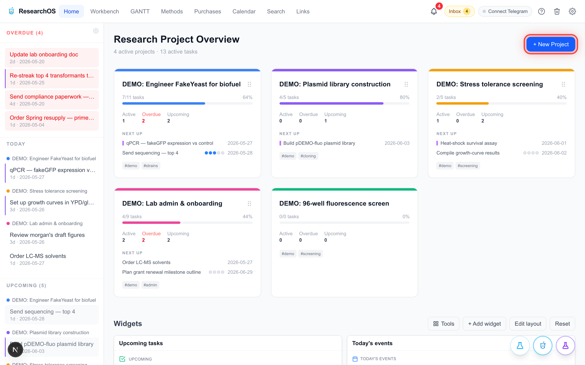
</p>
<p align="center"><em>Home for a lab member: project snapshots on top, with a customizable widget canvas (announcements, daily tasks, lab activity) below.</em></p>

> **Try the live demo at [research-os.app/demo](https://research-os.app/demo).** It runs entirely in your browser against synthetic fixture data, so you can poke around without signing up or picking a folder.

Built by Dr. Grant R. Nickles (PhD). Free and open source. ResearchOS grew out of work begun during a UW-Madison Distinguished Research Fellowship.

---

## What ResearchOS does

**Plan and schedule**

- Projects + Gantt with dependency-aware date shifting (drag one task, everything downstream moves with it), drag-to-link dependency chaining, image drops onto tasks, and right-click PTO with diagonal-stripe overlays.
- Workbench: a single view that surfaces what is ready, blocked, running, ready to write up (complete experiments with no result attached yet), and recently done.
- Calendar with filled-color event backgrounds (auto-contrast text), in-sidebar click-to-edit color picker, and external ICS feed overlays (Google Calendar, Outlook, iCloud, university calendars).
- High-level goals with SMART subgoals running alongside the schedule.

<!-- TODO screenshot agent: Gantt after the redesign, showing the multi-select projects dropdown open with Select all / Unselect all buttons visible, plus a dependency chain across two lanes.
     Route: /gantt
     Fixture: ?wikiCapture=1
     Viewport: 1440x900 desktop
     State: member fixture with several projects
     Save to: frontend/public/wiki/screenshots/gantt-overview.png
-->
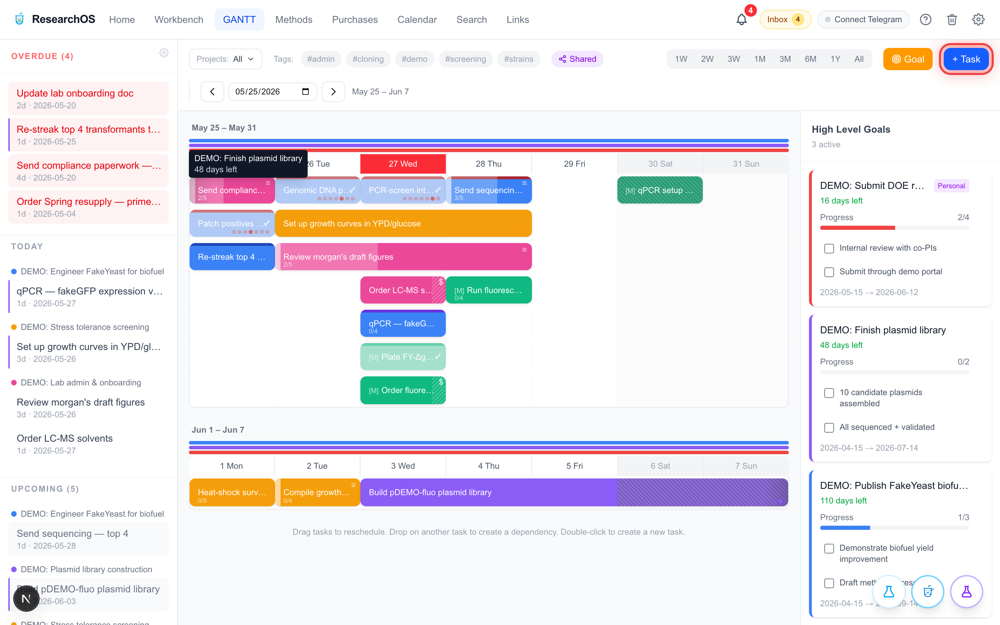

**Document and iterate**

- Lab Notes and Results tabs per experiment, both backed by a hybrid markdown editor with image attachments, file drops, and click-to-edit blocks.
- Methods library with ten different method types: free-form markdown, PDF, PCR protocol, LC gradient, well-plate layout, cell culture passage schedule, coding workflow, mass spec parameters, qPCR analysis, and compound methods that bundle the others into reusable kits.
- Unified sharing model for methods (and other shared records): `canRead` / `canWrite` lists with a whole-lab sentinel, replacing the older public-or-private toggle.
- Per-task method variations: attach a method, then record deviations on the experiment.
- Experiment comparison view for side-by-side outcomes across runs.

<!-- TODO screenshot agent: experiment editor after the hybrid editor redesign.
     Route: /workbench (open an experiment with Lab Notes + Results tabs)
     Fixture: ?wikiCapture=1
     Viewport: 1440x900 desktop
     State: member fixture
     Save to: frontend/public/wiki/screenshots/experiments-editor.png
-->
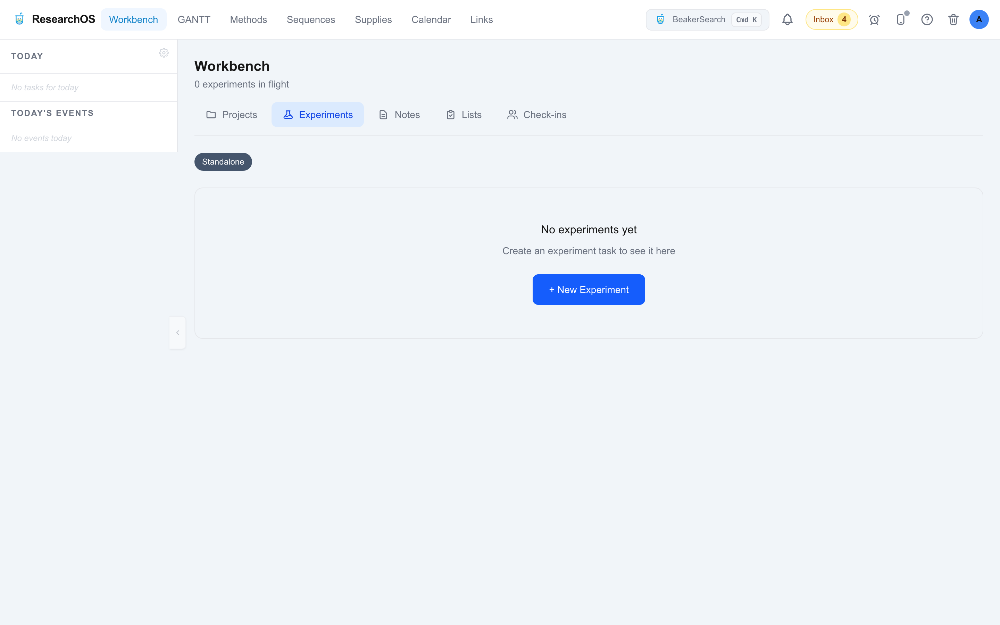

**Collaborate**

- Multiple users in one shared folder (OneDrive, Dropbox, iCloud, git, network share). Each user picks the folder, picks their username from the login screen (Lab Heads sort to the top with a PI badge), and gets their own subdirectory.
- Project sharing across users with optional edit permission. Writes route back to the owning user's directory so the owner stays in control of their data.
- Lab Inbox: comments on tasks, notes, and purchases, with 1-level reply threading, @-mentions, and in-place source-record popups so you can read context without leaving the inbox.
- Announcements: Lab Heads compose and pin lab-wide announcements; everyone reads them, with bell notifications on new posts.
- Receiver-side editing for shared tasks, including drag-to-reschedule through the dependency graph.

**Manage as a Lab Head**

- Lab Overview at `/lab-overview`: a customizable widget canvas plus a customizable sidebar, scoped to a separate Lab Head role (`account_type: "lab_head"`).
- Tools launcher: Tools are canonical popups; Widgets are tile-shaped entry points to those Tools. One Tool can ship multiple widget variants (LabPurchases has funding-bars, burn-rate, and pending-count tiles, like iPhone widget variants for one app).
- Soft-write actions (approve / decline purchases, assign tasks, flag for review, post announcements) gated by a Lab Head password unlock (5-minute edit sessions) and recorded in an audit log (`_pi_audit.json`).
- LabPurchases dashboard popup: 4-tab view with inline approve / decline buttons, persisted decline state with a Re-approve flow, a misc-purchases category for one-offs, and a 4-week burn-rate widget with a 4w / 8w / 12w / 6mo range selector.
- User archiving to remove people from active views while preserving their data.

<!-- TODO screenshot agent: Lab Overview canvas for a lab_head account, showing several widgets (announcements, pending approvals, lab activity, member workload) and the Tools launcher button.
     Route: /lab-overview
     Fixture: ?wikiCapture=1
     Viewport: 1440x900 desktop
     State: lab_head fixture
     Save to: frontend/public/wiki/screenshots/lab-overview.png
-->
<p align="center">
  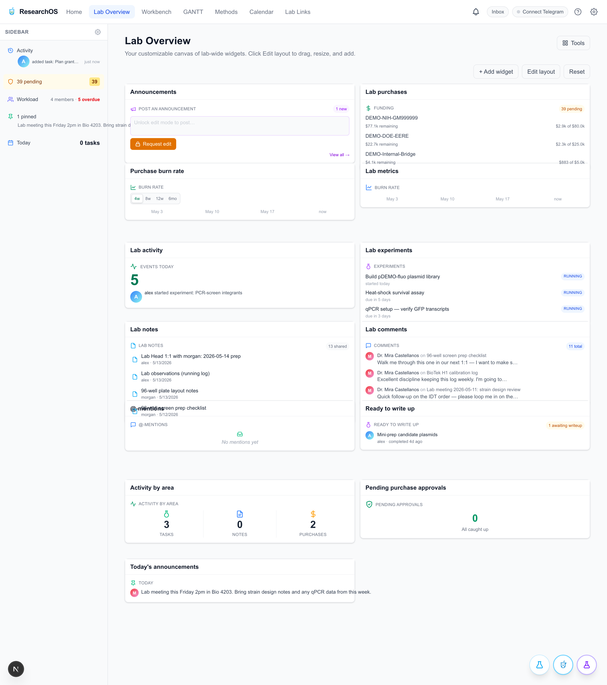
</p>
<p align="center"><em>Lab Overview: the Lab Head's customizable canvas, with the Tools launcher in the corner and widget tiles arranged across the grid.</em></p>

<!-- TODO screenshot agent: LabPurchases popup, tab A (pending approvals) selected, showing inline Approve / Decline buttons on a row.
     Route: /lab-overview (open LabPurchases tool from the launcher, switch to the Pending tab)
     Fixture: ?wikiCapture=1
     Viewport: 1440x900 desktop
     State: lab_head fixture with at least 2 pending purchases
     Save to: frontend/public/wiki/screenshots/lab-purchases-popup.png
-->
<p align="center">
  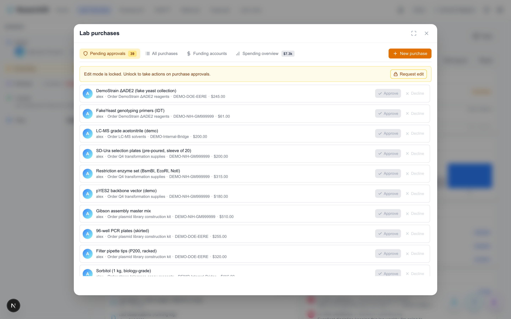
</p>
<p align="center"><em>LabPurchases popup, pending-approvals tab: approve or decline inline, no deep-link to a separate page.</em></p>

<!-- TODO screenshot agent: PiActions tool, audit-log tab (or pending-approvals tab), showing the soft-write history with timestamps + actor names.
     Route: /lab-overview (open PiActions tool from the launcher)
     Fixture: ?wikiCapture=1
     Viewport: 1440x900 desktop
     State: lab_head fixture with audit entries
     Save to: frontend/public/wiki/screenshots/pi-actions-audit.png
-->
<p align="center">
  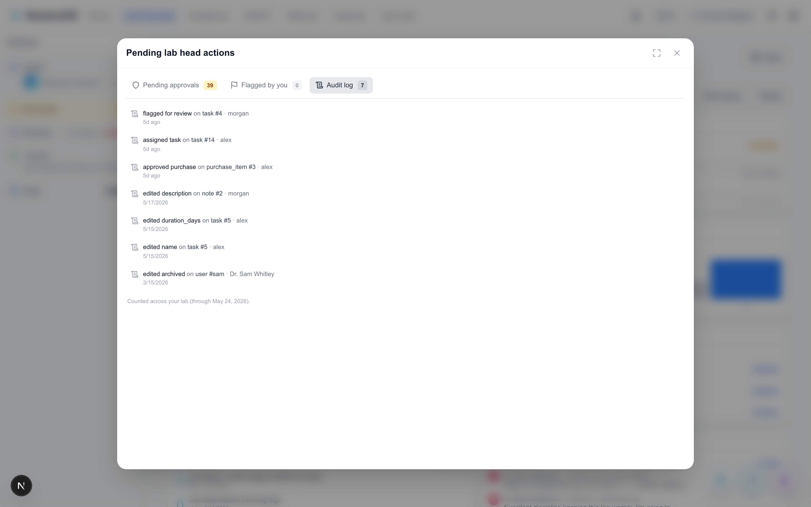
</p>
<p align="center"><em>PiActions: every soft-write a Lab Head makes (approvals, assignments, flags) lands in an auditable log.</em></p>

**Connect**

- **Telegram image inbox.** Pair a Telegram bot once; photos you send the bot arrive in your inbox in seconds with captions as titles. Drag onto any note to attach.
- **Calendar feed overlays.** Subscribe to public ICS feeds; events overlay on your Gantt and Calendar views (read-only).
- **AI Helper prompts.** Generate a prompt that turns Claude, ChatGPT, or Gemini into a ResearchOS-aware assistant. Paste into your own chat tier (no API key needed); the model knows your schemas, examples, and feature inventory.
- **LabArchives ELN import.** Bring existing notebooks from LabArchives offline ZIP exports as ResearchOS projects + tasks with attachments preserved.

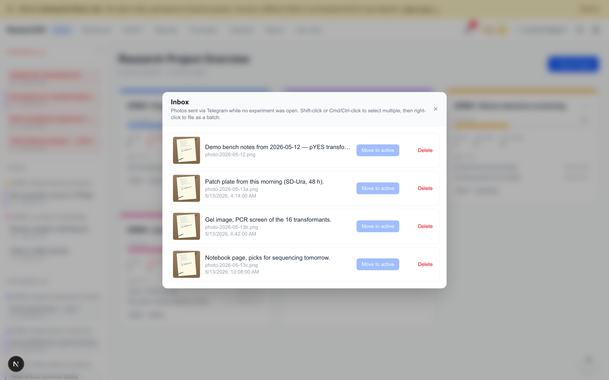

---

## How data is stored

```
+-----------------------------+
|        Your Browser         |
|     (Chrome / Edge)         |
|                             |
|  ResearchOS UI              |
|     |                       |
|     | File System Access    |
|     v                       |
|  Folder on your disk        |
|  - users/<username>/...     |
|  - results/task-<id>/...    |
+-----------------------------+
```

Everything lives in the folder you picked. To back up, sync, or share, point a tool you already trust at that folder. The two server-side routes (`/api/telegram-file` and `/api/calendar-feed`) are pure passthrough proxies that exist only because some third-party CDNs block direct browser fetches; they never store or log the traffic that flows through them. Settings has a "Data inventory" diagnostic that lists every file the app has ever written, and `/wiki/security` walks through the privacy model in detail.

---

## Run it

### Option A: hosted

Open **[research-os.app](https://research-os.app/)** in Chrome or Edge. Click "Connect folder," pick (or create) an empty folder on your machine, allow the read-write prompt, then pick or create a username. Your folder can live anywhere on disk; OneDrive, Dropbox, iCloud, or a plain local directory all work.

### Option B: run it yourself

```bash
git clone https://github.com/gnick18/ResearchOS.git
cd ResearchOS/frontend
npm install
npm run dev
```

Open [http://localhost:3000](http://localhost:3000). Convenience launchers `./start.sh` (macOS, Linux) and `.\start.ps1` (Windows) handle port cleanup.

### Option C: deploy your own to Vercel

```bash
cd frontend
npx vercel
```

The repo is preconfigured for Vercel. No environment variables required for the core app. After deploy, share the URL with your team; each user picks the same shared folder and signs in under their own username.

**Browser support.** Chrome and Edge are the supported, tested browsers. Other Chromium-based browsers (Arc, Vivaldi, Opera) usually work but are untested. Firefox and Safari do not implement the File System Access API the app depends on, and Brave (though Chromium-based) deliberately removes it.

---

## First-time setup: the welcome wizard

The first time you open ResearchOS against a fresh folder, a multi-step welcome wizard asks how you work. Q1 asks whether you're solo or part of a lab (auto-skipped when other users already exist in the folder, since at that point you're joining an established lab). Q1c follows up when you pick Lab: are you the Lab Head running it, or a member? Q2 then asks what brings you to ResearchOS, picking from nine use cases (PhD experiments, lab manager, teaching, computational research, postdoc, solo researcher, staff scientist, undergrad researcher, or just exploring; multi-select). The wizard uses your picks to tailor which tabs you see by default, then offers optional inline setup for Telegram, calendar feeds, and the AI Helper prompt.

Everything is reversible: tabs can be toggled in Settings, and Settings has both a "Re-run welcome wizard" button and a "Re-run feature tour" button if you want to start either flow over. ESC force-exits the tour at any point.

<p align="center">
  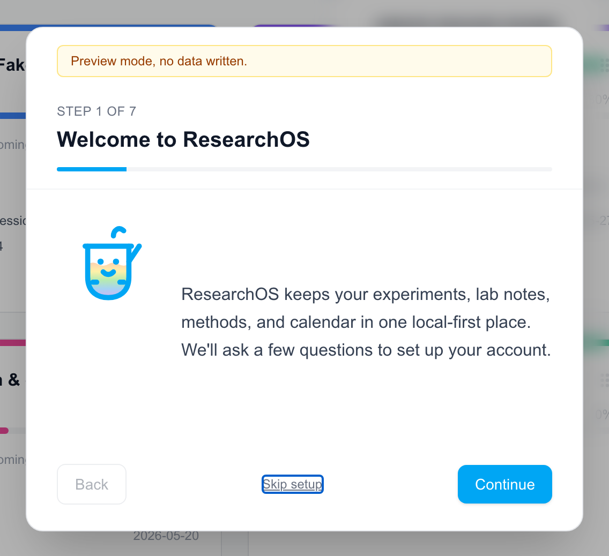
</p>
<p align="center"><em>Step 1: a two-sentence intro from BeakerBot, then on to picking how you work.</em></p>

<p align="center">
  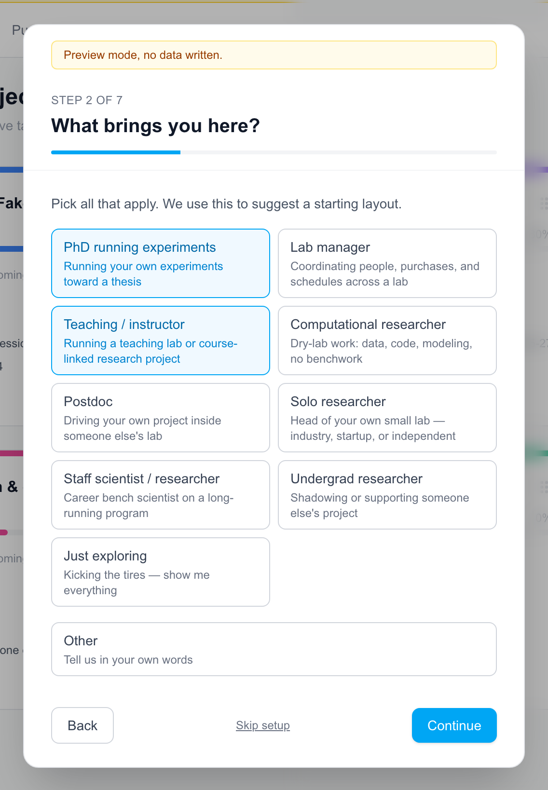
</p>
<p align="center"><em>Step 2: pick the ways you'll use ResearchOS (multi-select). The picks drive which tabs are visible by default.</em></p>

<!-- TODO screenshot agent: wrap-up step after the Q1c lab-head follow-up was added; confirm the wrap-up summary still echoes the right decisions.
     Route: welcome wizard, final step
     Fixture: ?wikiCapture=1
     Viewport: 1440x900 desktop
     State: lab fixture with Q1c answered
     Save to: frontend/public/wiki/screenshots/onboarding-wizard-step-7-wrapup.png
-->
<p align="center">
  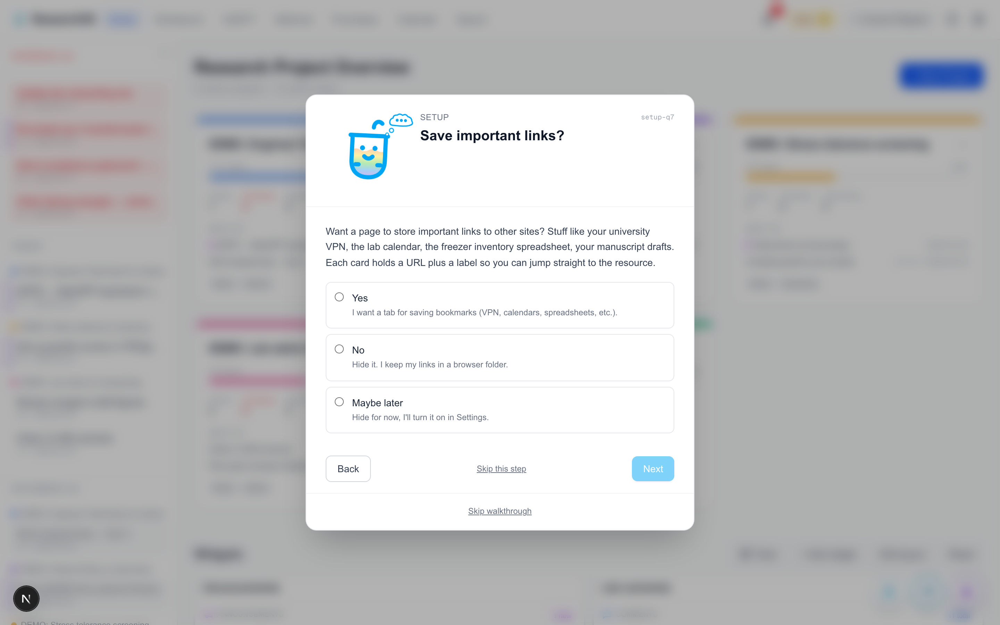
</p>
<p align="center"><em>Final step: confirmation. Each setup decision is echoed back, with an optional feature tour link before "Go to home."</em></p>

Skip the wizard entirely if you prefer; it never re-fires for the same user, and all features remain reachable from the navbar and Settings.

---

## Recovery and trust

ResearchOS treats your data folder as the source of truth, but a few small safety nets exist for the credentials and identity state that live alongside it:

- **Atomic file writes.** Every write goes through a temp-file plus rename so a torn write (tab crash, OS reboot) leaves the old contents intact rather than zero bytes.
- **Per-user tombstones for deleted accounts.** Tombstones survive cloud-sync round-trips so re-created cloud-stub directories never re-resurrect a user you intended to delete.
- **Per-user serial write queue for calendar feeds.** Concurrent feed refreshes serialize per user so two tabs racing on the same feed file cannot corrupt the cache.
- **Lab Head audit log.** Every approve / decline / assign / flag / announcement the Lab Head makes lands in `_pi_audit.json` with timestamp and actor.
- **Three-layer Telegram bot-token recovery.** Plaintext `_telegram.json` sidecar on disk is the primary; a browser-scoped IndexedDB cache backs it up per-user-per-folder; an opt-in encrypted backup (AES-GCM-256 with a key derived from your login password via PBKDF2-SHA-256) survives across browsers and machines. Settings shows what is enabled and lets you wipe any layer.

See `/wiki/security` for a full security audit, threat model, and findings.

---

## Continuous integration

ResearchOS runs lint, type-checking, unit tests (vitest), and end-to-end tests (Playwright) on every pull request and push to `main`. Test coverage reports are uploaded as workflow artifacts. The CI configuration lives at `.github/workflows/ci.yml`.

The project is preparing for submission to the [Journal of Open Source Software (JOSS)](https://joss.theoj.org). The CI pipeline, test coverage, and contribution guidelines target JOSS reviewer expectations.

---

## Project structure

```
ResearchOS/
├── frontend/                              Next.js + React app (all the application code)
│   ├── src/
│   │   ├── app/                           Pages and the two Vercel passthrough proxies
│   │   ├── components/                    React components
│   │   ├── lib/                           FSA layer, telegram client, calendar parser, methods, onboarding
│   │   └── __mocks__/                     FSA mock layer for headless CI tests
│   ├── e2e/                               Playwright end-to-end specs
│   ├── playwright.config.ts
│   ├── vitest.config.mts
│   └── package.json
├── scripts/                               One-off maintenance scripts (legacy folder sweep, AI Helper builder, demo zip)
├── ai-helper/                             Prose partials + eval harness for the AI Helper prompt build pipeline
├── SECURITY_AUDIT.md                      Security audit + threat model + findings
├── AGENTS.md                              Repo conventions, traps, and audit trail
├── .github/workflows/ci.yml               Lint + tsc + vitest + Playwright
├── start.sh / start.ps1                   Local dev launchers
└── README.md                              This file
```

---

## Development

```bash
cd frontend
npm install
npm run dev                 # http://localhost:3000
npm test                    # vitest run (node environment)
npm run test:coverage       # vitest with v8 coverage report
npm run test:e2e            # Playwright against a started dev server
npx tsc --noEmit            # type check
npm run lint                # eslint
```

The app is fully client-side. The two Next.js API routes (`/api/telegram-file`, `/api/calendar-feed`) are pure passthrough proxies and only run when their respective integrations are in use.

---

## Telegram pairing

Sending lab photos from your phone is faster than uploading through the browser, so ResearchOS supports a one-bot-per-user Telegram pipeline.

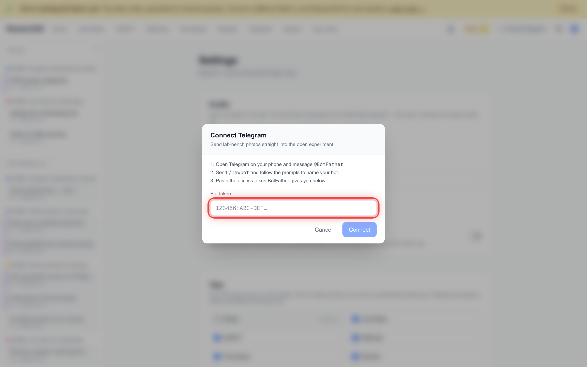

1. Open Telegram, chat with [@BotFather](https://t.me/BotFather), send `/newbot`, follow the prompts. Copy the bot token.
2. In ResearchOS, click the Telegram icon in the top bar, then **Pair bot**.
3. Paste your token. The app verifies it and writes the pairing to your folder.
4. Open Telegram, find your new bot, click **Start**.

After pairing, snap a photo on your phone, send it to your bot, and it shows up in the ResearchOS inbox within a few seconds with the caption as the title. Drag it onto any note to attach. Telegram pairings are per-user, so a shared lab folder can host one bot per researcher.

---

## External calendars

The Calendar tab can overlay events from any ICS-compatible feed.

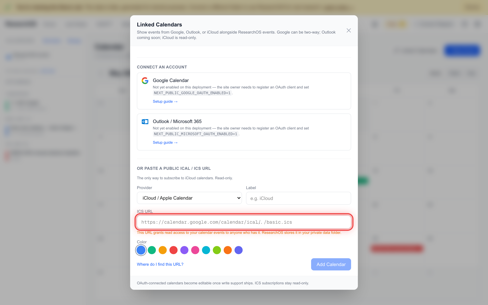

1. Calendar tab, then **Manage feeds**, then **Add subscription**.
2. Paste the ICS URL. Google Calendar, Outlook / Office 365, iCloud, and university calendars all expose one (usually under Calendar settings, "Share" or "Publish").
3. Pick a color and a name. Save.

Feeds are read-only; your tasks do not push back to Google or Outlook. Subscriptions are stored in your data folder (per-user), so they sync alongside everything else.

---

## AI Helper

ResearchOS does not run any AI models. Instead, the app generates a structured prompt that teaches your existing AI assistant (Claude, ChatGPT, or Gemini) what ResearchOS is, what entities it tracks, and how features connect. You paste the prompt into your usual chat and get a ResearchOS-aware helper for the duration of that conversation.

<!-- TODO screenshot agent: Settings AI Helper section after the Settings redesign (search bar at the top, Personal + Lab Mode tabs for lab head accounts).
     Route: /settings (scroll to AI Helper, or filter the search bar for "AI")
     Fixture: ?wikiCapture=1
     Viewport: 1440x900 desktop
     State: lab_head fixture (so the Personal / Lab Mode tabs are visible)
     Save to: frontend/public/wiki/screenshots/settings-ai-helper.png
-->
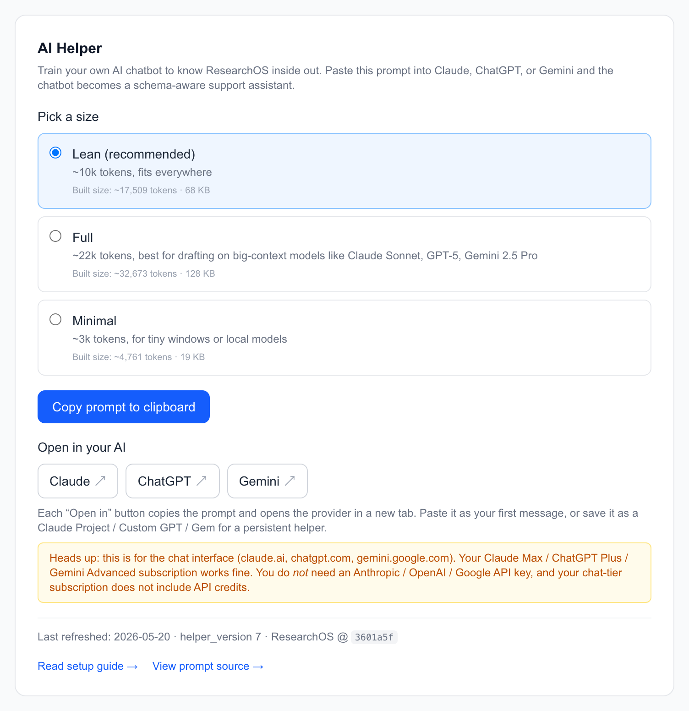

Settings has an "AI Helper" section with a one-click copy button and three "Open in" shortcuts that paste the prompt into a fresh chat in each provider. Three size variants exist (full for big-context models, lean for the default, minimal for small-context or local models with an explicit "you got the degraded variant" disclaimer).

The prompt build pipeline auto-extracts entity schemas from `types.ts` and canonical examples from fixture data, so it stays in sync with the codebase release-by-release. No API key is required, no usage is metered through ResearchOS, and your chat tier (Claude Max, ChatGPT Plus, Gemini Advanced) works fine without adding API credits.

Settings itself was redesigned with a substring search bar at the top, plus Personal and Lab Mode tabs for Lab Head accounts so Lab Head-specific settings (password, edit-session timeout, audit-log access) sit apart from personal preferences.

---

## Documentation

Detailed feature documentation lives in the in-app wiki at `/wiki/`, also reachable on the hosted version. Highlights:

- `/wiki/getting-started` for first-time setup paths
- `/wiki/security` for the privacy model, threat surface, and findings
- `/wiki/features/methods` for the ten method types and how they compose
- `/wiki/features/lab-overview` for the Lab Head canvas, widgets, and Tools launcher
- `/wiki/features/lab-head` for the Lab Head role, password unlock, audit log, and soft-write actions
- `/wiki/features/lab-inbox` for comments, threading, @-mentions, and announcements
- `/wiki/features/sharing-and-permissions` for the `canRead` / `canWrite` / whole-lab sentinel model
- `/wiki/integrations/telegram`, `/wiki/integrations/calendar-feeds`, `/wiki/integrations/labarchives`, `/wiki/integrations/ai-helper` for setup details

The wiki uses fixture-mode screenshots (`?wikiCapture=1`), so anything pictured is synthetic data; your real folder is never captured.

---

## Troubleshooting

**Folder picker is slow or browser looks frozen.** Normal on first open of an OneDrive or iCloud folder. The OS has to spin up the file provider. The "Don't refresh" callout on the loading screen explains this; just wait.

**Port already in use (local install).** `start.sh` kills port 3000 before launching. If something else is stuck:

```bash
lsof -ti tcp:3000 | xargs kill -9    # macOS, Linux
netstat -ano | findstr :3000          # Windows, then taskkill /PID <pid> /F
```

**Telegram bot says "Conflict: getUpdates".** Another browser tab or another device is polling the same bot. ResearchOS holds a per-tab lock; close the other tabs or devices.

**Forgot your account password.** Open your shared data folder, navigate to `users/<your-username>/`, delete `_auth.json`. Sign in normally.

**Calendar feed isn't updating.** Feeds are edge-cached for 15 minutes to keep serverless function invocations low. Remove and re-add the feed to force a refresh.

**Hero card on the Workbench shows an image I removed.** ResearchOS migrated to a per-tab attachment layout in May 2026. If you have legacy `results/task-N/Images/` content from before that migration, run `node scripts/sweep-legacy-task-folders.mjs <your-folder> --dry-run` to see what is left, then re-run with `--apply` to migrate or report unrecognized content.

**Lab Head edit session keeps timing out.** Sessions expire after 5 minutes of inactivity by design (the password unlock is per-session, not per-action). Re-enter the password to start a fresh session, or change the timeout in Settings under the Lab Mode tab.

---

## Contributing

Contributions are welcome, whether that is a bug report, a feature idea, a documentation fix, or code. A good first step is to open an issue or browse the [good first issues](https://github.com/gnick18/ResearchOS/labels/good%20first%20issue). Everyone taking part agrees to the [Code of Conduct](CODE_OF_CONDUCT.md), and [CONTRIBUTING.md](CONTRIBUTING.md) covers the setup, the CI expectations, and how to send a change.

Pull requests welcome. The repo is set up for clean CI runs:

```bash
cd frontend
npm install
npm test                    # vitest (2005+ tests across ~170 files as of 2026-05-24)
npm run test:e2e            # Playwright baseline against the dev server
npx tsc --noEmit
npm run lint                # 0 errors expected on main
```

Before opening a PR, please run all four locally. The CI workflow runs them on every push to `main` and on every pull request. Coverage reports and Playwright traces are uploaded as workflow artifacts.

See `AGENTS.md` for repo conventions, known traps, and the development audit trail. New features that touch network paths, IndexedDB writes, or on-disk credential storage should be discussed in an issue first so the security model stays coherent.

---

## License

ResearchOS is free software, licensed under the GNU Affero General Public License v3.0 or later (AGPL-3.0-or-later). See [LICENSE](LICENSE) for the full text.

Copyright (C) 2026 Grant R. Nickles.

In plain terms: you are free to use, study, share, and modify ResearchOS, and you can run it yourself at no cost, forever. If you run a modified version as a network service, the AGPL requires you to make your source available to that service's users. This keeps ResearchOS genuinely open and free for every lab.

---

## Sponsor

ResearchOS has no investors. The local-first app is free and open source forever, because your research lives in a folder on your own disk and never has to touch our servers. The only paid part is optional cloud storage above a generous free pool, priced to recover what it costs us to run, not to make a profit. Sponsorship and those plans cover hosting and development. If it helps your work, you can back it on [GitHub Sponsors](https://github.com/sponsors/ResearchOS-LLC). The tiers, perks, and the sponsor wall live at `/thanks` in the app.

---

## Acknowledgements

ResearchOS is built on open-source software and on published science, and we are grateful to everyone who made that work and gave it away. A warm thank-you and the curated highlights live in [ACKNOWLEDGEMENTS.md](ACKNOWLEDGEMENTS.md), and you can read the same page inside the app at `/open-source` (linked from `/thanks` as well).

The formal, machine-generated license inventory for every package we ship is in [THIRD_PARTY_NOTICES](THIRD_PARTY_NOTICES). Both files are produced from the actual installed dependency tree by `scripts/build-open-source-credits.mjs`, so they never drift from reality. Regenerate them with:

```bash
node scripts/build-open-source-credits.mjs
```

---

## Issues

[github.com/gnick18/ResearchOS/issues](https://github.com/gnick18/ResearchOS/issues)
