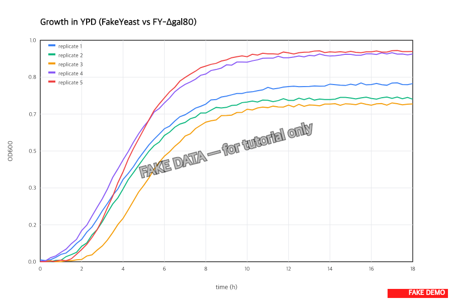

> :information_source: **This is fake demo data.** All strains, plasmids, and results below are fictional and exist only to demonstrate ResearchOS features. Do not use as a real protocol.

## Growth curves — running log

Two strains (`FakeYeast-001` WT vs `FY-pYESflbA-T1` with flbA cassette) × 4 glucose levels (0.5%, 1%, 2%, 4%). Want to see if flbA expression alters the dose-response in YPD before we layer on heat stress.

### 2026-05-12 — plate setup + reader booking

Seeded the 96-well plate this morning. Layout: rows A-D = WT, rows E-H = T1. Columns 1-3 = 0.5%, 4-6 = 1%, 7-9 = 2%, 10-12 = 4%. 200 µL per well, OD600 seed = 0.05 from fresh overnights.

Reader (Synergy H1) booked for 48 h continuous starting 11:00. 30 °C, 425 cpm double-orbital, 15 min reads.

Sample IDs: `GR-WT-{0.5,1,2,4}` and `GR-T1-{0.5,1,2,4}`, biological triplicates each (n=24 conditions total, 96 wells with 4 wells/condition).

### 2026-05-13 — mid-run check

Mid-log readings look as expected. WT vs T1 traces are visually overlapping at 2% glucose (no penalty from the cassette under uninduced conditions — good news). 4% glucose plateau a hair lower for both strains, probably osmotic pressure starting to bite.

OD600 at t=14h, T1 + 4% glucose: 1.31 (vs WT same condition: 1.36).

Caught condensation forming on the lid at hour ~30, breath-fogged the lid edge and reseated. No data dropout but worth noting.

### 2026-05-14 — run complete, exporting

Run finished overnight. Exporting the .xlsx now, will pull the OD600 traces into a Gompertz fit in python. Plotting all 24 conditions per strain × glucose.

Note: well H12 (T1 + 4% glucose, biological rep 3) flatlined at OD600 ≈ 0.08 the whole run — never came out of lag. Looks like a seeding failure (forgot to mix the overnight before pipetting?). Excluding it from the final analysis, will mention in the writeup.

Results writeup pending — should land in the results tab once the Gompertz fits are done.
