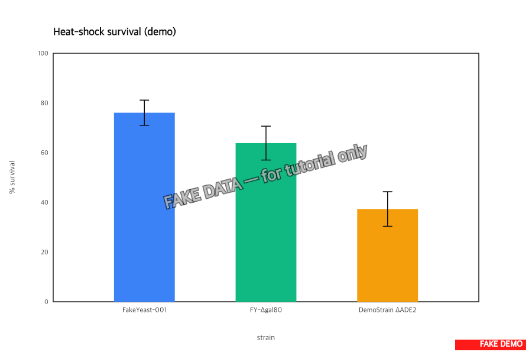

> :information_source: **This is fake demo data.** All strains, plasmids, and results below are fictional and exist only to demonstrate ResearchOS features. Do not use as a real protocol.

## Heat-shock survival assay — protocol prep

Pending: blocked on the growth-curve baseline (task-10) finishing so we can normalize survival to per-strain doubling rate.

### Plan

Three strains × three heat-shock temperatures (37 °C, 42 °C, 50 °C × 30 min):

1. `FakeYeast-001` (WT, baseline reference from task-19)
2. `FY-Δgal80` (constitutive GAL1 — used as positive expression control)
3. `DemoStrain-ΔADE2` (stress-sensitive reference)

Plus the 4 confirmed integrants (T1, T2, T6, T7) once task-30 says they're actually expressing flbA — currently they're just genotypically positive, we need transcript-level confirmation before they make sense in this assay.

### Reagents

- YPD pre-warmed to each shock temp (water bath, NOT incubator — needs to hit temp fast)
- SD-Ura plates × 24 (3 strains × 3 temps × biological triplicate × 1 spot dilution series each)
- 10-fold serial dilution series: 10⁰ to 10⁻⁵ in sterile water

### Steps

1. Grow each strain to mid-log (OD600 ≈ 0.6) in YPD.
2. Aliquot 100 µL into pre-warmed tubes at each temp.
3. Shock 30 min, then immediately ice 2 min.
4. Serial-dilute, spot 5 µL of each dilution on SD-Ura.
5. Incubate 30 °C, count CFUs at 48 h.

Expected demo readout for the bar plot (% survival vs 30 °C control):

- FakeYeast-001 baseline: ~78%
- FY-Δgal80 (constitutive cassette stress): ~64%
- DemoStrain-ΔADE2: ~41% (known sensitive)

*Image above is a placeholder showing the expected output format from a previous demo run — the actual data is not yet collected. Will be replaced once the assay runs.*
