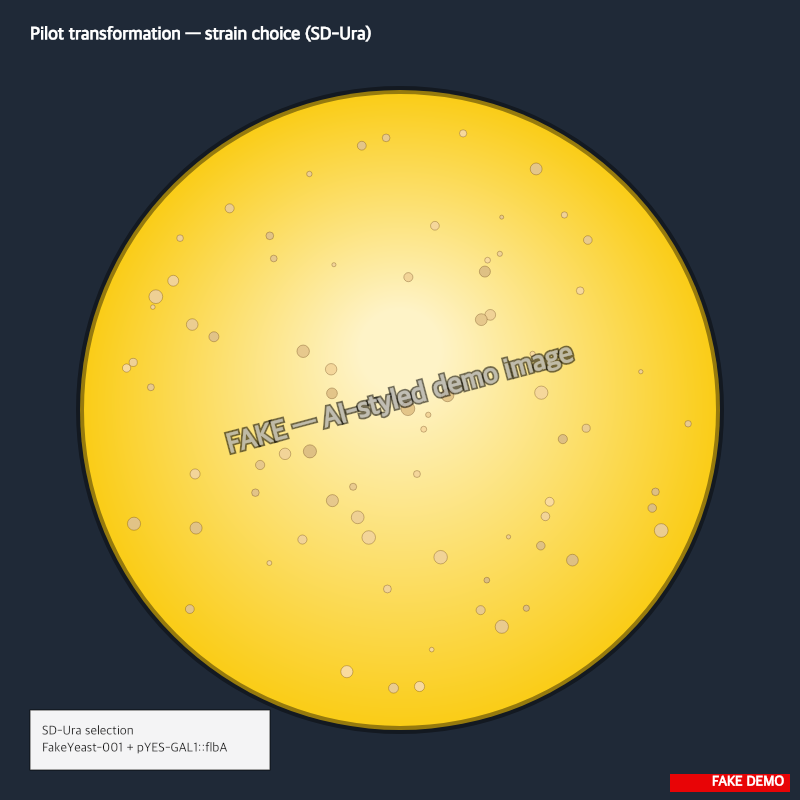

> :information_source: **This is fake demo data.** All strains, plasmids, and results below are fictional and exist only to demonstrate ResearchOS features. Do not use as a real protocol.

## Pilot transformation — strain choice

Goal: pick between FakeYeast-001 and DemoStrain-ΔADE2 as the chassis for the GAL1::flbA work. Need >100 transformants/µg with the empty pYES2 backbone before committing.

### Reagents (per rxn, ×8)

- 50% PEG-3350 (sterile): 240 µL
- 1 M LiAc: 36 µL
- ssDNA carrier (boiled 5 min, snap-chilled): 25 µL
- pYES2 backbone (linearized, EcoRI/XhoI): ~100 ng
- Yeast pellet from 5 mL OD600 0.6 culture

### Conditions

- Heat shock: 42 °C × 40 min
- Recovery: 1 h in YPD at 30 °C, no shaking
- Plate 200 µL on SD-Ura

### Notes

Ran 4 reactions per strain. DemoStrain-ΔADE2 pellet was much pinker than expected (ade2 phenotype), color held overnight.

Backbone was a fresh prep from morgan (concentration 142 ng/µL via Nanodrop on 2026-02-09).

