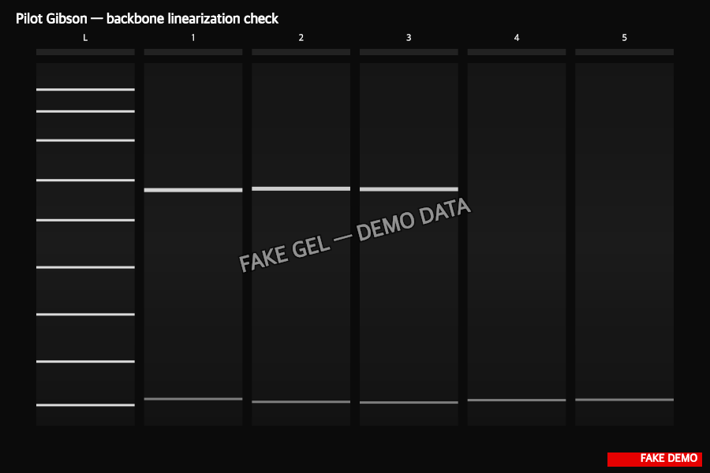

> :information_source: **This is fake demo data.** All strains, plasmids, and results below are fictional and exist only to demonstrate ResearchOS features. Do not use as a real protocol.

## Gibson backbone test — results

**Conclusion: locking in pYES2 (backbone 1) for the pDEMO-fluo library work.**

3 / 4 backbones gave the expected 5.86 kb linearized band with clean stoichiometry; backbone 4 (smeary, see notes) failed assembly QC as expected. Transformation efficiency for backbones 1-3: 12, 8, 14 colonies per 50 µL plated (avg ~220 cfu/µg DNA after correction).

Sequenced 2 colonies per backbone, junctions clean. Locking in backbone 1 (pYES2 fresh-digest stock) for downstream library work.
