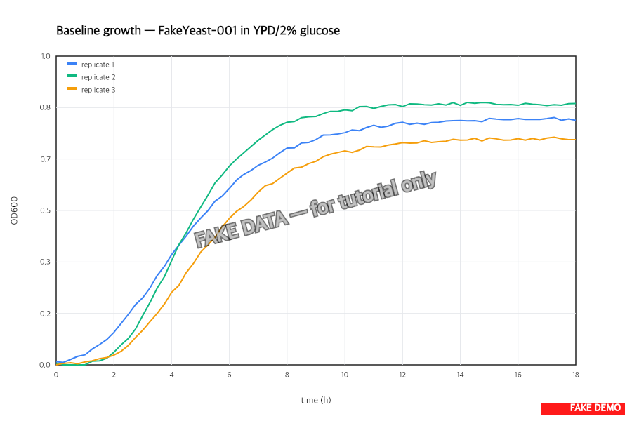

> :information_source: **This is fake demo data.** All strains, plasmids, and results below are fictional and exist only to demonstrate ResearchOS features. Do not use as a real protocol.

## Baseline growth — results

**Doubling time = 95 ± 4 min** for FakeYeast-001 in YPD/2% glucose at 30 °C (mean ± SD across 3 biological replicates).

Logistic fit parameters:

- µmax = 0.44 h⁻¹
- Lag = 2.1 h
- Plateau OD600 = 1.45

Locked in as the no-stress reference for the stress-tolerance project. Heat-shock (task-11) and high-glucose curves (task-10) will be normalized to this baseline.
