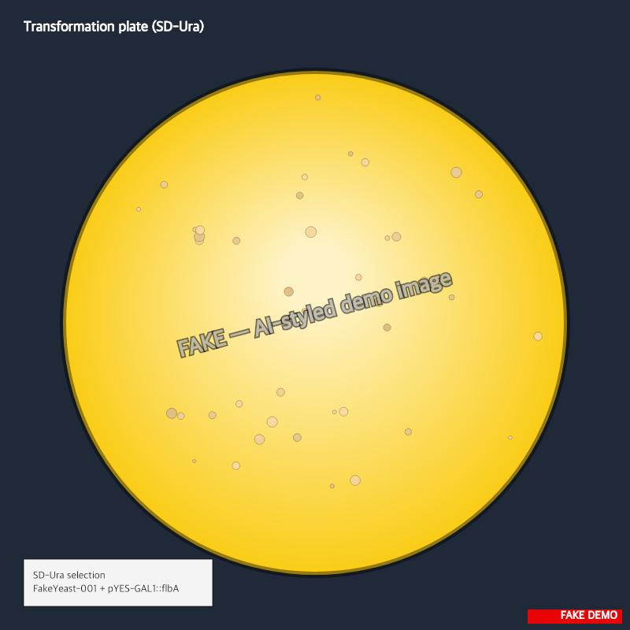

<!-- stamp:start -->
2026-05-08  
9:42 AM  
experiment: Yeast transformation: pYES-GAL1::flbA  
project folder: DEMO: Engineer FakeYeast for biofuel  
<!-- stamp:end -->
___
[last-access]: # (2026-05-08T14:30:00Z)

> :information_source: **This is fake demo data.** All strains, plasmids, and results below are fictional and exist only to demonstrate ResearchOS features. Do not use as a real protocol.

## Transformation notes — 2026-05-08

Integrating `pYES-GAL1::flbA` into FakeYeast-001 at the URA3 locus.

### Reagents (per rxn, ×10)

- 50% PEG-3350: 240 µL
- 1 M LiAc: 36 µL
- ssDNA carrier (10 mg/mL, boiled fresh): 25 µL
- `pYES-GAL1::flbA` linearized w/ AatII: ~120 ng/rxn
- Yeast pellet from 5 mL OD600 = 0.6 mid-log culture

### Conditions

| Step | Temp | Time |
|---|---|---|
| Mix + 30 min ramp | 30 °C | 30 min |
| Heat shock | 42 °C | **38 min** (interrupted, see deviation log) |
| Recovery in YPD | 30 °C | 1 h |
| Plate on SD-Ura | 30 °C | 48 h |

### Sample IDs

- `FY-pYESflbA-T1` through `FY-pYESflbA-T10`
- WT control (no DNA): `FY-NEG-1`
- Backbone-only (pYES2 empty): `FY-EV-1`

### Observations

Timer reset at minute 38 of heat shock (someone bumped the heat block). Restarted immediately but only managed 38 min total. Logged in the task deviation log.

Plated 200 µL out of the 1 mL recovery; saving the rest at 4 °C in case efficiency tanks.

After 48 h: counted **40 colonies** on the experimental plate. WT control: 0 colonies (good). EV control: 38 colonies (expected).

