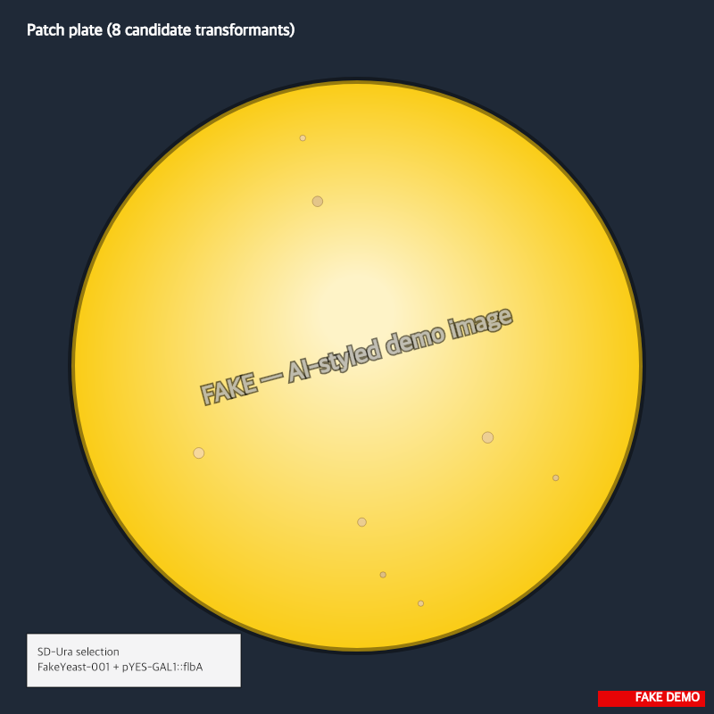

> :information_source: **This is fake demo data.** All strains, plasmids, and results below are fictional and exist only to demonstrate ResearchOS features. Do not use as a real protocol.

## Patch plate — 2026-05-11

Patching 8 colonies picked off the transformation plate (task-2) onto a fresh SD-Ura plate. Want clean single-colony-derived material for the PCR screen on Monday.

### Protocol

- Pre-warm SD-Ura plate to 30 °C, 30 min
- 8 patches in a 2×4 grid, ~5 mm spacing
- Streak from single isolated colony per pick using sterile toothpicks
- Incubate 30 °C, 48 h

### Layout

```
A1  A2  A3  A4
B1  B2  B3  B4
```

Sample IDs `FY-pYESflbA-T1` through `T8` map row-major to grid positions A1-B4.

### Observations

All 8 patches grew cleanly. No satellite colonies on or around any patch — confirms URA3 selection is holding.

Patch B3 is slightly smaller than the others (maybe 70% area) but still uniform growth. Picking top 4 by visual eye: A1, A2, A3, A4 — sending for Sanger sequencing tomorrow.


