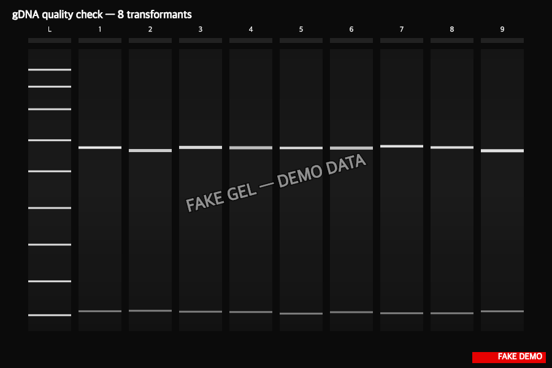

> :information_source: **This is fake demo data.** All strains, plasmids, and results below are fictional and exist only to demonstrate ResearchOS features. Do not use as a real protocol.

## gDNA prep — results

**All 8 preps passed quality gate** (A260/280 ≥ 1.80, A260/230 ≥ 1.95). Ready for PCR screen.

| Pass criterion | Threshold | Result |
|---|---|---|
| A260/280 | ≥ 1.80 | 8 / 8 |
| A260/230 | ≥ 1.95 | 8 / 8 |
| High-MW band on gel | clean ≥ 20 kb | 8 / 8 |
| Concentration | ≥ 100 ng/µL | 8 / 8 (range 178-312) |

Diluting all to 50 ng/µL working stocks for the DemoCheck PCR (task-5).
