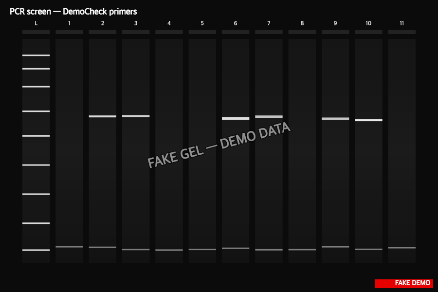

> :information_source: **This is fake demo data.** All strains, plasmids, and results below are fictional and exist only to demonstrate ResearchOS features. Do not use as a real protocol.

## PCR-screen results

**6 / 8 transformants positive for the GAL1::flbA cassette** (~75% integration rate, in line with the LiAc + linearized-plasmid expectation).

| Lane | Sample | ~1.4 kb band | Verdict |
|---|---|---|---|
| 2 | T1 | clean, strong | **positive** |
| 3 | T2 | clean, strong | **positive** |
| 4 | T3 | faint | negative (likely background) |
| 5 | T4 | clean, strong | **positive** |
| 6 | T5 | none | negative |
| 7 | T6 | clean, strong | **positive** |
| 8 | T7 | clean, strong | **positive** |
| 9 | T8 | clean, strong | **positive** |
| 10 | WT | none | (control as expected) |
| 11 | EV | none | (control as expected) |
| 12 | H2O | none | (control as expected) |

**Conclusion:** moving T1, T2, T4, T6, T7, T8 forward to the qPCR expression check (task-30). T3 and T5 archived but flagged as suspect.
