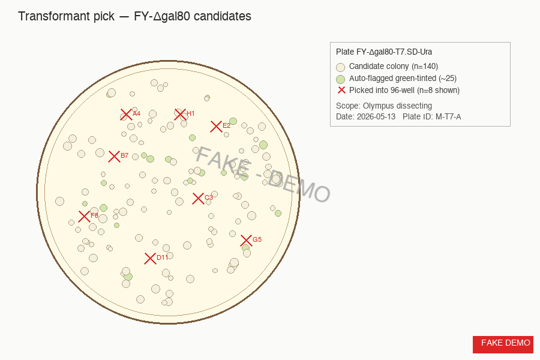

> :information_source: **This is fake demo data.** All strains, plasmids, and results below are fictional and exist only to demonstrate ResearchOS features. Do not use as a real protocol.

# Plate FY-Δgal80 transformants on 96-well

Joint screen with alex. Alex transformed FY (Δgal80) with the pYES-fakeGFP library on 2026-05-11; plates came off the incubator looking good on 2026-05-12. My job: pick 80 candidates + controls into a 96-well deep-well, induce overnight, hand off to the reader Thursday.

## Reagents pulled

- SD-Ura broth (1 L, made 2026-05-10) — shared bench stock, autoclaved tag still on
- SD-Ura + 2% galactose (induction media, 250 mL) — made fresh this morning
- Sterile water (autoclaved) — for the corner evaporation wells
- Deep-well 96 (Costar 3960) — 1 plate, sterile pouch
- Clear-bottom black 96 (Greiner 655096) — for the reader on Thursday, kept sealed

## Plate map

- **Column 1** (8 wells): WT FY, no transformation — negative control
- **Column 12** (8 wells): FY + pDEMO-fluo+ positive control plasmid (alex made a fresh prep 2026-05-08, freezer 5 box 2)
- **Columns 2-11** (80 wells): one candidate FY-Δgal80 transformant per well, picked from alex's `T7-A` and `T7-B` plates

Plate ID: **M-T7-A** (sticker on lid + side, both with date).

## Pick / pipetting

Olympus dissecting scope, 9-12 AM (scope booked Mon night for Tue morning, see lab links).

- 140 colonies counted on the SD-Ura plate. ~25 had a visibly greener tint by eye (auto-flagged in the snapshot for the figure).
- Picked all 25 green-tinters first, then 55 random non-tinted colonies to fill out the 80 wells. Random pick is the actual screen — the green eye-tint is a hunch, not the hit-call.
- One colony at position 11A on alex's plate looked **fuzzy** (contamination?). Skipped, picked the neighbor.

## Inoculation steps

1. 200 µL SD-Ura per well in the deep-well plate (Multichannel-A, ART filter tips).
2. Single colony per well, sterile toothpick, swirl 2-3 s and discard.
3. Seal with breathable AeraSeal, label both faces.
4. 30 °C, 200 rpm shaker (rack 3, far back, demo shaker A).
5. Hand-off Thursday 8 AM to morgan-reader-tab.

## Quirks / running notes

- Alex sent over a fresh pDEMO-fluo+ prep this morning, going to image transformants tomorrow once they're induced. Tube label says **A-2026-05-08-pDEMO-fluo+**, freezer 5, box 2, slot 3.
- Two colonies in col 9 went in late (picked at 11:45, last batch). Marking with a star on the plate-map fixture in case they look underdense by morning.
- Forgot to grab a fresh aliquot of galactose before lunch — re-warmed the existing one. Should be fine but worth flagging if results look weird.
- Reader is calibrated (see lab notes ID 6 — last check 2026-05-12, R² 0.996). Good to go.

## Hand-off note for tomorrow's me

- Pre-warm reader plate at 30 °C, transfer 50 µL/well from deep-well → reader plate.
- Corner wells of reader plate get 50 µL sterile water (evap control — H6 stays empty, it's the bad well from task 7).
- 485/528 nm, gain 60, kinetic mode every 30 min for 6 h.
- Export CSV to `~/lab/joint-screen/2026-05-14-M-T7-A.csv` AND push to the analysis notebook before going home.
