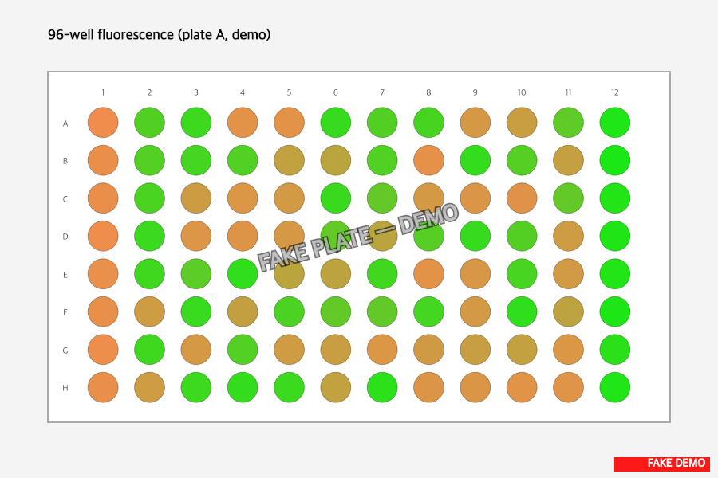

> :information_source: **This is fake demo data.** All strains, plasmids, and results below are fictional and exist only to demonstrate ResearchOS features. Do not use as a real protocol.

## Plate prep results — Plate M-T7-A

### Colonies picked

- 80 / 80 wells inoculated (deep-well plate M-T7-A)
- 8 wells WT (col 1), 8 wells pDEMO-fluo+ positive (col 12), 80 candidates (cols 2-11)
- 25 of the 80 candidates were "green-tinted" by eye on the SD-Ura plate (pre-flagged for follow-up; not the hit call)
- Skipped 1 fuzzy colony (alex plate, position 11A) — likely contam

### Plate after overnight 30 °C / 200 rpm

- All 80 candidate wells turbid by 8 AM next day. Median OD600 (eyeballed via reader pre-scan) ~0.6
- Column 1 (WT) wells turbid as expected
- Column 12 (positive) wells slightly slower — galactose induction draws growth down, this is fine and matches the pDEMO datasheet (demo)
- No cross-well contamination visible at 4× — clean job

### Hand-off

Plate transferred to reader plate M-T7-A-R, 50 µL/well + 50 µL water in corners. Ready for the fluorescence scan (task 2).

### Conclusions

- Joint screen plate is set up cleanly and ready to image
- 25 eye-tinted greens is more than I expected — looking forward to seeing how many of them actually hit the 0.6× threshold once the reader runs
- Note for next round: do the picking in the AM, not 11 AM — by noon I was rushing the last column and two wells went in late
