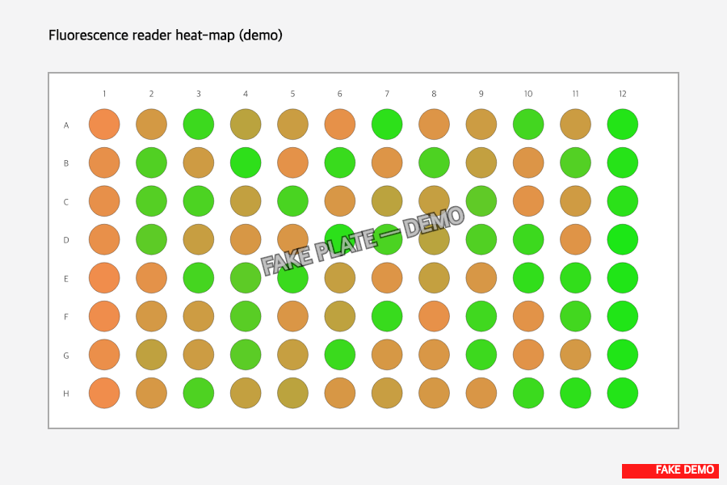
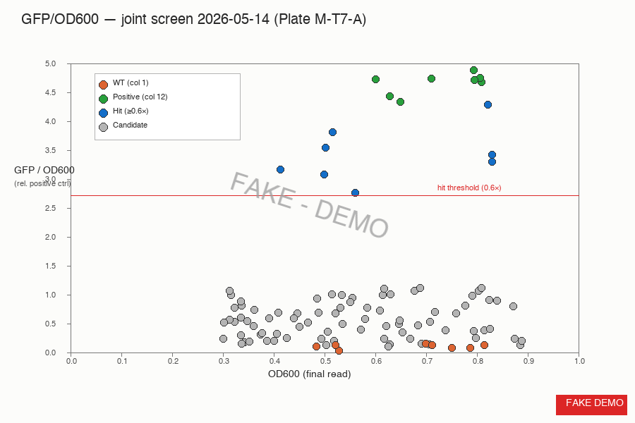
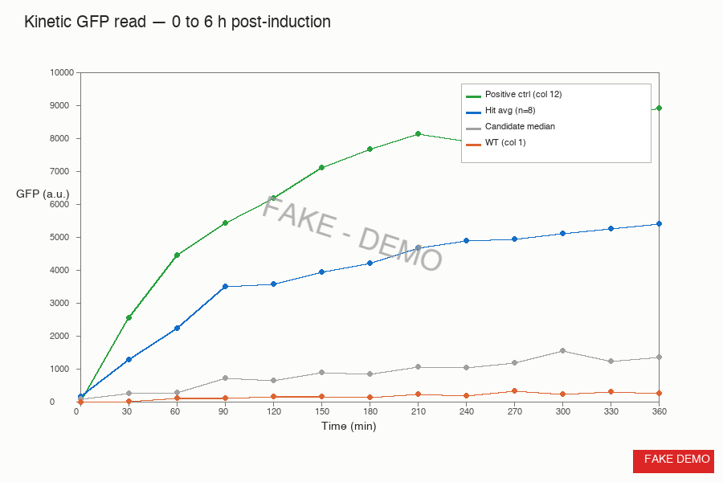

> :information_source: **This is fake demo data.** All strains, plasmids, and results below are fictional and exist only to demonstrate ResearchOS features. Do not use as a real protocol.

## Fluorescence scan — Plate M-T7-A-R (2026-05-14)

### Endpoint heat-map (t=360 min)

Reader heat-map at the final timepoint, GFP normalized per well (gain 60).

- Visible spread between candidates, WT (orange), and positive control (bright green)
- Hit clusters in **cols 3, 5, 7, 9** — consistent with the eye-tinted greens I pre-flagged during the pick

### GFP / OD600 vs final OD600

After normalizing per-well GFP by OD600 and dividing by the column-12 positive-control mean.

- Positive control (col 12, n=6) clusters at GFP/OD = **0.92 to 1.08** of itself — tight, gain choice was correct
- WT (col 1, n=6): GFP/OD = **0.01 to 0.04** — essentially zero, as expected
- **Hits: 8 candidates** above the 0.6× threshold (well IDs: B7, C3, D11, E2, F8, G5, H1, A4 → all originally eye-tinted on the SD-Ura plate)
- 17 more candidates above the WT floor but below the 0.6× cutoff — possible weak expressors, parking for now

### Kinetic curves

How fast each group climbs from 0 to 6 h post-induction.

- Positive control plateau ~8800 a.u. by 4 h
- Hit average climbs slower, reaches ~5500 a.u. by 6 h (still climbing slightly — would need an 8 h read for true plateau)
- Candidate median plateaus ~1400 a.u. (mostly the weak-expressor pool)
- WT essentially flat (~350 a.u., baseline autofluorescence)

### Key numbers

| Group              | n  | GFP/OD600 (rel.)  | OD600 final      |
|--------------------|----|-------------------|------------------|
| Positive (col 12)  | 6  | 1.00 ± 0.05       | 0.71 ± 0.08      |
| WT (col 1)         | 6  | 0.02 ± 0.01       | 0.78 ± 0.06      |
| Hits (≥0.6× pos)   | 8  | 0.77 ± 0.11       | 0.65 ± 0.10      |
| Candidates (<0.6×) | 52 | 0.11 ± 0.06       | 0.62 ± 0.12      |

### Conclusions

- **8 hits** out of 60 candidates → 13.3% hit rate, in line with what alex predicted for the T7 library (10-15%)
- All 8 hits were also eye-tinted on the SD-Ura plate. The dissecting-scope tint screen is a real signal at this gain (would not bet on it alone, but it tracks)
- Mean GFP/OD600 for hits = **3.2× WT** in the kinetic plateau (rough number, want to confirm via qPCR)
- Reader CV on the positive-control wells stayed under 6% across the whole 6 h run — gain 60 is the right choice for this plasmid

### Next

- Pick the top 3 hits (B7, D11, G5 — highest GFP/OD) for qPCR transcript confirmation (task 3, Sat morning)
- Glycerol stock all 8 hits today, freezer 7, box "M-T7-hits"
- Send the CSV + figures to alex by EOD so he can rotate the plate for the second-round T7-B picks next week
