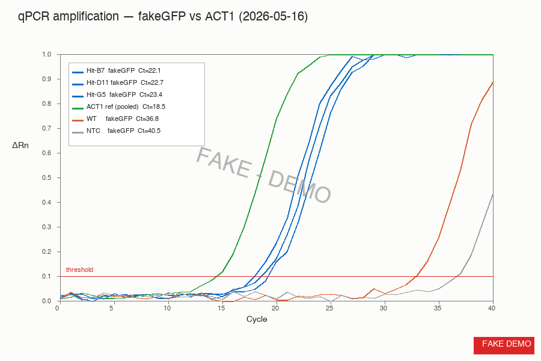
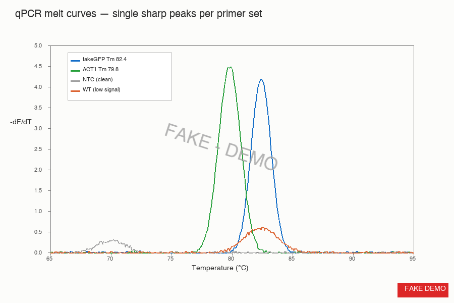
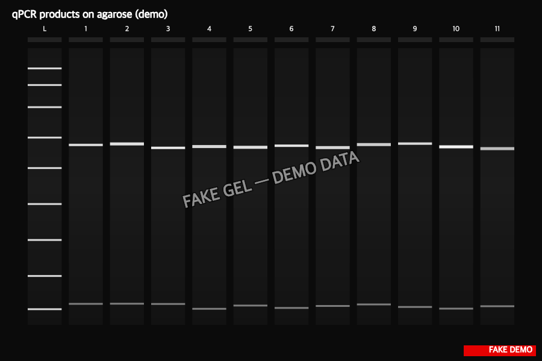

> :information_source: **This is fake demo data.** All strains, plasmids, and results below are fictional and exist only to demonstrate ResearchOS features. Do not use as a real protocol.

## qPCR results — fakeGFP transcript in 3 top hits

### Amplification curves

- **Hits (B7, D11, G5)**: fakeGFP Ct = **22.1, 22.7, 23.4** (mean 22.7)
- **WT FY**: fakeGFP Ct = **36.8** — essentially background, late and shallow
- **NTC**: no amplification before cycle 40 — clean
- **ACT1 reference**: Ct = 18.5 across all samples (pooled curve shown)

### Melt curves

- fakeGFP: single sharp peak at **Tm 82.4 °C** — matches predicted 82 °C, no primer-dimer or non-specific product
- ACT1: single sharp peak at **Tm 79.8 °C** — matches
- NTC: small broad bump at ~70 °C (primer-dimer, well below the amplicon Tm — does not affect quantification)
- WT signal: same Tm as hits (82.4) but tiny height — real fakeGFP transcript, just baseline-level (probably autofluorescence-paired leaky transcription)

### Gel (sanity check)

- 5 µL of each qPCR product on a 1.5% gel after the melt curve completed
- All hit lanes show a single clean band at ~145 bp (fakeGFP) and ~120 bp (ACT1)
- WT lane: faint band at 145 bp, consistent with the Ct 36.8 signal
- No primer-dimer products visible at the size cutoff

### ΔΔCt vs WT (relative fakeGFP transcript)

| Sample   | fakeGFP Ct | ACT1 Ct | ΔCt   | ΔΔCt vs WT | Fold-change |
|----------|------------|---------|-------|------------|-------------|
| WT       | 36.8       | 18.5    | 18.3  | 0          | 1.0×        |
| Hit-B7   | 22.1       | 18.5    | 3.6   | −14.7      | **~26,500×** |
| Hit-D11  | 22.7       | 18.5    | 4.2   | −14.1      | **~17,500×** |
| Hit-G5   | 23.4       | 18.5    | 4.9   | −13.4      | **~10,800×** |

### Conclusions

- All 3 top hits show massive fakeGFP transcript over WT — 4 to 5 orders of magnitude — clean confirmation that the fluorescence signal in task 2 is bona fide transcript, not background or autofluorescence.
- Hit ranking by transcript matches the ranking by GFP/OD600 from task 2 (B7 > D11 > G5).
- ACT1 reference is stable across samples (Ct 18.4 to 18.6) — normalization is solid.
- Single sharp melt peaks on the target Tm confirm specificity. No need to re-design primers.
- Sending the amplification + melt + gel figures to alex tonight so he can green-light the T7-B library construction Monday morning.
