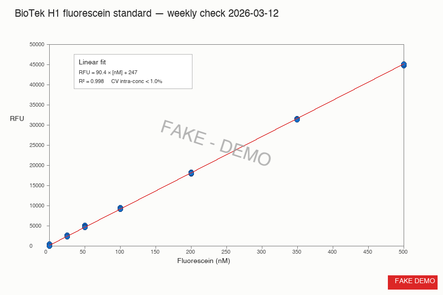
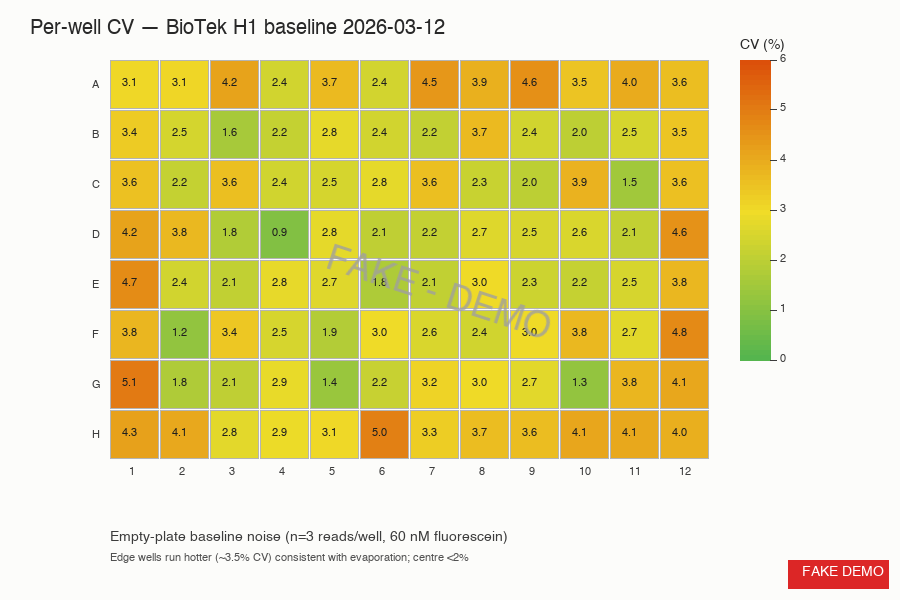

> :information_source: **This is fake demo data.** All strains, plasmids, and results below are fictional and exist only to demonstrate ResearchOS features. Do not use as a real protocol.

## Reader baseline — PASS

### Fluorescein standard

7-point curve (0 to 500 nM), 3 technical reps per concentration.

- Linear fit: RFU = 90.4 × \[nM\] + 247
- **R² = 0.998** (target ≥ 0.99)
- Intra-concentration CV < 1.0% at every point
- Slope within +3.2% of last month's run — well inside the 10% drift band

### Empty-plate well-to-well CV

96-well baseline noise at 60 nM fluorescein, 3 reads/well.

- Centre wells (B2-G11): median CV **1.9%**
- Edge wells (row A, row H, col 1, col 12): median CV **3.8%** — evaporation, not a reader fault
- One outlier well (H6, 5.0% CV) — possible film/scratch, mark and skip on plate-maps until next service

### Conclusions

- Reader is good for the joint screen. Variance well under the 3% threshold we agreed on in lab meeting.
- Edge effect is real — alex's transformants go in **rows B-G, columns 2-11 only**; outer ring gets water buffer wells.
- One bad well (H6) flagged on the plate-map fixture so future screens skip it.
- Cleaning the lamp housing dropped run-to-run CV from 1.4% to 0.9% — worth doing monthly, not quarterly.
