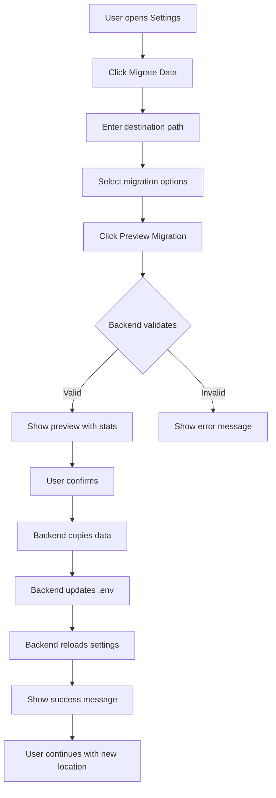
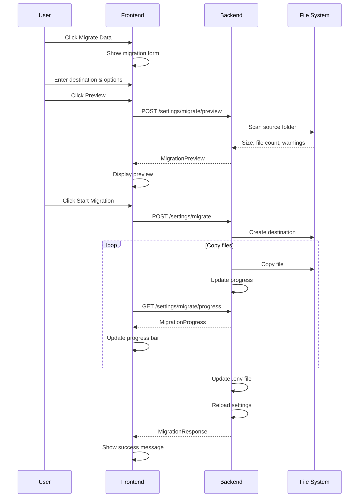

# Data Migration Feature Plan

## Overview

Add a "Migrate Data" feature to the Settings menu that allows users to easily move their ResearchOS data from one location to another. This handles multiple scenarios:
- GitHub mode → Local-only mode
- Local folder → Different local folder
- Same machine → Different machine (export/import)

## Current Architecture Analysis

### Data Storage Structure
```
{github_localpath}/
├── users/
│   ├── {current_user}/           # User's private data
│   │   ├── projects/
│   │   │   └── {id}.json
│   │   ├── tasks/
│   │   │   └── {id}.json
│   │   ├── methods/
│   │   │   └── {id}.json
│   │   ├── dependencies/
│   │   │   └── {id}.json
│   │   ├── events/
│   │   │   └── {id}.json
│   │   ├── goals/
│   │   │   └── {id}.json
│   │   ├── pcr_protocols/
│   │   │   └── {id}.json
│   │   ├── purchase_items/
│   │   │   └── {id}.json
│   │   ├── item_catalog/
│   │   │   └── {id}.json
│   │   ├── lab_links/
│   │   │   └── {id}.json
│   │   ├── notes/
│   │   │   └── {id}.json
│   │   ├── Images/
│   │   │   ├── _metadata.json
│   │   │   └── {experiment-folders}/
│   │   ├── Files/
│   │   │   ├── _metadata.json
│   │   │   └── {experiment-folders}/
│   │   ├── _counters.json
│   │   ├── _shared_with_me.json
│   │   └── _notifications.json
│   ├── public/                   # Shared methods & PCR protocols
│   │   ├── methods/
│   │   ├── pcr_protocols/
│   │   └── _counters.json
│   ├── lab/                      # Lab-level shared data
│   │   ├── funding_accounts/
│   │   └── _counters.json
│   └── _global_counters.json
└── .git/                         # Git repo (if GitHub mode)
```

### Configuration (`.env` file)
```env
GITHUB_TOKEN=ghp_xxx
GITHUB_REPO=username/repo
GITHUB_LOCALPATH=/path/to/data
CORS_ORIGINS=["http://localhost:3000"]
CURRENT_USER=GrantNickles
MAIN_USER=
STORAGE_MODE=github
```

## Migration Scenarios

### Scenario 1: GitHub Mode → Local Mode
**User wants to stop syncing to GitHub and use local-only storage.**

Steps:
1. Copy data to new local folder
2. Remove `.git` folder from destination (optional - user choice)
3. Update `.env`: set `STORAGE_MODE=local`, clear `GITHUB_TOKEN` and `GITHUB_REPO`
4. Update `GITHUB_LOCALPATH` to new location

### Scenario 2: Local → Different Local Path
**User wants to move data to a different folder on the same machine.**

Steps:
1. Copy data to new location
2. Update `GITHUB_LOCALPATH` in `.env`
3. Optionally delete original folder

### Scenario 3: Export for Different Machine
**User wants to move data to a different computer.**

Steps:
1. Export data to a portable location (e.g., a zip file or external drive)
2. On new machine: Import data and configure path

## Technical Design

### Backend API Endpoints

#### `POST /settings/migrate`
Migrate data to a new location.

**Request:**
```python
class MigrationRequest(BaseModel):
    destination_path: str           # Where to copy data
    migration_type: str             # "copy" or "move"
    target_mode: str                # "github" or "local"
    remove_git_folder: bool = False # Only for github→local migration
    new_github_repo: str = ""       # New repo if changing
    new_github_token: str = ""      # New token if changing
```

**Response:**
```python
class MigrationResponse(BaseModel):
    status: str                     # "success" or "error"
    message: str
    source_path: str
    destination_path: str
    bytes_copied: int
    files_copied: int
    new_storage_mode: str
```

#### `GET /settings/migrate/preview`
Preview what will be migrated.

**Response:**
```python
class MigrationPreview(BaseModel):
    source_path: str
    total_size_bytes: int
    file_count: int
    folder_count: int
    has_git_folder: bool
    users_included: List[str]
    warnings: List[str]             # e.g., "Path already exists"
```

### Frontend UI

Add a "Migrate Data" section to the SettingsPopup with:

1. **Current Location Display**
   - Show current path and storage mode
   - Show size of data folder

2. **Migration Options**
   - Radio buttons for migration type: Copy / Move
   - Checkbox for target mode: GitHub / Local-only
   - If Local-only: checkbox to remove .git folder

3. **Destination Path Input**
   - Text input for new path
   - "Browse" button (if possible in browser)

4. **Preview Section**
   - Shows what will be copied
   - Any warnings (path exists, permissions, etc.)

5. **Action Buttons**
   - "Preview Migration" - shows what will happen
   - "Start Migration" - executes the migration
   - Progress bar during migration

### Migration Flow Diagram



## Edge Cases & Considerations

### 1. Git Folder Handling
- When migrating from GitHub to local mode, the `.git` folder can be large
- Option to exclude it from copy (saves space/time)
- If keeping git, warn user about potential sync conflicts

### 2. Attachments (Images/Files)
- These folders can be large with binary files
- Need to handle copy progress for large files
- Verify file integrity after copy

### 3. Permissions
- Check write permissions on destination before starting
- Handle permission errors gracefully

### 4. Existing Destination
- If destination exists, warn user
- Options: Cancel, Merge, Overwrite

### 5. Multi-User Data
- The `users/` folder may contain multiple users
- Always copy all users (not just current user)
- Preserve public/ and lab/ folders

### 6. Symbolic Links
- Handle any symlinks in the data folder
- Decide whether to follow or skip

### 7. Open Files
- Warn if backend is actively writing to files
- Consider pausing file operations during migration

## Implementation Steps

### Phase 1: Backend Migration API
1. Add migration endpoints to `settings.py`
2. Implement `preview_migration()` function
3. Implement `execute_migration()` function
4. Add progress tracking for large migrations

### Phase 2: Frontend UI
1. Add migration section to `SettingsPopup.tsx`
2. Add preview functionality
3. Add progress indicator
4. Handle success/error states

### Phase 3: Testing
1. Test GitHub → Local migration
2. Test Local → Local migration
3. Test with large attachment folders
4. Test permission error handling
5. Test cancellation during migration

## API Implementation Details

### Key Functions

```python
def preview_migration(destination: str) -> MigrationPreview:
    """Preview what will be migrated without making changes."""
    # 1. Validate destination path exists or can be created
    # 2. Calculate total size and file count
    # 3. Check for existing data at destination
    # 4. Return preview with any warnings

def execute_migration(request: MigrationRequest) -> MigrationResponse:
    """Execute the migration."""
    # 1. Create destination if needed
    # 2. Copy all data with progress tracking
    # 3. Optionally remove .git folder
    # 4. Update .env file
    # 5. Reload settings
    # 6. Return result
```

### Progress Tracking

For large migrations, use Server-Sent Events (SSE) or polling:

```python
@router.get("/migrate/progress")
async def get_migration_progress():
    """Get current migration progress."""
    return {
        "status": "in_progress",  # or "complete", "error"
        "bytes_copied": 12345678,
        "total_bytes": 50000000,
        "files_copied": 150,
        "total_files": 500,
        "current_file": "Images/experiment-1/large-image.tif"
    }
```

## Security Considerations

1. **Path Validation**: Ensure destination is not a system directory
2. **Token Handling**: Clear GitHub token from memory after updating .env
3. **Access Control**: Only allow migration for authenticated users
4. **Backup**: Consider creating a backup before migration

## Alternative: Simple Approach

If the full migration feature is too complex, a simpler approach:

1. Add a "Change Data Path" button in settings
2. User manually copies the folder (show instructions)
3. User enters new path in settings
4. System validates and updates configuration

This puts the responsibility on the user but is much simpler to implement.

## Decision: Full Automated Migration

**User chose**: Go straight to Full Automated Migration - copy everything via API

This approach provides the best user experience with a single-click migration process.

---

## Detailed Implementation Plan

### Backend Implementation (`backend/app/routers/settings.py`)

#### 1. Add Migration Models
```python
class MigrationRequest(BaseModel):
    destination_path: str
    migration_type: str = "copy"  # "copy" or "move"
    target_mode: str = "local"    # "github" or "local"
    remove_git_folder: bool = False
    new_github_repo: str = ""
    new_github_token: str = ""

class MigrationPreview(BaseModel):
    source_path: str
    destination_path: str
    total_size_bytes: int
    file_count: int
    folder_count: int
    has_git_folder: bool
    users_found: List[str]
    warnings: List[str]
    can_proceed: bool

class MigrationProgress(BaseModel):
    status: str  # "idle", "in_progress", "complete", "error"
    bytes_copied: int
    total_bytes: int
    files_copied: int
    total_files: int
    current_file: str
    error_message: str = ""

class MigrationResponse(BaseModel):
    status: str
    message: str
    source_path: str
    destination_path: str
    bytes_copied: int
    files_copied: int
    new_storage_mode: str
```

#### 2. Add Migration Endpoints
- `POST /settings/migrate/preview` - Preview migration
- `POST /settings/migrate` - Execute migration
- `GET /settings/migrate/progress` - Get progress (for polling)

#### 3. Migration Helper Functions
```python
def calculate_folder_size(path: Path) -> tuple[int, int, int]:
    """Returns (total_bytes, file_count, folder_count)"""

def copy_folder_with_progress(src: Path, dst: Path, progress_callback) -> int:
    """Copy folder contents with progress tracking"""

def validate_destination(path: str) -> tuple[bool, List[str]]:
    """Validate destination path and return any warnings"""
```

### Frontend Implementation (`frontend/src/components/SettingsPopup.tsx`)

#### 1. Add Migration Section
Add a collapsible "Migrate Data" section at the bottom of the settings popup.

#### 2. Migration UI Components
- Current location display with size info
- Destination path input
- Migration type selector (Copy/Move)
- Target mode selector (GitHub/Local)
- Options checkboxes (remove .git folder)
- Preview button and results display
- Progress bar during migration
- Success/error messages

#### 3. Add API Functions (`frontend/src/lib/api.ts`)
```typescript
export const migrationApi = {
  preview: async (request: MigrationRequest): Promise<MigrationPreview>,
  execute: async (request: MigrationRequest): Promise<MigrationResponse>,
  getProgress: async (): Promise<MigrationProgress>,
};
```

### Migration Flow



### File Structure After Implementation

```
backend/
├── app/
│   ├── routers/
│   │   └── settings.py        # Add migration endpoints
│   └── ...

frontend/
├── src/
│   ├── components/
│   │   └── SettingsPopup.tsx  # Add migration UI section
│   └── lib/
│       └── api.ts             # Add migration API functions
```

### Edge Cases to Handle

1. **Destination already exists**
   - Warning in preview
   - Option to merge or cancel

2. **Insufficient disk space**
   - Check before starting
   - Clear error message

3. **Permission denied**
   - Check write permissions
   - Helpful error message

4. **Large files (attachments)**
   - Progress tracking
   - No timeout issues

5. **Migration cancelled**
   - Cleanup partial copy
   - Restore original state

6. **Network paths**
   - Support for network drives
   - Handle network errors
