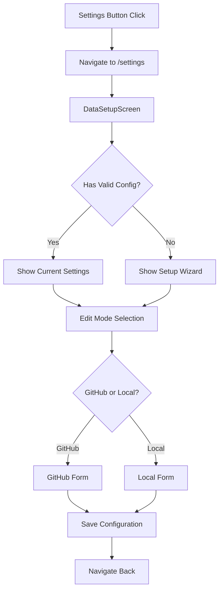

# Data Setup Screen Implementation Plan

## Overview

Revamp the settings button to open a full-screen Data Setup page instead of a popup. This page will match the aesthetic of the login screen and include all features from `ResearchFolderSetup.tsx`.

## Current State Analysis

### Existing Components

1. **SettingsPopup.tsx** - Current popup with:
   - GitHub token input (masked display)
   - GitHub repository input
   - Local path input
   - Current user input
   - Verify and Save buttons

2. **UserLoginScreen.tsx** - Reference aesthetic:
   - Full-screen dark gradient background
   - Background pattern overlay
   - Centered glass-morphism card
   - Logo and title at top
   - Footer text at bottom

3. **ResearchFolderSetup.tsx** - Features to incorporate:
   - Mode selection (GitHub vs Local)
   - GitHub form with token, repo, path
   - Local form with just path
   - Create folder structure checkbox
   - Same visual aesthetic

### Backend Endpoints Available

- `GET /settings` - Get current settings
- `PUT /settings` - Update settings
- `POST /settings/verify` - Verify settings work
- `GET /settings/check-path` - Check data path validity
- `GET /settings/storage-mode` - Get storage mode
- `POST /settings/setup-folder` - Setup folder with mode selection
- `POST /settings/reload` - Reload settings from .env

## Proposed Architecture

### New Route Structure

```
frontend/src/app/settings/page.tsx    # New settings page route
frontend/src/components/DataSetupScreen.tsx  # Main settings component (optional, can be inline)
```

### Component Flow



## UI Design

### Layout Structure

```
┌─────────────────────────────────────────────────────────────┐
│                  Full Screen Dark Gradient                   │
│  ┌─────────────────────────────────────────────────────┐    │
│  │                    Logo + Title                      │    │
│  │              ResearchOS Data Setup                   │    │
│  └─────────────────────────────────────────────────────┘    │
│                                                             │
│  ┌─────────────────────────────────────────────────────┐    │
│  │              Glass-morphism Card                     │    │
│  │  ┌─────────────────────────────────────────────┐    │    │
│  │  │         Current Status Banner                │    │    │
│  │  │   [Configured/Not Configured] + Mode        │    │    │
│  │  └─────────────────────────────────────────────┘    │    │
│  │                                                      │    │
│  │  ┌─────────────────────────────────────────────┐    │    │
│  │  │         Mode Selection Cards                 │    │    │
│  │  │   [GitHub Repository]  [Local Folder]       │    │    │
│  │  └─────────────────────────────────────────────┘    │    │
│  │                                                      │    │
│  │  ┌─────────────────────────────────────────────┐    │    │
│  │  │         Configuration Form                   │    │    │
│  │  │   - Data Path                               │    │    │
│  │  │   - GitHub Token (if GitHub mode)           │    │    │
│  │  │   - GitHub Repo (if GitHub mode)            │    │    │
│  │  │   - Create folder checkbox                  │    │    │
│  │  └─────────────────────────────────────────────┘    │    │
│  │                                                      │    │
│  │  ┌─────────────────────────────────────────────┐    │    │
│  │  │         Action Buttons                       │    │    │
│  │  │   [Back] [Verify] [Save]                    │    │    │
│  │  └─────────────────────────────────────────────┘    │    │
│  └─────────────────────────────────────────────────────┘    │
│                                                             │
│  ┌─────────────────────────────────────────────────────┐    │
│  │                   Footer Text                        │    │
│  └─────────────────────────────────────────────────────┘    │
└─────────────────────────────────────────────────────────────┘
```

### Visual Styling

Match the login screen aesthetic:
- Background: `bg-gradient-to-br from-slate-900 via-slate-800 to-slate-900`
- Pattern overlay: SVG cross pattern at 5% opacity
- Card: `bg-white/10 backdrop-blur-xl rounded-2xl border border-white/20`
- Text: White for headings, slate-400 for secondary
- Buttons: Gradient for primary, transparent for secondary

## Implementation Details

### 1. Create Settings Page Route

File: `frontend/src/app/settings/page.tsx`

```typescript
// Page component that renders DataSetupScreen
// Uses same layout pattern as login page
// Handles navigation back to previous page
```

### 2. DataSetupScreen Component Features

#### Mode Selection Section
- Two large clickable cards for GitHub vs Local
- Visual indicators for current selection
- Icons and descriptions for each option

#### GitHub Configuration Form
- Local Repository Path input
- GitHub Repository input (username/repo format)
- GitHub Personal Access Token input (password type)
- Create folder structure checkbox
- Link to create GitHub token

#### Local Configuration Form
- Local Folder Path input
- Create folder structure checkbox
- Info box about cloud storage compatibility

#### Status Display
- Current configuration status
- Storage mode indicator
- Masked token display if configured

#### Actions
- Back button (navigate to previous page or home)
- Verify button (test current configuration)
- Save button (update configuration)

### 3. Update Settings Button

In `frontend/src/app/page.tsx`:
- Change from opening popup to navigating to `/settings`
- Same for any other pages with settings button

### 4. API Integration

Use existing API functions from `frontend/src/lib/api.ts`:
- `settingsApi.get()` - Load current settings
- `settingsApi.update()` - Save settings
- `settingsApi.verify()` - Verify configuration
- `settingsApi.setupFolder()` - Setup with mode selection

## File Changes Summary

### New Files
1. `frontend/src/app/settings/page.tsx` - Settings page route

### Modified Files
1. `frontend/src/app/page.tsx` - Update settings button behavior
2. `frontend/src/lib/api.ts` - Ensure all needed API functions exist

### Deprecated Files
1. `frontend/src/components/SettingsPopup.tsx` - Can be removed after migration

## User Flow

1. User clicks settings button (gear icon) in bottom-right
2. App navigates to `/settings` page
3. Page loads current settings and displays status
4. User can:
   - View current configuration
   - Switch between GitHub and Local mode
   - Edit configuration values
   - Verify configuration works
   - Save changes
5. User clicks Back to return to previous page

## Error Handling

- Display error messages in red alert boxes
- Handle API failures gracefully
- Validate inputs before submission
- Show loading states during API calls

## Success States

- Green success message after saving
- Verification results display
- Automatic reload after configuration change

## Implementation Order

1. Create the settings page route file
2. Implement the DataSetupScreen component
3. Add mode selection UI
4. Add GitHub configuration form
5. Add Local configuration form
6. Add status display and actions
7. Update settings button navigation
8. Test and verify functionality
9. Remove old SettingsPopup component
