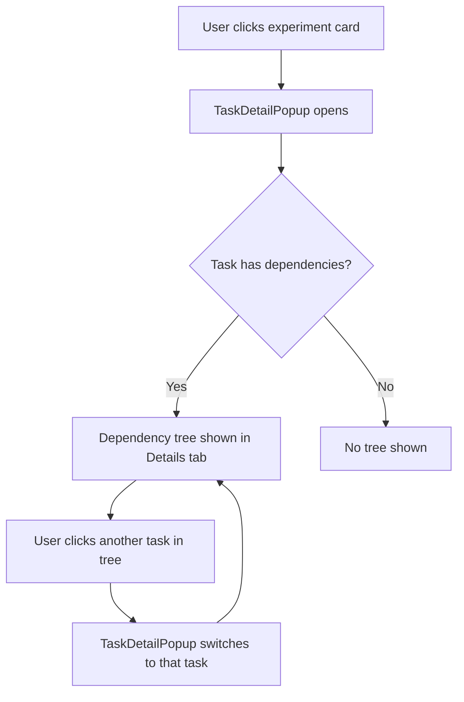

# Plan: Make Dependency Tree Clickable & Remove Experiment Chain Popup

## Overview

The current implementation has two UI elements for navigating dependency chains:
1. **Experiment Chain Popup** - A sidebar that appears when viewing a task in a chain
2. **Dependency Tree** - A visual tree in the Details tab showing the chain

This plan consolidates these by making the dependency tree nodes clickable and removing the redundant chain popup.

## Current Implementation

### Experiment Chain Popup (to be removed)
- **Location**: [`frontend/src/app/experiments/page.tsx:932-991`](frontend/src/app/experiments/page.tsx:932)
- **State**: `chainSidebarTasks` - stores the tasks in the chain
- **Trigger**: Shown when `chainSidebarTasks` has multiple tasks
- **Function**: Allows clicking to switch between tasks in the chain

### Dependency Tree (to be enhanced)
- **Location**: [`frontend/src/components/TaskDetailPopup.tsx:1322-1435`](frontend/src/components/TaskDetailPopup.tsx:1322)
- **Current behavior**: Shows hover popup with task details when clicking other tasks
- **Needed change**: Make clicking a task node actually open that task

## Implementation Steps

### Step 1: Modify TaskDetailPopup to Support Task Navigation

The TaskDetailPopup needs a way to notify the parent when a different task should be opened.

**Changes to TaskDetailPopup.tsx:**

1. Add an `onNavigateToTask` callback prop:
```typescript
interface TaskDetailPopupProps {
  task: Task;
  project?: Project;
  onClose: () => void;
  onNavigateToTask?: (task: Task) => void;  // NEW
}
```

2. Modify the dependency tree node click handler to call the callback instead of showing a hover popup:
```typescript
// In the dependency tree rendering (around line 1369)
onClick={(e) => {
  if (!isCurrentTask && onNavigateToTask) {
    onNavigateToTask(chainTask);  // Navigate to the clicked task
  }
}}
```

3. Update the task node styling to make it more obviously clickable:
- Add cursor-pointer
- Add hover effects (slight scale or shadow)
- Consider adding a "click to view" hint

### Step 2: Modify Experiments Page to Handle Navigation

**Changes to experiments/page.tsx:**

1. Remove the chain sidebar popup code (lines 932-991)

2. Remove the `chainSidebarTasks` state:
```typescript
// REMOVE THIS:
const [chainSidebarTasks, setChainSidebarTasks] = useState<Task[] | null>(null);
```

3. Simplify `handleChainClick` to just open the task directly:
```typescript
const handleChainClick = useCallback((chain: ExperimentChain) => {
  setSelectedTask(chain.rootTask);  // Just open the root task
}, []);
```

4. Pass `onNavigateToTask` to TaskDetailPopup:
```typescript
<TaskDetailPopup
  task={selectedTask}
  project={projects.find((p) => p.id === selectedTask.project_id)}
  onClose={() => setSelectedTask(null)}
  onNavigateToTask={(task) => setSelectedTask(task)}  // NEW
/>
```

### Step 3: Update Dependency Tree UI

Make the dependency tree more obviously interactive:

1. **Visual changes**:
   - Add a subtle "open" icon on hover for non-current tasks
   - Change cursor to pointer
   - Add a subtle hover animation (scale or shadow)
   - Remove the current hover popup behavior

2. **Accessibility**:
   - Add keyboard navigation support (Enter to open)
   - Add aria-label for screen readers

## Files to Modify

| File | Changes |
|------|---------|
| `frontend/src/components/TaskDetailPopup.tsx` | Add `onNavigateToTask` prop, modify dependency tree click behavior |
| `frontend/src/app/experiments/page.tsx` | Remove chain sidebar, simplify click handlers |

## UI Flow After Changes



## Benefits

1. **Reduced UI clutter** - One less popup on screen
2. **More intuitive** - Clicking a task in the tree opens it, which is the expected behavior
3. **Consistent navigation** - All task navigation happens through the dependency tree
4. **Better use of screen space** - The dependency tree is already visible; no need for a separate sidebar

## Considerations

1. **Task switching animation** - Consider adding a smooth transition when switching between tasks
2. **Unsaved changes warning** - If the user has unsaved changes in the current task, warn before switching
3. **Back navigation** - Consider adding a "back" button to return to the previous task

## Testing Checklist

- [ ] Clicking a task in the dependency tree opens that task
- [ ] Chain sidebar no longer appears
- [ ] Task switching works correctly
- [ ] Dependency tree displays correctly for all chain configurations
- [ ] No console errors
