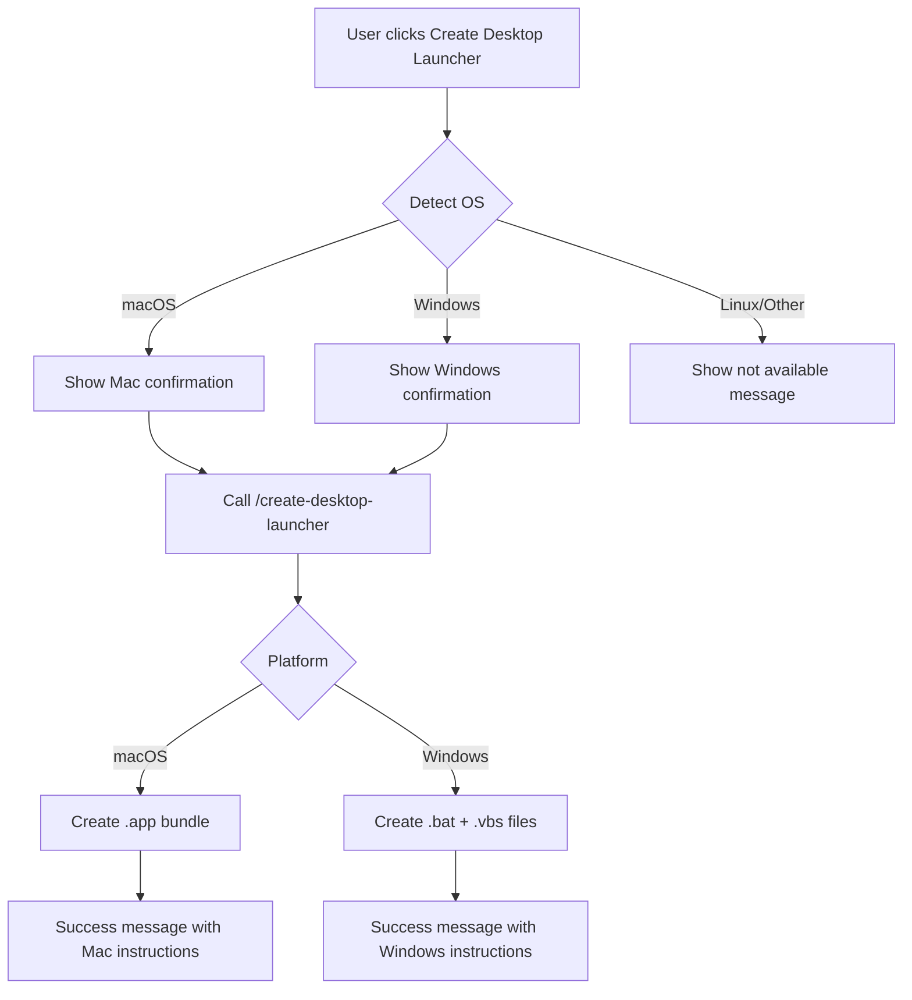

# Desktop Launcher Cross-Platform Support Plan

## Overview

Add Windows support to the desktop launcher feature, allowing users on both macOS and Windows to create desktop shortcuts that launch ResearchOS with one click.

## Current Implementation

### Frontend
- [`MacAppLauncherPopup.tsx`](frontend/src/components/MacAppLauncherPopup.tsx) - Detects macOS via user agent and shows error for other platforms
- Calls `/settings/create-mac-app` endpoint

### Backend
- [`settings.py`](backend/app/routers/settings.py) - `/create-mac-app` endpoint creates a `.app` bundle on macOS only

## Proposed Changes

### 1. Rename Component
Rename `MacAppLauncherPopup.tsx` to `DesktopLauncherPopup.tsx` to reflect cross-platform nature.

### 2. Frontend Changes



#### OS Detection Logic
```typescript
const detectOS = (): 'mac' | 'windows' | 'linux' | 'unknown' => {
    const userAgent = navigator.userAgent.toLowerCase();
    if (userAgent.includes('mac')) return 'mac';
    if (userAgent.includes('windows')) return 'windows';
    if (userAgent.includes('linux')) return 'linux';
    return 'unknown';
};
```

### 3. Backend Changes

#### New Unified Endpoint
Replace `/create-mac-app` with `/create-desktop-launcher` that handles both platforms:

```python
@router.post("/create-desktop-launcher", response_model=DesktopLauncherResponse)
async def create_desktop_launcher(request: DesktopLauncherRequest):
    platform_type = platform.system()  # 'Darwin', 'Windows', 'Linux'
    
    if platform_type == 'Darwin':
        return create_mac_app(request)
    elif platform_type == 'Windows':
        return create_windows_launcher(request)
    else:
        raise HTTPException(status_code=400, detail="Unsupported platform")
```

#### Windows Launcher Creation
For Windows, create two files:

1. **Batch file** - The actual launcher script:
```batch
@echo off
cd /d "%~dp0..\..\.."
start /b cmd /c "start.sh"
timeout /t 5 /nobreak > nul
start http://localhost:3000
```

Wait, Windows doesn't run `.sh` files directly. We need a different approach:

**Option A: Use PowerShell script**
```powershell
# ResearchOS Launcher
$projectDir = Split-Path -Parent $PSScriptRoot
Set-Location $projectDir

# Start backend
Start-Process -FilePath "python" -ArgumentList "-m", "uvicorn", "app.main:app", "--host", "0.0.0.0", "--port", "8000" -WindowStyle Hidden

# Start frontend
Set-Location "frontend"
Start-Process -FilePath "npm" -ArgumentList "run", "dev" -WindowStyle Hidden

# Wait and open browser
Start-Sleep -Seconds 5
Start-Process "http://localhost:3000"
```

**Option B: Create a .vbs wrapper to run batch file hidden**
This prevents the command window from flashing.

### 4. Windows Launcher Structure

```
%USERPROFILE%\Desktop\ResearchOS\
├── ResearchOS.bat      # Main launcher (runs hidden)
├── ResearchOS.vbs      # VBScript wrapper to hide console
└── ResearchOS.ico      # Optional: custom icon
```

#### Batch File Content
```batch
@echo off
cd /d "%~dp0"
cd ..\..\..

REM Kill existing processes on ports
for /f "tokens=5" %%a in ('netstat -ano ^| findstr :8000') do taskkill /F /PID %%a 2>nul
for /f "tokens=5" %%a in ('netstat -ano ^| findstr :3000') do taskkill /F /PID %%a 2>nul

REM Start backend
cd backend
start /b python -m uvicorn app.main:app --host 0.0.0.0 --port 8000

REM Start frontend
cd ..\frontend
start /b npm run dev

REM Wait and open browser
timeout /t 5 /nobreak > nul
start http://localhost:3000
```

#### VBS Wrapper Content - to hide console window
```vbscript
Set WshShell = CreateObject("WScript.Shell")
WshShell.Run chr(34) & CreateObject("Scripting.FileSystemObject").GetParentFolderName(WScript.ScriptFullName) & "\ResearchOS.bat" & chr(34), 0
Set WshShell = Nothing
```

### 5. UI Changes

#### Platform-Specific Messaging

| Element | macOS | Windows |
|---------|-------|---------|
| Title | Create Desktop Launcher | Create Desktop Launcher |
| Confirm | You're using a Mac! | You're using Windows! |
| Location | Desktop - drag to Dock | Desktop - pin to Taskbar |
| Instructions | Right-click > Open first time | Double-click to run |
| Security | Gatekeeper bypass info | Windows Defender info |

### 6. Implementation Steps

1. **Backend**: Add `create_windows_launcher()` function in `settings.py`
2. **Backend**: Create unified `/create-desktop-launcher` endpoint
3. **Frontend**: Rename component to `DesktopLauncherPopup.tsx`
4. **Frontend**: Update OS detection to handle Windows
5. **Frontend**: Update API call to new endpoint
6. **Frontend**: Add platform-specific UI text
7. **Testing**: Test on both platforms

### 7. Files to Modify

| File | Changes |
|------|---------|
| `backend/app/routers/settings.py` | Add Windows launcher creation, unify endpoint |
| `frontend/src/components/MacAppLauncherPopup.tsx` | Rename and update for cross-platform |
| `frontend/src/components/SettingsPopup.tsx` | Update import if needed |

### 8. Considerations

#### Windows-Specific Issues
- **Console window**: Use VBS wrapper to hide it
- **Path separators**: Use `\\` in Python strings
- **Process management**: Windows uses different commands than Unix
- **Security**: Windows Defender may flag unsigned scripts

#### Linux Support
- Could add `.desktop` file creation for Linux
- Lower priority since user base is smaller

## Decisions

- **Endpoint**: Replace `/create-mac-app` with unified `/create-desktop-launcher` endpoint
- **Linux support**: Yes, add `.desktop` file creation for Linux
- **Windows console**: Show console window for debugging purposes

## Linux Launcher Implementation

For Linux, create a `.desktop` file:

```
[Desktop Entry]
Version=1.0
Name=ResearchOS
Comment=Launch ResearchOS
Exec=/bin/bash -c "cd /path/to/project && ./start.sh"
Icon=applications-science
Terminal=true
Type=Application
Categories=Science;
```

The `.desktop` file will be created in `~/Desktop/` and marked as executable.
