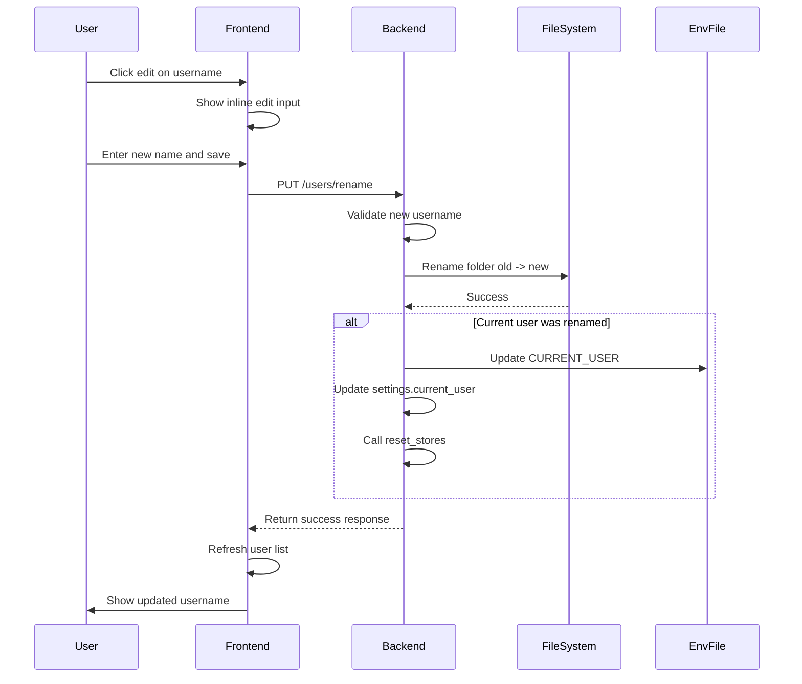

# Editable User Profile Names - Implementation Plan

## Overview

This plan outlines the implementation for allowing users to rename their profile names after creation. When a username is changed, the corresponding data folder must be renamed while preserving all existing data, and the `.env` file must be updated to reflect the new username.

## Current Architecture

### User Data Storage
- User data is stored in: `{GITHUB_LOCALPATH}/data/users/{username}/`
- Each user folder contains subdirectories: `projects`, `tasks`, `dependencies`, `methods`, `events`, `goals`, `pcr_protocols`, `purchase_items`, `item_catalog`, `lab_links`
- A `_counters.json` file tracks auto-increment IDs for each entity type

### Current User Management
- Backend: [`backend/app/routers/users.py`](backend/app/routers/users.py) handles user CRUD operations
- Frontend: [`frontend/src/components/UserLoginScreen.tsx`](frontend/src/components/UserLoginScreen.tsx) displays user selection UI
- The `.env` file stores `CURRENT_USER` to track the active user
- The `_update_env_with_user()` function updates the `.env` when switching users

## Implementation Plan

### 1. Backend Changes

#### 1.1 New Request/Response Models

Add to [`backend/app/routers/users.py`](backend/app/routers/users.py):

```python
class RenameUserRequest(BaseModel):
    """Request to rename a user."""
    old_username: str
    new_username: str

class RenameUserResponse(BaseModel):
    """Response after renaming a user."""
    status: str
    old_username: str
    new_username: str
```

#### 1.2 New Endpoint: PUT /users/rename

Add to [`backend/app/routers/users.py`](backend/app/routers/users.py):

```python
@router.put("/rename", response_model=RenameUserResponse)
async def rename_user(request: RenameUserRequest):
    """Rename a user profile and its data folder."""
```

#### 1.3 Rename Logic Implementation

The rename function must:

1. **Validate inputs**:
   - `old_username` must exist as a user folder
   - `new_username` must not be empty
   - `new_username` must be alphanumeric/underscores only
   - `new_username` must not already exist
   - `new_username` must not be a reserved name (`public`, `.git`, `.github`)

2. **Rename the folder**:
   - Use `shutil.move()` to safely rename the directory
   - Source: `{users_dir}/{old_username}`
   - Destination: `{users_dir}/{new_username}`
   - This preserves all contents automatically

3. **Update .env if current user was renamed**:
   - Check if `settings.current_user == old_username`
   - If so, call `_update_env_with_user(new_username)`
   - Update `settings.current_user = new_username`
   - Call `reset_stores()` to reinitialize storage paths

#### 1.4 Helper Function

```python
def _rename_user_folder(old_username: str, new_username: str) -> None:
    """Rename a user folder while preserving all data."""
    users_dir = _get_users_dir()
    old_path = users_dir / old_username
    new_path = users_dir / new_username
    
    if not old_path.exists():
        raise ValueError(f"User '{old_username}' does not exist")
    
    if new_path.exists():
        raise ValueError(f"User '{new_username}' already exists")
    
    # Rename the folder - all contents are preserved
    shutil.move(str(old_path), str(new_path))
```

### 2. Frontend Changes

#### 2.1 UI Design - Inline Edit Mode

Add an edit button to each user item in the list. When clicked:
- Replace the username display with an editable text input
- Show Save and Cancel buttons
- Validate input before submitting

#### 2.2 Add API Method

Add to [`frontend/src/lib/api.ts`](frontend/src/lib/api.ts):

```typescript
export interface RenameUserResponse {
  status: string;
  old_username: string;
  new_username: string;
}

export const usersApi = {
  // ... existing methods
  rename: (oldUsername: string, newUsername: string) =>
    api.put<RenameUserResponse>("/users/rename", { 
      old_username: oldUsername, 
      new_username: newUsername 
    }).then((r) => r.data),
};
```

#### 2.3 Component Changes to UserLoginScreen.tsx

Add state for editing:
```typescript
const [editingUser, setEditingUser] = useState<string | null>(null);
const [editValue, setEditValue] = useState("");
```

Add edit button to user list items:
- Show a pencil icon on hover
- Clicking enters edit mode for that user

Add inline edit UI:
- Text input with the current username
- Save button (validates and submits)
- Cancel button (exits edit mode)

Handle rename success:
- Refresh the user list
- If the renamed user was logged in, the backend will have updated `.env`

### 3. Data Flow Diagram



### 4. Error Handling

| Error Case | HTTP Status | Error Message |
|------------|-------------|---------------|
| Old username does not exist | 404 | User X does not exist |
| New username is empty | 400 | New username cannot be empty |
| New username has invalid chars | 400 | Username can only contain letters, numbers, and underscores |
| New username already exists | 409 | User X already exists |
| New username is reserved | 400 | Username X is reserved |
| Folder rename fails | 500 | Failed to rename user folder |

### 5. Files to Modify

| File | Changes |
|------|---------|
| [`backend/app/routers/users.py`](backend/app/routers/users.py) | Add `RenameUserRequest`, `RenameUserResponse` models, `_rename_user_folder()` helper, and `PUT /users/rename` endpoint |
| [`frontend/src/lib/api.ts`](frontend/src/lib/api.ts) | Add `RenameUserResponse` interface and `usersApi.rename()` method |
| [`frontend/src/components/UserLoginScreen.tsx`](frontend/src/components/UserLoginScreen.tsx) | Add edit mode state, edit button UI, inline edit form, and rename handler |

### 6. Testing Checklist

- [ ] Rename user that is NOT the current user
  - Folder should be renamed
  - Data should be intact
  - `.env` should NOT change
- [ ] Rename user that IS the current user
  - Folder should be renamed
  - Data should be intact
  - `.env` should update to new username
  - `settings.current_user` should update
  - Stores should reinitialize
- [ ] Try to rename to existing username (should fail)
- [ ] Try to rename with invalid characters (should fail)
- [ ] Try to rename to reserved name like "public" (should fail)
- [ ] Cancel edit mode (should not make any changes)
- [ ] Verify all data files are preserved after rename
