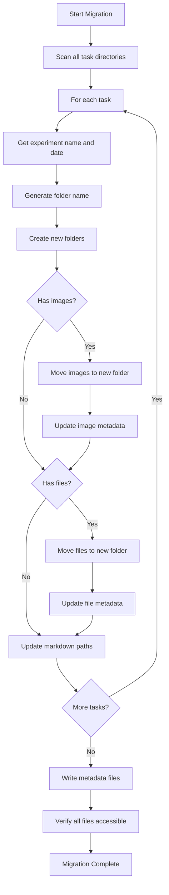

# File and Image Storage Restructuring Plan

## Overview

This plan outlines the restructuring of file and image storage to use experiment-specific nested folders with metadata tracking. This improves organization, prevents filename collisions, and makes manual navigation of the data folder easier.

## Current Structure

```
data-repo/
├── users/
│   └── {username}/
│       └── results/
│           └── task-{id}/
│               ├── notes.md
│               ├── results.md
│               ├── Images/
│               │   └── {timestamp}-{filename}
│               ├── NotesPDFs/
│               │   └── {timestamp}-{filename}
│               └── ResultsPDFs/
│                   └── {timestamp}-{filename}
```

**Problems:**
- All images for an experiment are in a flat folder
- No metadata tracking for files/images
- Potential for filename collisions
- Difficult to manually navigate and find files

## New Structure

```
data-repo/
├── users/
│   └── {username}/
│       ├── Images/
│       │   ├── _metadata.json
│       │   └── {date-name}/
│       │       └── {filename}
│       └── Files/
│           ├── _metadata.json
│           └── {date-name}/
│               └── {filename}
```

**Where `{date-name}` format is:** `Mar-04-2026-MyExperimentName`
- Uses abbreviated month name to avoid US/EU date confusion
- Experiment name with spaces replaced by hyphens
- Example: `Mar-04-2026-Protein-Purification-Day-1`

## Metadata Schema

### Images/_metadata.json

```json
{
  "version": 1,
  "images": [
    {
      "id": 1,
      "filename": "gel-result.png",
      "path": "Images/Mar-04-2026-Protein-Purification/gel-result.png",
      "experiment_id": 42,
      "experiment_name": "Protein Purification Day 1",
      "project_name": "Enzyme Study",
      "uploaded_at": "2026-03-04T14:30:00Z",
      "file_size": 2456789,
      "file_type": "image/png",
      "folder": "Mar-04-2026-Protein-Purification"
    }
  ]
}
```

### Files/_metadata.json

```json
{
  "version": 1,
  "files": [
    {
      "id": 1,
      "filename": "protocol.pdf",
      "path": "Files/Mar-04-2026-Protein-Purification/protocol.pdf",
      "experiment_id": 42,
      "experiment_name": "Protein Purification Day 1",
      "project_name": "Enzyme Study",
      "uploaded_at": "2026-03-04T14:35:00Z",
      "file_size": 1234567,
      "file_type": "application/pdf",
      "folder": "Mar-04-2026-Protein-Purification",
      "attachment_type": "notes"  // "notes" or "results"
    }
  ]
}
```

## Implementation Steps

### Phase 1: Backend Schema and Storage

1. **Create Pydantic schemas** in `backend/app/schemas.py`:
   - `ImageMetadata` - schema for image metadata entries
   - `FileMetadata` - schema for file metadata entries
   - `ImageMetadataCreate` - request schema for creating image metadata
   - `FileMetadataCreate` - request schema for creating file metadata

2. **Create metadata storage layer** in `backend/app/storage.py`:
   - `ImageMetadataStore` - manages the Images/_metadata.json file
   - `FileMetadataStore` - manages the Files/_metadata.json file
   - Methods: `add_entry`, `remove_entry`, `get_by_experiment`, `get_by_id`, `list_all`

3. **Create helper functions** for folder naming:
   - `generate_experiment_folder_name(experiment_name, date)` - creates folder name like "Mar-04-2026-My-Experiment"
   - `sanitize_experiment_name(name)` - removes spaces and special characters

### Phase 2: Backend API Endpoints

4. **Create new router** `backend/app/routers/attachments.py`:
   - `POST /attachments/images` - upload image with new folder structure
   - `POST /attachments/files` - upload file with new folder structure
   - `GET /attachments/images` - list all images with optional filters
   - `GET /attachments/files` - list all files with optional filters
   - `GET /attachments/images/{experiment_id}` - get images for experiment
   - `GET /attachments/files/{experiment_id}` - get files for experiment
   - `DELETE /attachments/images/{id}` - delete image and metadata entry
   - `DELETE /attachments/files/{id}` - delete file and metadata entry

5. **Update existing endpoints** in `backend/app/routers/github_proxy.py`:
   - Keep existing `/github/image` endpoint for backward compatibility
   - Add deprecation notice

### Phase 3: Migration Script

6. **Create migration script** `backend/app/migrations/migrate_attachments.py`:
   - Scan all existing `results/task-{id}/` directories
   - For each task, get experiment name and start_date
   - Generate new folder name
   - Move images to `Images/{folder-name}/`
   - Move files to `Files/{folder-name}/`
   - Update metadata files
   - Track all moved files for markdown path updates

7. **Create markdown path updater** `backend/app/migrations/update_markdown_paths.py`:
   - For each experiment's notes.md and results.md
   - Find all image references: ``
   - Replace with new path: ``
   - Or use relative path from experiment location

### Phase 4: Frontend Updates

8. **Update ExperimentPanel.tsx**:
   - Modify `handleImageUpload` to use new API endpoint
   - Update image path references in markdown
   - Modify `handleFileUpload` to use new API endpoint

9. **Update ResultsEditor.tsx**:
   - Same changes as ExperimentPanel

10. **Update TaskDetailPopup.tsx**:
    - Same changes for image/file uploads

11. **Update LiveMarkdownEditor.tsx**:
    - Update `imageBasePath` handling
    - Update image path resolution for preview

12. **Update markdown-helpers.tsx**:
    - Update image path resolution to handle new folder structure

### Phase 5: Testing and Cleanup

13. **Test migration script** on a backup of data

14. **Run migration** on production data

15. **Verify all images and files** are accessible

16. **Clean up old directories** after successful migration

## Folder Name Generation

```python
from datetime import date

def generate_experiment_folder_name(experiment_name: str, exp_date: date) -> str:
    """Generate folder name like 'Mar-04-2026-My-Experiment'."""
    # Format date as abbreviated month-day-year
    date_str = exp_date.strftime("%b-%d-%Y")  # Mar-04-2026
    
    # Sanitize experiment name
    safe_name = sanitize_experiment_name(experiment_name)
    
    return f"{date_str}-{safe_name}"

def sanitize_experiment_name(name: str) -> str:
    """Remove special characters and replace spaces with hyphens."""
    # Replace spaces with hyphens
    safe = name.replace(" ", "-")
    # Remove any character that's not alphanumeric, hyphen, or underscore
    safe = "".join(c for c in safe if c.isalnum() or c in "-_")
    # Remove consecutive hyphens
    while "--" in safe:
        safe = safe.replace("--", "-")
    # Remove leading/trailing hyphens
    safe = safe.strip("-")
    return safe
```

## Markdown Path Updates

When updating markdown files, we need to change:

**Old path:**
```markdown

```

**New path:**
```markdown

```

Or we could use a simpler approach with just the filename if we implement a path resolver:

```markdown

```

The backend would resolve this based on the experiment context.

## Migration Workflow Diagram



## Backward Compatibility

To maintain backward compatibility during transition:

1. Keep old directory structure readable
2. Support both old and new path formats in markdown preview
3. Add deprecation warnings to old API endpoints
4. Eventually remove old structure after migration is verified

## Questions Resolved

1. **Date format**: Use abbreviated month format (Mar-04-2026) to avoid US/EU confusion
2. **Metadata location**: Single `_metadata.json` file per folder (Images and Files)
3. **Migration**: Full migration including markdown path updates

## Estimated File Changes

| File | Changes |
|------|---------|
| `backend/app/schemas.py` | Add ImageMetadata, FileMetadata schemas |
| `backend/app/storage.py` | Add metadata store classes |
| `backend/app/routers/attachments.py` | New file - attachment endpoints |
| `backend/app/routers/github_proxy.py` | Add deprecation notice |
| `backend/app/migrations/migrate_attachments.py` | New file - migration script |
| `frontend/src/components/ExperimentPanel.tsx` | Update upload handlers |
| `frontend/src/components/ResultsEditor.tsx` | Update upload handlers |
| `frontend/src/components/TaskDetailPopup.tsx` | Update upload handlers |
| `frontend/src/components/LiveMarkdownEditor.tsx` | Update path handling |
| `frontend/src/lib/markdown-helpers.tsx` | Update path resolution |
| `frontend/src/lib/api.ts` | Add new API methods |
| `frontend/src/lib/types.ts` | Add new types |