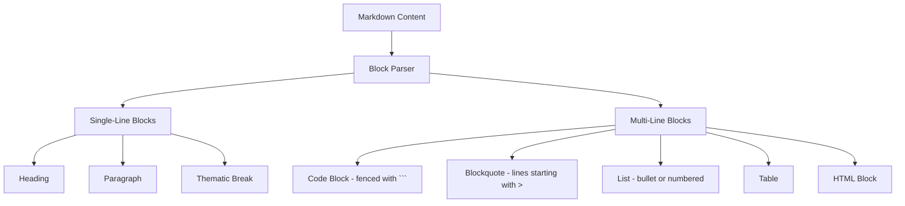
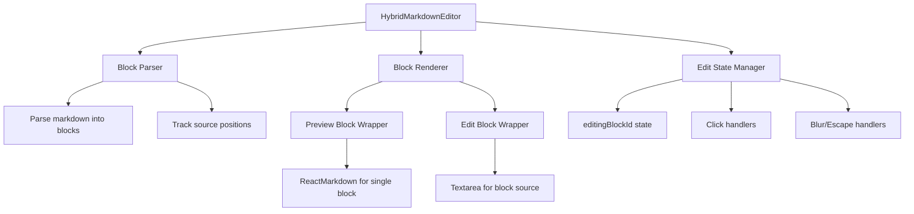

# Hybrid Markdown Editor Implementation Plan

## Overview

The goal is to create a "hybrid mode" for the LiveMarkdownEditor where:
- The entire document is rendered as preview (like read mode)
- Clicking on any line/block switches that specific element to edit mode
- Everything else remains in preview mode
- For multi-line blocks (code blocks, blockquotes, lists), the entire block switches to edit mode

## Current State Analysis

### LiveMarkdownEditor Component
- Located at [`LiveMarkdownEditor.tsx`](frontend/src/components/LiveMarkdownEditor.tsx:1)
- Has two modes controlled by `previewMode` state:
  - `previewMode=true`: Renders markdown using ReactMarkdown
  - `previewMode=false`: Shows a textarea for raw editing
- Uses ReactMarkdown with remarkGfm, rehypeRaw, rehypeHighlight plugins

### Integration Points (25 usages)
1. **MethodTabs.tsx** - Method content editing
2. **TaskDetailPopup.tsx** - Lab notes tabs (2 instances)
3. **ExperimentPanel.tsx** - Experiment notes (2 instances)
4. **NoteDetailPopup.tsx** - Meeting notes (2 instances)
5. **ResultsEditor.tsx** - Results editing
6. **methods/page.tsx** - Method editing page (2 instances)

## Technical Architecture

### Block Types to Handle



### Component Architecture



## Implementation Plan

### Phase 1: Block Parser Utility

Create a new utility file [`frontend/src/lib/markdown-block-parser.ts`](frontend/src/lib/markdown-block-parser.ts:1)

```typescript
interface MarkdownBlock {
  id: string;           // Unique identifier for the block
  type: BlockType;      // Type of block
  content: string;      // Raw markdown content
  startOffset: number;  // Character offset in source
  endOffset: number;    // End character offset
  startLine: number;    // Line number (0-indexed)
  endLine: number;      // End line number
}

type BlockType = 
  | 'heading'
  | 'paragraph'
  | 'codeBlock'
  | 'blockquote'
  | 'list'
  | 'table'
  | 'thematicBreak'
  | 'html'
  | 'blankLine';
```

**Key Functions:**
1. `parseMarkdownBlocks(content: string): MarkdownBlock[]`
   - Parses markdown into blocks
   - Handles fenced code blocks (```), blockquotes (>), lists (-, *, 1.), tables, etc.
   - Tracks exact character positions for each block

2. `findBlockAtPosition(blocks: MarkdownBlock[], offset: number): MarkdownBlock | null`
   - Finds which block contains a given cursor position
   - Used to determine which block to edit when clicking

3. `updateBlockContent(content: string, block: MarkdownBlock, newContent: string): string`
   - Replaces a block's content in the full document
   - Returns updated full markdown content

### Phase 2: HybridMarkdownEditor Component

Create a new component [`frontend/src/components/HybridMarkdownEditor.tsx`](frontend/src/components/HybridMarkdownEditor.tsx:1)

**Props Interface:**
```typescript
interface HybridMarkdownEditorProps {
  value: string;
  onChange: (value: string) => void;
  placeholder?: string;
  onImageDrop?: (files: File[]) => void;
  onFileDrop?: (files: File[]) => void;
  imageBasePath?: string;
  showToolbar?: boolean;
  onAddImage?: () => void;
  onBrowseImages?: () => void;
  disabled?: boolean;
  showShortcutsHelper?: boolean;
  allowAnyFileType?: boolean;
}
```

**State Management:**
```typescript
// Track which block is being edited
const [editingBlockId, setEditingBlockId] = useState<string | null>(null);

// Parse content into blocks (memoized)
const blocks = useMemo(() => parseMarkdownBlocks(value), [value]);

// Track the current edit content (for the textarea)
const [editContent, setEditContent] = useState<string>('');
```

**Rendering Strategy:**
1. Render all blocks in a container
2. Each block is wrapped with a click handler
3. Non-editing blocks render via ReactMarkdown
4. Editing block renders as a textarea

### Phase 3: Block Wrapper Components

**PreviewBlock Component:**
- Wraps rendered markdown blocks
- Shows subtle hover indicator (light border or background)
- Click handler to enter edit mode
- Passes click position to determine which block

**EditBlock Component:**
- Textarea for editing block content
- Auto-focus on mount
- Auto-resize to fit content
- Blur handler to exit edit mode
- Escape key to cancel changes
- Keyboard shortcuts support (reuse existing logic)

### Phase 4: Integration with LiveMarkdownEditor

**Option A: Add mode prop to existing component**
```typescript
interface LiveMarkdownEditorProps {
  // ... existing props
  mode?: 'edit' | 'preview' | 'hybrid';
}
```

**Option B: Create separate component, update consumers**
- Keep LiveMarkdownEditor as-is
- Create HybridMarkdownEditor as new component
- Update integration points to use the appropriate component

**Recommendation:** Option A is cleaner for maintenance, but Option B is safer for gradual rollout.

### Phase 5: Update Integration Points

For each integration point, add the hybrid mode option:

1. **MethodTabs.tsx** - Line ~671
2. **TaskDetailPopup.tsx** - Lines ~2050, ~3305
3. **ExperimentPanel.tsx** - Lines ~485, ~1079
4. **NoteDetailPopup.tsx** - Lines ~664, ~678
5. **ResultsEditor.tsx** - Line ~426
6. **methods/page.tsx** - Lines ~849, ~1443

## Detailed Block Parsing Logic

### Fenced Code Blocks
```
Regex: /^```(\w*)\n([\s\S]*?)^```/gm
- Captures language identifier
- Captures content between fences
- Handles nested backticks correctly
```

### Blockquotes
```
Regex: /^(> .*(\n> .*)*)+/gm
- Groups consecutive > lines as one block
- Handles nested quotes
```

### Lists
```
Regex: /^([*-]|\d+\.) .*(\n([*-]|\d+\.) .*)*/gm
- Groups consecutive list items
- Handles both bullet and numbered lists
```

### Tables
```
Regex: /^\|.*\|(\n\|.*\|)+/gm
- Groups table rows together
```

## User Experience Considerations

### Visual Indicators
- Hover state: Light blue background or border
- Active edit: Clear textarea with visible border
- Transition: Smooth animation when switching modes

### Keyboard Navigation
- Click: Enter edit mode for that block
- Escape: Exit edit mode, save changes
- Tab: Move to next block (optional enhancement)
- Ctrl/Cmd+Enter: Exit edit mode and save

### Edge Cases
1. **Empty document**: Show placeholder with click-to-add
2. **Multiple clicks**: Debounce or ignore clicks while editing
3. **Rapid editing**: Handle quick block switching gracefully
4. **Large blocks**: Scroll textarea within viewport
5. **Nested structures**: Edit entire outer block

## Testing Strategy

1. **Unit tests for block parser:**
   - Various markdown structures
   - Edge cases (empty, malformed, nested)
   - Position tracking accuracy

2. **Component tests:**
   - Click to edit behavior
   - Content updates propagate correctly
   - Keyboard shortcuts work in edit mode

3. **Integration tests:**
   - Works across all consumer components
   - Image handling still works
   - Auto-save still works

## Migration Path

1. **Phase 1:** Implement block parser utility
2. **Phase 2:** Create HybridMarkdownEditor component
3. **Phase 3:** Add feature flag to toggle hybrid mode
4. **Phase 4:** Test in one integration point (e.g., NoteDetailPopup)
5. **Phase 5:** Roll out to all integration points
6. **Phase 6:** Make hybrid mode the default (optional)

## File Changes Summary

| File | Action | Description |
|------|--------|-------------|
| `frontend/src/lib/markdown-block-parser.ts` | Create | Block parsing utility |
| `frontend/src/components/HybridMarkdownEditor.tsx` | Create | New hybrid editor component |
| `frontend/src/components/LiveMarkdownEditor.tsx` | Modify | Add mode prop or keep as-is |
| `frontend/src/components/MethodTabs.tsx` | Modify | Use hybrid mode |
| `frontend/src/components/TaskDetailPopup.tsx` | Modify | Use hybrid mode |
| `frontend/src/components/ExperimentPanel.tsx` | Modify | Use hybrid mode |
| `frontend/src/components/NoteDetailPopup.tsx` | Modify | Use hybrid mode |
| `frontend/src/components/ResultsEditor.tsx` | Modify | Use hybrid mode |
| `frontend/src/app/methods/page.tsx` | Modify | Use hybrid mode |

## Design Decisions (Confirmed)

1. **Default mode:** Hybrid mode is the default mode for all markdown editors

2. **Toolbar integration:** Replace the current Edit/Preview toggle with a three-way toggle:
   - **Edit** - Traditional raw markdown editing (current edit mode)
   - **Hybrid** - Preview with click-to-edit blocks (new default)
   - **Preview** - Read-only rendered view (current preview mode)

3. **Block granularity:** For lists, clicking any list item edits the entire list block (consistent with code block behavior)

4. **Save behavior:** Changes save automatically on blur (no explicit save button needed)

5. **Visual style:** Subtle border appears on hover to indicate clickability

6. **Blank line preservation:** Multiple consecutive blank lines in markdown should render as visible spacing in preview/hybrid modes (currently collapsed by default HTML behavior)

## Implementation Phases

### Phase 1: Block Parser Utility
Create [`frontend/src/lib/markdown-block-parser.ts`](frontend/src/lib/markdown-block-parser.ts:1) with:
- `parseMarkdownBlocks()` function
- `findBlockAtPosition()` function  
- `updateBlockContent()` function
- Unit tests for parser

### Phase 2: HybridMarkdownEditor Component
Create [`frontend/src/components/HybridMarkdownEditor.tsx`](frontend/src/components/HybridMarkdownEditor.tsx:1) with:
- Block-based rendering
- Click-to-edit functionality
- Auto-save on blur
- Keyboard shortcut support

### Phase 3: Update LiveMarkdownEditor
Modify [`frontend/src/components/LiveMarkdownEditor.tsx`](frontend/src/components/LiveMarkdownEditor.tsx:1):
- Add `mode` prop with values: 'edit' | 'hybrid' | 'preview'
- Default mode to 'hybrid'
- Update toolbar with three-way toggle
- Integrate block parser and hybrid rendering

### Phase 4: Update Integration Points
Update all 6 integration points to work with new mode system:
1. [`MethodTabs.tsx`](frontend/src/components/MethodTabs.tsx:671)
2. [`TaskDetailPopup.tsx`](frontend/src/components/TaskDetailPopup.tsx:2050)
3. [`ExperimentPanel.tsx`](frontend/src/components/ExperimentPanel.tsx:485)
4. [`NoteDetailPopup.tsx`](frontend/src/components/NoteDetailPopup.tsx:664)
5. [`ResultsEditor.tsx`](frontend/src/components/ResultsEditor.tsx:426)
6. [`methods/page.tsx`](frontend/src/app/methods/page.tsx:849)

## Blank Line Preservation

### Problem
Markdown by default collapses multiple blank lines into a single paragraph break. Users adding multiple newlines for visual separation see them in edit mode but they disappear in preview mode.

### Solution Options

**Option A: CSS-based approach (Recommended)**
Add custom CSS to the prose container to preserve whitespace:
```css
.prose p + p {
  margin-top: 1em; /* Default spacing */
}
.prose .blank-line {
  height: 1em;
  display: block;
}
```

**Option B: Pre-process markdown content**
Transform consecutive blank lines into explicit spacing elements before rendering:
```typescript
function preserveBlankLines(content: string): string {
  // Replace 2+ consecutive blank lines with explicit spacing
  return content.replace(/\n{3,}/g, (match) => {
    const lineCount = match.length - 1; // Number of blank lines
    return '\n\n' + '<div class="blank-line"></div>'.repeat(lineCount - 1) + '\n\n';
  });
}
```

**Option C: Custom ReactMarkdown component**
Add a custom component for handling whitespace:
```typescript
components={{
  p: ({ children }) => {
    // Check if paragraph is empty/whitespace only
    if (!children || (typeof children === 'string' && !children.trim())) {
      return <div className="h-4" />; // Render as spacing
    }
    return <p>{children}</p>;
  }
}}
```

### Recommended Implementation
Use **Option B** (pre-process markdown) combined with **Option A** (CSS) for the most reliable results:

1. In the block parser, track blank lines as separate blocks
2. Render blank line blocks as `<div class="blank-line">&nbsp;</div>` 
3. Add CSS to the LiveMarkdownEditor's prose container:
   ```css
   .blank-line {
     height: 1.5em; /* Match line height */
     display: block;
   }
   ```

This approach:
- Preserves the exact number of blank lines the user typed
- Works in both preview and hybrid modes
- Doesn't break standard markdown rendering
- Is reversible when switching back to edit mode
