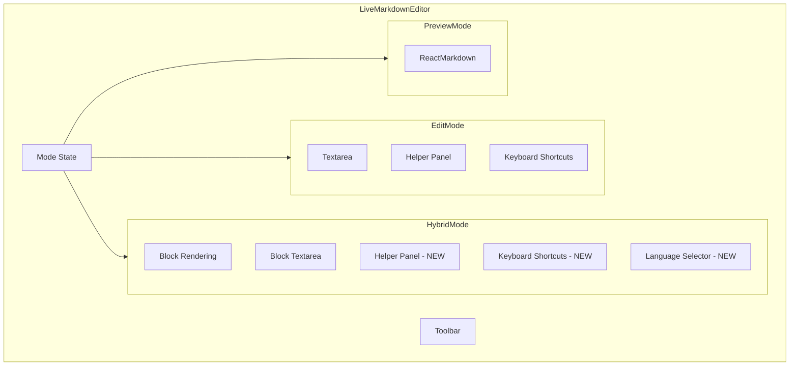

# Hybrid Mode Keyboard Shortcuts and Helper Panel Plan

## Overview

The user wants the hybrid mode in the Live Markdown Editor to have the same keyboard functionality and helper panel (shortcuts + style guide tabs) that exists in the edit mode.

## Current State Analysis

### Edit Mode Features (in `LiveMarkdownEditor.tsx`)

1. **Keyboard Shortcuts** (lines 157-311):
   - `KEYBOARD_SHORTCUTS` array with configurations for:
     - Bold (⌘B), Italic (⌘I), Underline (⌘U), Link (⌘K)
     - Strikethrough (⌘⇧X), Code Block (⌘⌃C)
     - Headings 1-6 (⌘1-6), Quote (⌃Q)

2. **Helper Panel** (lines 1414-1539):
   - Collapsible sidebar on the left
   - Two tabs: "Shortcuts" and "Style Guide"
   - Shortcuts tab shows keyboard shortcuts with labels
   - Style Guide tab shows markdown syntax examples (clickable to insert)

3. **Language Selector Popup** (lines 1617-1658):
   - Appears when typing ``` or using code block shortcut
   - Searchable list of common programming languages
   - Inserts language identifier after ```

4. **Helper Functions**:
   - `applyMarkdownFormat()` (lines 442-488): Applies formatting to selected text
   - `adjustHeadingLevel()` (lines 361-436): Adjusts heading levels with ⌘⌃+/-

### Hybrid Mode (in `HybridMarkdownEditor.tsx`)

Currently only has:
- Basic Tab key handling for indentation (lines 152-200)
- Escape key to exit edit mode
- No keyboard shortcuts for formatting
- No helper panel
- No language selector

## Implementation Plan

### Step 1: Add Keyboard Shortcuts Configuration

Copy the `KEYBOARD_SHORTCUTS` array and `ShortcutConfig` interface from `LiveMarkdownEditor.tsx` to `HybridMarkdownEditor.tsx`.

Also copy:
- `MARKDOWN_STYLE_GUIDE` array
- `COMMON_LANGUAGES` array
- `applyMarkdownFormat()` function
- `adjustHeadingLevel()` function

### Step 2: Add Helper Panel State

Add state variables for:
```typescript
const [helperCollapsed, setHelperCollapsed] = useState(false);
const [helperTab, setHelperTab] = useState<HelperTab>("shortcuts");
const [showLanguageSelector, setShowLanguageSelector] = useState(false);
const [languageSelectorPosition, setLanguageSelectorPosition] = useState({ top: 0, left: 0 });
const [codeBlockInsertPosition, setCodeBlockInsertPosition] = useState<number | null>(null);
const [languageSearch, setLanguageSearch] = useState("");
```

### Step 3: Update `handleEditKeyDown`

Extend the keyboard handler to process all shortcuts:
- Check for each shortcut in `KEYBOARD_SHORTCUTS`
- Handle heading level adjustments (⌘⌃+/⌘⌃-)
- Handle code block shortcut specially (show language selector)
- Call `applyMarkdownFormat()` for other shortcuts

### Step 4: Add Language Selector Logic

Add handlers for:
- `handleTextChange`: Detect ``` typing and show language selector
- `handleLanguageSelect`: Insert selected language

### Step 5: Add Helper Panel UI

Add the collapsible helper panel to the left side of the editor:
- Show when `showShortcutsHelper` prop is true (default: true)
- Two tabs: Shortcuts and Style Guide
- Shortcuts tab: Display keyboard shortcuts
- Style Guide tab: Display markdown syntax examples (clickable to insert at cursor)

### Step 6: Update Props Interface

Add new props to `HybridMarkdownEditorProps`:
```typescript
interface HybridMarkdownEditorProps {
  // ... existing props
  showShortcutsHelper?: boolean;
}
```

### Step 7: Update Parent Component

Update `LiveMarkdownEditor.tsx` to pass `showShortcutsHelper` to `HybridMarkdownEditor`:
```typescript
<HybridMarkdownEditor
  value={value}
  onChange={onChange}
  placeholder={placeholder}
  disabled={disabled}
  imageBasePath={imageBasePath}
  showShortcutsHelper={showShortcutsHelper}
/>
```

## Architecture Diagram



## File Changes

### `frontend/src/components/HybridMarkdownEditor.tsx`

1. Add imports for types if needed
2. Add constant arrays: `KEYBOARD_SHORTCUTS`, `MARKDOWN_STYLE_GUIDE`, `COMMON_LANGUAGES`
3. Add helper functions: `applyMarkdownFormat()`, `adjustHeadingLevel()`
4. Add state for helper panel and language selector
5. Update `handleEditKeyDown` to handle all shortcuts
6. Add `handleTextChange` for language selector detection
7. Add `handleLanguageSelect` for language insertion
8. Add helper panel JSX
9. Add language selector popup JSX
10. Update props interface

### `frontend/src/components/LiveMarkdownEditor.tsx`

1. Pass `showShortcutsHelper` prop to `HybridMarkdownEditor`
2. Remove the helper panel from only showing in edit mode (keep the logic but also show in hybrid)

## Testing Checklist

- [ ] Keyboard shortcuts work in hybrid mode (Bold, Italic, etc.)
- [ ] Heading shortcuts work (⌘1-6)
- [ ] Heading level adjustment works (⌘⌃+/⌘⌃-)
- [ ] Code block shortcut shows language selector
- [ ] Language selector inserts language correctly
- [ ] Helper panel shows in hybrid mode
- [ ] Shortcuts tab displays correctly
- [ ] Style Guide tab displays and inserts syntax on click
- [ ] Helper panel can be collapsed/expanded
- [ ] Tab/Shift+Tab indentation still works
- [ ] Escape still exits edit mode
