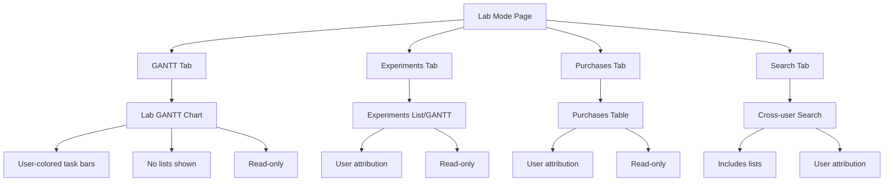

# Lab Mode Feature - Implementation Gameplan v2

## Overview

Lab Mode is a special "view-only" login that provides access to view, search, and export all data across all users in the system. This is designed for PIs, lab managers, and students to find notes from each other or review work from past researchers.

---

## Current Implementation Status

### ✅ Already Implemented

#### Backend Infrastructure
- User metadata system with `_user_metadata.json` (colors, created_at)
- Color assignment algorithm with 20 distinct colors
- User deletion with two-step confirmation
- User rename with metadata sync
- "lab" in reserved usernames
- Lab API router (`/api/lab/*`) with endpoints:
  - `GET /api/lab/users` - List all users with metadata
  - `GET /api/lab/tasks` - All tasks across users (excl. goals)
  - `GET /api/lab/projects` - All projects across users
  - `GET /api/lab/methods` - All methods across users
  - `GET /api/lab/experiments` - All experiment tasks
  - `GET /api/lab/search` - Cross-user search
- High-level goals excluded from all Lab endpoints

#### Frontend - Login
- Lab Mode button on login screen
- Disabled/grayed out when no users exist
- Auto-creates lab user folder on login

#### Frontend - Lab Page ([`frontend/src/app/lab/page.tsx`](frontend/src/app/lab/page.tsx))
- Basic page structure with tabs (Overview, Search)
- Stats display (Total Users, Tasks, Projects)
- Projects list with user attribution
- Tasks table with user attribution

#### Frontend - Draggable User Filter Button ([`frontend/src/components/LabUserFilterButton.tsx`](frontend/src/components/LabUserFilterButton.tsx))
- Floating button positioned fixed on screen
- Draggable to reposition (position saved in localStorage)
- Shows count of selected users
- Click to expand into circle icons
- All users selected by default
- Users sorted by created_at (oldest first)
- Toggle select/deselect all button
- Border around selected users
- Click user to toggle visibility

#### Frontend - Lab Search Panel ([`frontend/src/components/LabSearchPanel.tsx`](frontend/src/components/LabSearchPanel.tsx))
- Cross-user search
- Task type filters (experiment, purchase, list)
- User attribution in results
- Search includes lists (as required)

#### Frontend - Lab Task Detail Popup ([`frontend/src/components/LabTaskDetailPopup.tsx`](frontend/src/components/LabTaskDetailPopup.tsx))
- Read-only task detail view
- Shows user attribution
- "View Only" badge

---

## ❌ Missing Features (User Requirements)

### 1. GANTT Chart View for Lab Mode

**Requirement:** Lab Mode should have a GANTT chart showing ALL users' tasks.

**Current State:** No GANTT chart in Lab Mode. The Overview tab only shows lists/tables.

**What Needs to Be Done:**
- Create a new "GANTT" tab in Lab Mode
- Build a Lab-specific GANTT component or adapt existing [`GanttChart.tsx`](frontend/src/components/GanttChart.tsx)
- Key differences from regular GANTT:
  - Use **user colors** instead of project colors for task bars
  - Hide list-type tasks (`task_type === "list"`)
  - Hide high-level goals (already excluded in backend)
  - Show username labels on tasks
  - Read-only (no drag/drop, no editing)
  - No dependency creation

### 2. Purchases View for Lab Mode

**Requirement:** Lab Mode should show all purchases across all users.

**Current State:** No dedicated Purchases view in Lab Mode.

**What Needs to Be Done:**
- Add "Purchases" tab to Lab Mode
- Create backend endpoint `GET /api/lab/purchases` (or filter from tasks)
- Display purchases in a table/list format
- Show user attribution with user colors
- Read-only view

### 3. Experiments View for Lab Mode

**Requirement:** Lab Mode should show all experiments across all users.

**Current State:** Backend endpoint exists (`GET /api/lab/experiments`) but no dedicated frontend view.

**What Needs to Be Done:**
- Add "Experiments" tab to Lab Mode
- Display experiments in a meaningful way (could be GANTT or list)
- Show user attribution with user colors
- Read-only view

### 4. User Colors for Projects in Lab Mode

**Requirement:** "Instead of showing project folder colors, all projects should be changed to a unique color that is assigned to each user in the lab database."

**Current State:** Projects in Lab Mode show their original project colors, not user colors.

**What Needs to Be Done:**
- Update project display to use `user_color` instead of project `color`
- This applies to:
  - Projects list in Overview tab
  - Any project references in GANTT chart
  - Search results showing projects

---

## Implementation Plan

### Phase 1: Backend Enhancements

#### 1.1 Add Purchases Endpoint for Lab Mode

**File:** [`backend/app/routers/lab.py`](backend/app/routers/lab.py)

Add endpoint to get all purchases:
```python
@router.get("/purchases", response_model=List[LabTask])
async def get_all_purchases(usernames: Optional[str] = None):
    """Get all purchase tasks across all users."""
    # Similar to get_all_experiments but filter for task_type == "purchase"
```

### Phase 2: Frontend - Lab Mode Page Restructure

#### 2.1 Update Tab Structure

**File:** [`frontend/src/app/lab/page.tsx`](frontend/src/app/lab/page.tsx)

Change from:
```tsx
type TabType = "overview" | "search";
```

To:
```tsx
type TabType = "gantt" | "experiments" | "purchases" | "search";
```

#### 2.2 Create Lab GANTT Component

**New File:** `frontend/src/components/LabGanttChart.tsx`

A simplified, read-only GANTT chart for Lab Mode:
- Accepts `tasks`, `users`, `selectedUsernames` as props
- Uses user colors for task bars (not project colors)
- Hides list-type tasks
- Shows username labels on tasks
- No drag/drop functionality
- No dependency creation
- Click opens LabTaskDetailPopup
- **Same time range options as regular GANTT** (1 week to 1 year)
- View mode selector (1week, 2week, 3week, 1month, 3month, 6month, 1year)

Key implementation details:
```tsx
interface LabGanttChartProps {
  tasks: LabTask[];
  users: LabUser[];
  selectedUsernames: Set<string>;
  onTaskClick: (task: LabTask) => void;
}

// Task color should be:
const taskColor = users.find(u => u.username === task.username)?.color;
// Instead of: projectColors[task.project_id]
```

#### 2.3 Create Lab Purchases Panel

**New File:** `frontend/src/components/LabPurchasesPanel.tsx`

A table/list view of all purchases:
- Shows purchase name, user, status, dates
- Uses user colors for visual attribution
- Click to view details in LabTaskDetailPopup

#### 2.4 Create Lab Experiments Panel

**New File:** `frontend/src/components/LabExperimentsPanel.tsx`

Similar to the existing user experiments page, but organized by username AND project name:
- **Grouped by username first, then by project**
- Shows experiment name, user, project, dates, methods
- Uses user colors for visual attribution
- Click to view details in LabTaskDetailPopup
- Could include a mini-timeline or calendar view per user/project

### Phase 3: User Color Integration

#### 3.1 Update Project Display Colors

**File:** [`frontend/src/app/lab/page.tsx`](frontend/src/app/lab/page.tsx)

In the projects list, change:
```tsx
// FROM: Using project color
<div className="w-3 h-3 rounded-full" style={{ backgroundColor: project.color }} />

// TO: Using user color
<div className="w-3 h-3 rounded-full" style={{ backgroundColor: project.user_color }} />
```

#### 3.2 Ensure All Lab Views Use User Colors

Verify that all Lab Mode components use `user_color` for visual attribution:
- LabGanttChart: task bars colored by user
- LabPurchasesPanel: user avatar/badge colored by user
- LabExperimentsPanel: user avatar/badge colored by user
- LabSearchPanel: already uses user colors ✅

---

## Updated Tab Structure



---

## Privacy Controls Summary

| Data Type | Shown in Lab Mode | Notes |
|-----------|-------------------|-------|
| High-level Goals | ❌ NO | Private to each user |
| Regular Tasks | ✅ YES | Shown in GANTT, Search |
| List Tasks | ❌ GANTT, ✅ Search | Hidden from GANTT, searchable |
| Experiments | ✅ YES | Dedicated tab + GANTT |
| Purchases | ✅ YES | Dedicated tab |
| Projects | ✅ YES | With user colors |
| Methods | ✅ YES | Searchable |

---

## Files to Create/Modify

### New Files to Create
1. `frontend/src/components/LabGanttChart.tsx` - Read-only GANTT for Lab Mode
2. `frontend/src/components/LabPurchasesPanel.tsx` - Purchases view
3. `frontend/src/components/LabExperimentsPanel.tsx` - Experiments view

### Files to Modify
1. `frontend/src/app/lab/page.tsx` - Restructure tabs, add new views
2. `backend/app/routers/lab.py` - Add purchases endpoint (if needed)
3. `frontend/src/lib/api.ts` - Add API functions for new endpoints

---

## Testing Checklist

### User Filter Button
- [ ] Button is draggable and position persists
- [ ] Clicking toggles expanded state
- [ ] Users sorted by created_at (oldest first)
- [ ] Select/Deselect All works correctly
- [ ] Selected users have border
- [ ] Unselected users are faded
- [ ] Filter applies to all views (GANTT, Experiments, Purchases, Search)

### GANTT View
- [ ] Shows all tasks from selected users
- [ ] Task bars use user colors (not project colors)
- [ ] List tasks are hidden
- [ ] High-level goals are hidden
- [ ] Clicking task opens read-only detail popup
- [ ] No drag/drop functionality
- [ ] No dependency creation

### Experiments View
- [ ] Shows all experiments from selected users
- [ ] User attribution with user colors
- [ ] Read-only detail view

### Purchases View
- [ ] Shows all purchases from selected users
- [ ] User attribution with user colors
- [ ] Read-only detail view

### Search
- [ ] Searches across all selected users
- [ ] Includes list tasks in results
- [ ] High-level goals excluded
- [ ] User attribution shown

### Privacy
- [ ] High-level goals never visible anywhere
- [ ] All data is read-only (no edit buttons)
- [ ] No create/delete functionality

---

## Clarified Requirements

1. **Experiments View Format:** Similar to the existing user experiments page, but organized by username AND project name. This means a detailed view showing experiments grouped by user, then by project.

2. **GANTT Time Range:** Same time range options as regular GANTT (1 week to 1 year). Users can select their preferred view mode.

3. **GANTT Coloring:** Tasks colored by username only (not project colors).

---

## Summary

The Lab Mode feature has a solid foundation with:
- ✅ Backend infrastructure complete
- ✅ User metadata and colors working
- ✅ Draggable user filter button implemented
- ✅ Search functionality working
- ✅ Read-only task detail popup

Still needed:
- ❌ GANTT chart view with user colors
- ❌ Dedicated Experiments view
- ❌ Dedicated Purchases view
- ❌ Project colors changed to user colors in Lab views
