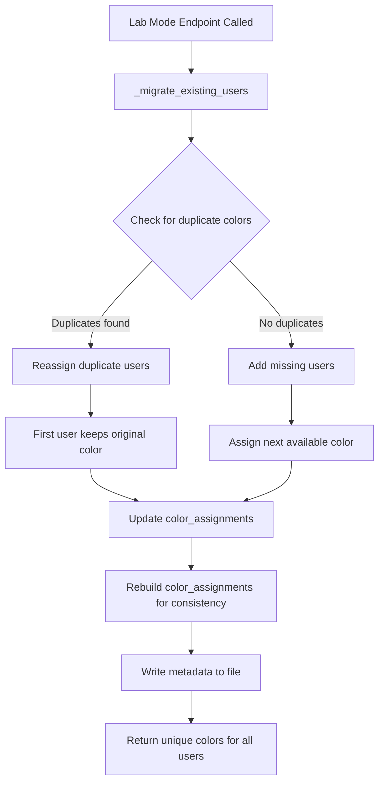

# Lab Mode User Colors Fix Plan

## Problem Statement

In Lab Mode, different users are sometimes assigned the same color, making it difficult to distinguish between users. All users should have unique colors that are consistent across the entire Lab Mode interface.

## Root Cause Analysis

The bug is in the [`_migrate_existing_users()`](backend/app/routers/users.py:417) function in `backend/app/routers/users.py`. 

### The Bug

When the function detects duplicate colors and reassigns them, it:

1. Correctly identifies users with duplicate colors
2. Reassigns duplicate users to new colors
3. **BUT** when deleting the old color mapping, it removes the entry entirely instead of updating it for the first user who keeps that color

Here's the problematic code (lines 435-452):

```python
# Reassign colors for users with duplicates
for color, users_with_color in color_to_users.items():
    if len(users_with_color) > 1:
        # Keep the first user's color, reassign others
        for user in users_with_color[1:]:
            new_color = _get_next_available_color()
            ...
            # BUG: This deletes the color for ALL users
            if color in metadata["color_assignments"]:
                del metadata["color_assignments"][color]  # <-- Problem
            metadata["color_assignments"][new_color] = user
```

The first user (who keeps the original color) is never added back to `color_assignments`, so `_get_next_available_color()` may return that "untracked" color again for a new user.

### Data Structure

The metadata is stored in `users/_user_metadata.json`:

```json
{
  "version": 1,
  "users": {
    "alice": { "color": "#3b82f6", "created_at": "..." },
    "bob": { "color": "#10b981", "created_at": "..." }
  },
  "color_assignments": {
    "#3b82f6": "alice",
    "#10b981": "bob"
  }
}
```

The `color_assignments` dictionary is the reverse mapping used to track which colors are in use.

## Solution

### Fix 1: Correct the `_migrate_existing_users()` function

Update the duplicate color handling to properly maintain the `color_assignments` mapping:

```python
# Reassign colors for users with duplicates
for color, users_with_color in color_to_users.items():
    if len(users_with_color) > 1:
        # First user keeps the color - ensure it's tracked
        first_user = users_with_color[0]
        metadata["color_assignments"][color] = first_user
        
        # Reassign other users to new colors
        for user in users_with_color[1:]:
            new_color = _get_next_available_color()
            if not new_color:
                new_color = USER_COLOR_PALETTE[0]
            
            if "users" not in metadata:
                metadata["users"] = {}
            if user in metadata["users"]:
                metadata["users"][user]["color"] = new_color
                metadata["color_assignments"][new_color] = user
```

### Fix 2: Add a function to rebuild `color_assignments` from scratch

Add a helper function to ensure consistency between `users` and `color_assignments`:

```python
def _rebuild_color_assignments(metadata: Dict) -> None:
    """Rebuild color_assignments from users data to ensure consistency."""
    metadata["color_assignments"] = {}
    for username, data in metadata.get("users", {}).items():
        color = data.get("color")
        if color:
            metadata["color_assignments"][color] = username
```

Call this at the end of `_migrate_existing_users()` to ensure the data is always consistent.

### Fix 3: Ensure `_get_next_available_color()` is robust

The current implementation checks `color_assignments` keys, which should work correctly once the above fixes are in place. No changes needed here.

## Implementation Steps

1. **Update `_migrate_existing_users()` function** in `backend/app/routers/users.py`:
   - Fix the duplicate color handling logic
   - Add call to rebuild `color_assignments` at the end

2. **Add `_rebuild_color_assignments()` helper function** in `backend/app/routers/users.py`

3. **Test the fix**:
   - The migration runs automatically when Lab Mode endpoints are called
   - Verify all users have unique colors
   - Verify colors are consistent across all Lab Mode views

## Files to Modify

- `backend/app/routers/users.py` - Fix the color assignment logic

## Verification

After the fix:
1. All users in `users/_user_metadata.json` should have unique colors
2. The `color_assignments` dictionary should be a perfect reverse mapping of user colors
3. Lab Mode should display each user with a unique, consistent color across:
   - User filter button
   - Gantt chart
   - Experiments panel
   - Purchases panel
   - Notes panel
   - Search results

## Diagram: Color Assignment Flow


