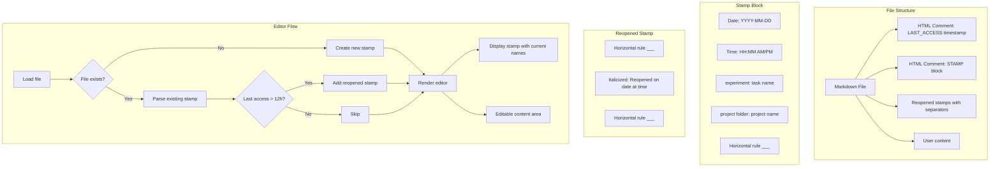

# Markdown Editor Improvements Plan

## Overview

This plan addresses three issues:
1. The markdown editor in the experiment popup (Lab Notes and Results tabs) lacks features compared to the method markdown editor
2. The pre-added template text in Lab Notes and Results is unwanted
3. A simple stamp with date, time, experiment name, and project folder should be added instead

## Current State Analysis

### Method Markdown Editor (Good)
Located in [`frontend/src/app/methods/page.tsx`](frontend/src/app/methods/page.tsx) - `CreateMethodModal` component

**Features:**
- Preview button to toggle between edit and preview mode
- Add Image button for file picker upload
- Drag and drop image support
- Clean toolbar with buttons above the editor

### LiveMarkdownEditor (Needs Improvement)
Located in [`frontend/src/components/LiveMarkdownEditor.tsx`](frontend/src/components/LiveMarkdownEditor.tsx)

**Current Features:**
- Click to edit, blur to preview (implicit mode switching)
- Image drag and drop support
- Image paste from clipboard

**Missing Features:**
- Explicit Preview button
- Add Image button in toolbar

### Components Using LiveMarkdownEditor
1. [`ExperimentPanel.tsx`](frontend/src/components/ExperimentPanel.tsx) - `LabNotesTab` and `ResultsTab`
2. [`ResultsEditor.tsx`](frontend/src/components/ResultsEditor.tsx)

### Current Pre-added Text

**Lab Notes** (ExperimentPanel.tsx):
```
# Lab Notes: ${task.name}

**Date:** ${task.start_date}

## Procedure

## Observations

## Notes
```

**Results** (ExperimentPanel.tsx):
```
# Results: ${task.name}

**Date:** ${task.start_date}

## Data

## Analysis

## Conclusions
```

**ResultsEditor.tsx**:
```
# Results: ${task.name}

**Date:** ${task.start_date}
**Duration:** ${task.duration_days} days

## Observations

## Data

## Conclusions
```

## Proposed Changes

### 1. Enhance LiveMarkdownEditor Component

Add a toolbar with Preview and Add Image buttons to match the method editor experience.

**New Props:**
- `showToolbar?: boolean` - Whether to show the toolbar (default: true)
- `onAddImage?: () => void` - Callback when Add Image button is clicked

**New Internal State:**
- `previewMode: boolean` - Explicit preview toggle

**UI Changes:**
```
┌─────────────────────────────────────────────────────┐
│ [Preview] [Add Image]                    [Save]     │  <- Toolbar
├─────────────────────────────────────────────────────┤
│                                                     │
│                   Editor / Preview                   │
│                                                     │
└─────────────────────────────────────────────────────┘
```

### 2. New Stamp Format

Replace the verbose template with a minimal stamp. The stamp uses special HTML comments to mark the block for dynamic updating:

```markdown
<!-- STAMP_START -->
2026-02-15
12:07 PM
experiment: Western Blot Analysis
project folder: Protein Research
<!-- STAMP_END -->
___
```

**Key Features:**
- Stamp is locked (not directly editable by user)
- Experiment name and project folder dynamically update if they change
- Uses HTML comments to identify the stamp block for parsing
- Horizontal rule (`___`) separator after the stamp

### 3. Reopened Tracking

When a file is reopened after 12+ hours, add a reopened stamp:

```markdown
___
*Reopened on 2026-02-16 at 2:30 PM*
___
```

**Logic:**
- Track last access time in the file or via metadata
- If current time - last access time > 12 hours, add reopened line
- Each reopening gets its own stamp with separators

### 3. Implementation Details

#### A. LiveMarkdownEditor.tsx Changes

1. Add toolbar above the editor/preview area
2. Add Preview toggle button
3. Add Add Image button that triggers file input
4. Keep existing drag/drop and paste functionality
5. When in preview mode, show rendered markdown
6. When in edit mode, show textarea
7. **New**: Add support for locked stamp regions that are rendered but not editable
8. **New**: Parse stamp block and render dynamically with current task/project names

#### B. Stamp Parsing and Rendering

The stamp is stored in the markdown file with HTML comment markers:

```markdown
<!-- STAMP_START -->
2026-02-15
12:07 PM
experiment: Western Blot Analysis
project folder: Protein Research
<!-- STAMP_END -->
___
```

When rendering:
1. Parse the stamp block using regex: `<!-- STAMP_START -->([\s\S]*?)<!-- STAMP_END -->`
2. Extract the date and time (first two lines after marker)
3. Replace experiment name and project folder with current values from props
4. Render the stamp as a locked/non-editable region above the editor

When saving:
1. Preserve the stamp block in the file
2. Update experiment name and project folder to current values

#### C. Reopened Tracking Logic

Store last access timestamp in the markdown file:

```markdown
<!-- LAST_ACCESS: 2026-02-15T12:07:00Z -->
```

On file load:
1. Parse last access timestamp
2. Calculate hours since last access
3. If > 12 hours, add reopened stamp:
   ```markdown
   ___
   *Reopened on 2026-02-16 at 2:30 PM*
   ___
   ```
4. Update last access timestamp to current time

#### D. ExperimentPanel.tsx Changes

**LabNotesTab:**
1. Fetch project name using `projectsApi.get(task.project_id)`
2. Generate stamp with current date/time when creating new file
3. Parse and render stamp dynamically with current task/project names
4. Handle reopened tracking
5. Pass image upload handler to improved LiveMarkdownEditor

**ResultsTab:**
1. Same changes as LabNotesTab

#### E. ResultsEditor.tsx Changes

1. Same pattern as ExperimentPanel changes

### 4. Date/Time Formatting

Use the users timezone (America/Chicago, UTC-6:00) for formatting:
- Date: YYYY-MM-DD format
- Time: 12-hour format with AM/PM

```typescript
const now = new Date();
const dateStr = now.toLocaleDateString('en-CA'); // YYYY-MM-DD
const timeStr = now.toLocaleTimeString('en-US', { 
  hour: 'numeric', 
  minute: '2-digit',
  hour12: true 
});
```

## File Changes Summary

| File | Changes |
|------|---------|
| [`LiveMarkdownEditor.tsx`](frontend/src/components/LiveMarkdownEditor.tsx) | Add toolbar with Preview and Add Image buttons, support for locked stamp regions |
| [`ExperimentPanel.tsx`](frontend/src/components/ExperimentPanel.tsx) | Update LabNotesTab and ResultsTab with new stamp format, project name fetching, and reopened tracking |
| [`ResultsEditor.tsx`](frontend/src/components/ResultsEditor.tsx) | Update with new stamp format, project name fetching, and reopened tracking |

## Technical Considerations

1. **Project Name Fetching**: The Task object has `project_id` but not the project name. Need to fetch project details using `projectsApi.get(task.project_id)`.

2. **Stamp Generation Timing**: The stamp should be generated when the file is first created (i.e., when the file doesn't exist yet), not on every load.

3. **Image Upload**: The existing image upload logic should be preserved and connected to the new Add Image button in the toolbar.

4. **Backward Compatibility**: Existing notes/results files should not be modified. The stamp is only added for new files.

5. **Dynamic Stamp Updates**: The stamp block stores the original experiment/project names, but when rendering, we replace them with current values. This ensures the stamp always shows the correct names even if renamed.

6. **Reopened Tracking**: Store last access timestamp in HTML comment. Check on load if > 12 hours have passed.

## Mermaid Diagram


