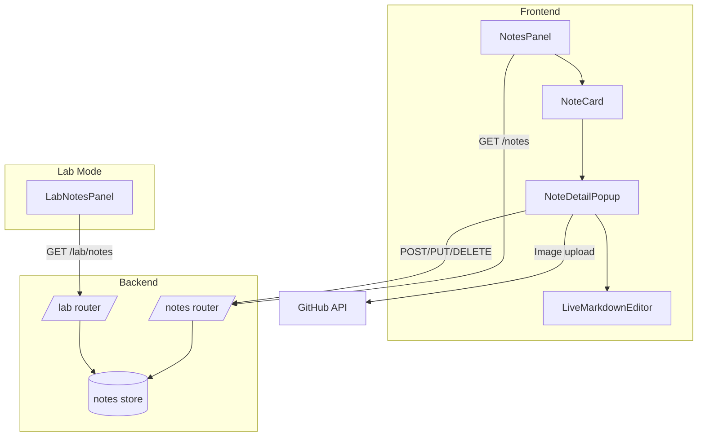
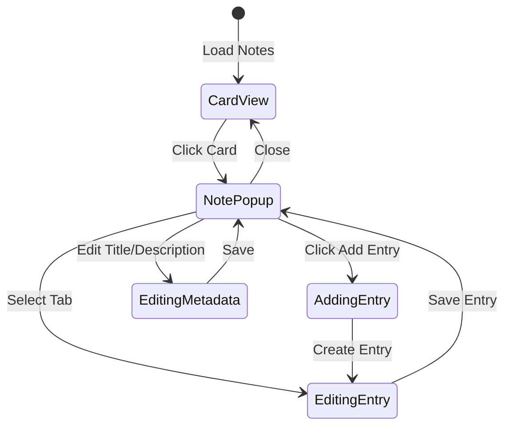

# Meeting Notes Feature Plan

## Overview

Add a new "Notes" tab that allows users to create and manage meeting notes. Notes appear as cards that expand into a detailed popup with the existing LiveMarkdownEditor. Notes can be single entries or "running logs" with multiple timestamped tabs.

## Requirements Summary

1. **Notes as Cards**: Display notes as expandable cards with Title and Description
2. **LiveMarkdownEditor Integration**: Full markdown editing with image support
3. **Running Logs**: Notes can have multiple timestamped entries (tabs)
4. **User Ownership**: Notes are user-specific with optional sharing
5. **Lab Mode Integration**: Lab heads can view all notes from all users

---

## Data Model

### Note Schema

```python
# Backend: backend/app/schemas.py

class NoteEntry(BaseModel):
    """A single entry within a note (for running logs)."""
    id: str  # UUID
    title: str  # e.g., "Week 1 Meeting" or date string
    date: date  # User-chosen date for this entry
    content: str  # Markdown content
    created_at: datetime
    updated_at: datetime

class NoteEntryCreate(BaseModel):
    title: str
    date: date
    content: str = ""

class NoteEntryUpdate(BaseModel):
    title: Optional[str] = None
    date: Optional[date] = None
    content: Optional[str] = None

class NoteCreate(BaseModel):
    title: str
    description: str = ""
    is_running_log: bool = False  # If true, has multiple entries
    is_shared: bool = False  # If true, visible to other lab members
    entries: List[NoteEntryCreate] = []  # Initial entries

class NoteUpdate(BaseModel):
    title: Optional[str] = None
    description: Optional[str] = None
    is_shared: Optional[bool] = None

class NoteOut(BaseModel):
    id: int
    title: str
    description: str
    is_running_log: bool
    is_shared: bool
    entries: List[NoteEntry]
    created_at: datetime
    updated_at: datetime
    username: str  # Owner username
```

### Storage Structure

```
{data_repo}/users/{username}/notes/
├── 1.json
├── 2.json
└── _counters.json
```

Each note file contains:
```json
{
  "id": 1,
  "title": "Fall 2026 meetings with Emile",
  "description": "Weekly sync meetings",
  "is_running_log": true,
  "is_shared": true,
  "entries": [
    {
      "id": "uuid-1",
      "title": "Week 1 - Project Kickoff",
      "date": "2026-09-01",
      "content": "# Meeting Notes\n...",
      "created_at": "2026-09-01T10:00:00",
      "updated_at": "2026-09-01T11:00:00"
    }
  ],
  "created_at": "2026-09-01T10:00:00",
  "updated_at": "2026-09-01T11:00:00",
  "username": "grant"
}
```

---

## API Endpoints

### User Notes Endpoints

```
GET    /api/notes                    # List user's notes
POST   /api/notes                    # Create new note
GET    /api/notes/{id}               # Get specific note
PUT    /api/notes/{id}               # Update note metadata
DELETE /api/notes/{id}               # Delete note

# Entry management
POST   /api/notes/{id}/entries       # Add new entry to note
PUT    /api/notes/{id}/entries/{entry_id}  # Update entry
DELETE /api/notes/{id}/entries/{entry_id}  # Delete entry
PUT    /api/notes/{id}/entries/reorder     # Reorder entries
```

### Lab Mode Endpoints

```
GET    /api/lab/notes                # Get all notes from all users
GET    /api/lab/notes/shared         # Get only shared notes
GET    /api/lab/user/{username}/notes # Get notes for specific user
```

---

## Frontend Components

### Component Hierarchy

```
NotesPanel (new)
├── NoteCard (new) - Individual card in grid
│   └── Click → opens NoteDetailPopup
└── NoteDetailPopup (new)
    ├── Header with title/description editing
    ├── Sharing toggle
    ├── EntryTabs (for running logs)
    │   └── LiveMarkdownEditor (existing)
    └── Entry management controls
```

### NotesPanel Component

Location: `frontend/src/components/NotesPanel.tsx`

Features:
- Grid layout of note cards
- "New Note" button with options:
  - New Single Note
  - New Running Log
- Filter/search functionality
- Sort by date/title

### NoteCard Component

Location: `frontend/src/components/NoteCard.tsx`

Features:
- Display title and description
- Visual indicator for running log vs single note
- Shared indicator icon
- Entry count for running logs
- Last updated timestamp

### NoteDetailPopup Component

Location: `frontend/src/components/NoteDetailPopup.tsx`

Features:
- Modal overlay with note content
- Editable title and description
- Sharing toggle switch
- For running logs:
  - Tab bar with all entries
  - Add new entry button
  - Entry reordering (drag and drop)
  - Delete entry option
- LiveMarkdownEditor for content editing
- Image upload support via existing GitHub API

---

## UI/UX Design

### Card Grid View

```
┌─────────────────────────────────────────────────────────────┐
│  Notes                                    [+ New Note ▼]    │
├─────────────────────────────────────────────────────────────┤
│  ┌─────────────────┐  ┌─────────────────┐  ┌─────────────┐  │
│  │ 📋 Single Note  │  │ 📑 Running Log  │  │ 📋 Shared   │  │
│  │                 │  │                 │  │             │  │
│  │ Meeting with    │  │ Fall 2026       │  │ Protocol    │  │
│  │ Lab Head        │  │ Meetings        │  │ Review      │  │
│  │                 │  │                 │  │             │  │
│  │ Mar 4, 2026     │  │ 5 entries       │  │ Mar 1, 2026 │  │
│  └─────────────────┘  └─────────────────┘  └─────────────┘  │
└─────────────────────────────────────────────────────────────┘
```

### Note Detail Popup (Running Log)

```
┌─────────────────────────────────────────────────────────────┐
│  Fall 2026 Meetings with Emile                         [X]  │
│  Weekly sync meetings to discuss project progress           │
│  ┌─────────────────────────────────────────────────────┐    │
│  │ [Shared: ON]                                        │    │
│  └─────────────────────────────────────────────────────┘    │
│  ┌─────────────────────────────────────────────────────┐    │
│  │ [Week 1] [Week 2] [Week 3] [+ Add Entry]            │    │
│  ├─────────────────────────────────────────────────────┤    │
│  │ Date: [Mar 4, 2026 ▼]  Title: [Week 3 Meeting    ] │    │
│  ├─────────────────────────────────────────────────────┤    │
│  │ ┌─────────────────────────────────────────────────┐ │    │
│  │ │ LiveMarkdownEditor                              │ │    │
│  │ │                                                 │ │    │
│  │ │ # Discussion Points                             │ │    │
│  │ │ - Progress on PCR optimization                  │ │    │
│  │ │ - Next steps for cloning                        │ │    │
│  │ │                                                 │ │    │
│  │ └─────────────────────────────────────────────────┘ │    │
│  └─────────────────────────────────────────────────────┘    │
│                                        [Delete Entry] [Save] │
└─────────────────────────────────────────────────────────────┘
```

---

## Implementation Steps

### Phase 1: Backend

1. **Add Note schemas** to `backend/app/schemas.py`
   - NoteEntry, NoteEntryCreate, NoteEntryUpdate
   - NoteCreate, NoteUpdate, NoteOut

2. **Add notes storage** to `backend/app/storage.py`
   - Create `_notes_store = JsonStore("notes")`
   - Add `get_notes_store()` function

3. **Create notes router** at `backend/app/routers/notes.py`
   - CRUD endpoints for notes
   - Entry management endpoints
   - Include router in `main.py`

4. **Add lab notes endpoints** to `backend/app/routers/lab.py`
   - Get all notes across users
   - Filter by shared status

### Phase 2: Frontend Types & API

5. **Add Note types** to `frontend/src/lib/types.ts`
   - Mirror backend schemas

6. **Add notes API** to `frontend/src/lib/api.ts`
   - notesApi object with all endpoints
   - Update labApi for lab mode

### Phase 3: Frontend Components

7. **Create NoteCard component** at `frontend/src/components/NoteCard.tsx`
   - Card display with metadata
   - Click handler to open popup

8. **Create NoteDetailPopup component** at `frontend/src/components/NoteDetailPopup.tsx`
   - Modal with LiveMarkdownEditor
   - Tab management for running logs
   - Entry CRUD operations

9. **Create NotesPanel component** at `frontend/src/components/NotesPanel.tsx`
   - Grid of NoteCards
   - New note creation
   - Search/filter

### Phase 4: Integration

10. **Add Notes tab to main experiments page** (`frontend/src/app/experiments/page.tsx`)
    - Add "Notes" tab button
    - Render NotesPanel when active

11. **Add Notes tab to Lab Mode page** (`frontend/src/app/lab/page.tsx`)
    - Add "Notes" tab button
    - Create LabNotesPanel variant or pass readOnly/shared props

12. **Implement sharing toggle** in NoteDetailPopup
    - API call to update `is_shared`
    - Visual indicator on cards

---

## Technical Considerations

### Image Storage

Notes with images will use the existing GitHub image upload flow:
- Images stored in `{data_repo}/Images/notes/{note_id}/`
- LiveMarkdownEditor's `imageBasePath` prop set accordingly
- Relative paths in markdown: `./Images/notes/1/image.png`

### Entry Ordering

Entries are stored in order in the JSON array. Reordering:
- Frontend drag-and-drop updates order
- Backend accepts new order array
- `PUT /api/notes/{id}/entries/reorder` with `{ entry_ids: ["uuid-1", "uuid-3", "uuid-2"] }`

### Date Handling

- Entry dates are user-chosen (not auto-timestamped)
- Default date for new entry: today
- Date picker in entry editor

### Sharing Model

- `is_shared` is a boolean flag on the note
- Lab mode shows all notes, organized by user
- Shared notes have a visual indicator
- Non-shared notes only visible to owner and lab head

---

## Mermaid Diagrams

### Data Flow



### Component State Flow



---

## Files to Create/Modify

### New Files
- `backend/app/routers/notes.py` - Notes API router
- `frontend/src/components/NotesPanel.tsx` - Notes grid panel
- `frontend/src/components/NoteCard.tsx` - Individual note card
- `frontend/src/components/NoteDetailPopup.tsx` - Note detail modal
- `frontend/src/components/LabNotesPanel.tsx` - Lab mode notes panel (optional, or reuse NotesPanel with props)

### Modified Files
- `backend/app/schemas.py` - Add Note schemas
- `backend/app/storage.py` - Add notes store
- `backend/app/main.py` - Include notes router
- `backend/app/routers/lab.py` - Add lab notes endpoints
- `frontend/src/lib/types.ts` - Add Note types
- `frontend/src/lib/api.ts` - Add notes API
- `frontend/src/app/experiments/page.tsx` - Add Notes tab
- `frontend/src/app/lab/page.tsx` - Add Notes tab

---

## Questions Resolved

1. **Location**: Notes tab on both main experiments page and lab mode
2. **Ownership**: User-specific with optional sharing toggle
3. **Entry Management**: Full CRUD + reorder + custom dates
