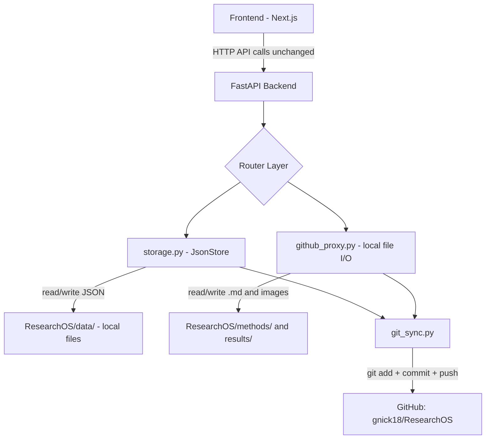

# Migration Plan: PostgreSQL → JSON File Storage on GitHub Data Repo

## Overview

Replace the PostgreSQL database (and all SQLAlchemy/Alembic infrastructure) with **JSON files stored in a local Git repo** (`ResearchOS/`). The backend reads/writes JSON files directly on disk, then auto-commits and pushes to GitHub after every mutation.

**Two repos:**
1. **This repo** (`ResearchManager_GANNT`) — website source code
2. **Data repo** (`gnick18/ResearchOS`, cloned at `ResearchOS/`) — all persistent data

---

## Data Repo Folder Structure

```
ResearchOS/
├── data/
│   ├── projects/
│   │   ├── 1.json        # single project record
│   │   └── 2.json
│   ├── tasks/
│   │   ├── 1.json        # single task record
│   │   └── 2.json
│   ├── dependencies/
│   │   ├── 1.json
│   │   └── 2.json
│   ├── methods/
│   │   ├── 1.json        # method metadata
│   │   └── 2.json
│   └── _counters.json    # auto-increment IDs: {projects: 5, tasks: 23, ...}
├── methods/              # .md protocol files (already used by github_proxy)
│   └── some-protocol.md
├── results/              # result .md files and images
│   └── ...
└── README.md
```

**Why individual files per record?**
- Git diffs are clean — only the changed record shows up in a commit
- No merge conflicts when the app updates one record at a time
- Scales fine for research project volumes (hundreds, not millions)

---

## Architecture Changes

### What Gets Removed
| Component | Files |
|-----------|-------|
| SQLAlchemy ORM models | `backend/app/models.py` |
| SQLAlchemy engine/session | `backend/app/database.py` |
| Alembic migrations | `backend/alembic/` + `backend/alembic.ini` |
| Docker Compose (Postgres) | `docker-compose.yml` |
| PostgreSQL dependencies | `asyncpg`, `sqlalchemy`, `alembic` from `requirements.txt` |

### What Gets Added/Modified

#### New: `backend/app/storage.py` — JSON File Storage Layer
Replaces `database.py`. Provides CRUD operations over JSON files:

```python
class JsonStore:
    """Generic JSON-file-backed store for a given entity type."""
    
    def __init__(self, base_path: Path, entity_name: str):
        self.dir = base_path / "data" / entity_name
        self.dir.mkdir(parents=True, exist_ok=True)
    
    def list_all(self) -> list[dict]: ...
    def get(self, id: int) -> dict | None: ...
    def create(self, data: dict) -> dict: ...    # auto-assigns ID
    def update(self, id: int, data: dict) -> dict: ...
    def delete(self, id: int) -> bool: ...
```

Key design decisions:
- **Synchronous file I/O** — JSON reads/writes are fast on local disk, no need for async
- **File locking** — use `fcntl.flock` or a simple lock file to prevent concurrent write corruption
- **ID generation** — `_counters.json` tracks the next ID for each entity type, incremented atomically

#### New: `backend/app/git_sync.py` — Auto Commit+Push
```python
async def commit_and_push(repo_path: Path, message: str) -> None:
    """Stage all changes, commit, and push to origin."""
    # Runs git commands via subprocess
    # Called after every successful mutation
```

- Uses `asyncio.create_subprocess_exec` to avoid blocking the event loop
- Batches rapid writes with a small debounce if needed

#### Modified: `backend/app/config.py`
```python
class Settings(BaseSettings):
    github_token: str = ""
    github_repo: str = ""
    github_localpath: str = ""    # NEW — path to local data repo clone
    cors_origins: list[str] = ["http://localhost:3000"]
    # DATABASE_URL removed
```

#### Modified: Router files
All routers (`projects.py`, `tasks.py`, `dependencies.py`, `methods.py`) change from:
- `db: AsyncSession = Depends(get_db)` → `store: JsonStore = Depends(get_store)`
- SQLAlchemy queries → `store.list_all()`, `store.get(id)`, etc.
- Response shapes stay the same (no frontend API changes needed)

#### Modified: `backend/app/routers/github_proxy.py`
- Reads/writes `.md` and image files directly from the local data repo filesystem
- No more GitHub API calls for file operations (just local `open()` / `pathlib`)
- The git_sync module handles pushing changes to GitHub

#### Modified: `backend/requirements.txt`
Remove: `sqlalchemy`, `asyncpg`, `alembic`, `httpx` (if only used for GitHub API)
Keep: `fastapi`, `uvicorn`, `pydantic`, `pydantic-settings`, `python-dotenv`

---

## Migration Flow Diagram



---

## Detailed Steps

### Phase 1: New Storage Layer
1. Create `backend/app/storage.py` with `JsonStore` class
2. Create `backend/app/git_sync.py` with commit+push helper
3. Update `backend/app/config.py` to add `github_localpath`, remove `database_url`
4. Initialize the data repo structure: `data/projects/`, `data/tasks/`, `data/dependencies/`, `data/methods/`, `data/_counters.json`

### Phase 2: Rewrite Routers
5. Rewrite `backend/app/routers/projects.py` — use `JsonStore` instead of SQLAlchemy
6. Rewrite `backend/app/routers/tasks.py` — use `JsonStore`, keep date computation logic from `engine/`
7. Rewrite `backend/app/routers/dependencies.py` — use `JsonStore`, keep cycle detection
8. Rewrite `backend/app/routers/methods.py` — use `JsonStore`
9. Rewrite `backend/app/routers/github_proxy.py` — use local filesystem reads/writes + `git_sync`

### Phase 3: Cleanup
10. Delete `backend/app/models.py` (ORM models no longer needed)
11. Delete `backend/app/database.py`
12. Delete entire `backend/alembic/` directory and `backend/alembic.ini`
13. Delete `docker-compose.yml`
14. Update `backend/requirements.txt` — remove `sqlalchemy`, `asyncpg`, `alembic`
15. Update `backend/app/main.py` — remove any SQLAlchemy imports
16. Update `.env.example` to reflect new config shape

### Phase 4: Frontend + Tests
17. Verify frontend API calls still work (response shapes unchanged)
18. Update `backend/tests/test_dates.py` if needed (date logic is unchanged)
19. Add basic integration tests for the new storage layer

---

## What Stays the Same
- **Frontend** — no changes to API calls or components (response shapes preserved)
- **Date engine** (`backend/app/engine/dates.py`, `shift.py`) — pure logic, no DB dependency
- **API routes and URLs** — all endpoint paths remain identical
- **Pydantic schemas** (`backend/app/schemas.py`) — kept as-is for request/response validation
