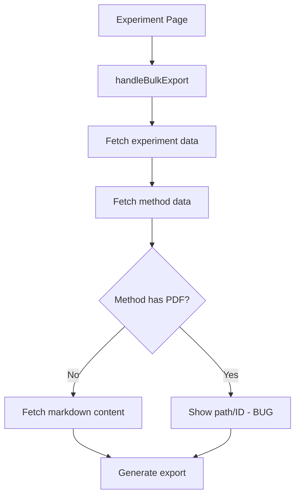
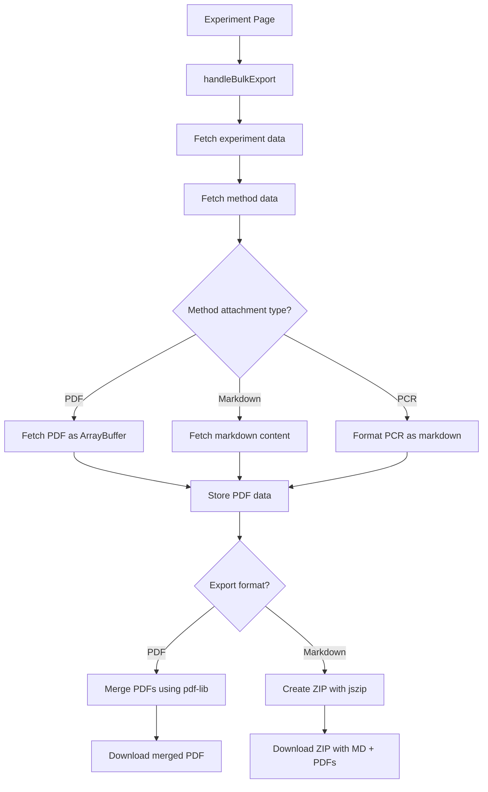

# PDF Method Export Enhancement Plan

## Problem Statement

When exporting experiments that have PDF methods attached, the current implementation shows a meaningless string (likely the method ID or path) instead of the actual PDF content. This needs to be fixed so that:

1. **PDF Export**: The attached PDF method is concatenated/merged with the generated PDF
2. **Markdown Export**: A ZIP file is created containing both the markdown file and the PDF file, with the markdown containing a link to the PDF

## Current Architecture

### Data Flow



### Key Files

- [`frontend/src/lib/export-utils.ts`](frontend/src/lib/export-utils.ts) - Export utility functions
- [`frontend/src/app/experiments/page.tsx`](frontend/src/app/experiments/page.tsx:344) - Export handler
- [`frontend/src/lib/types.ts`](frontend/src/lib/types.ts:197) - MethodAttachment type

### Method Structure

Methods can have multiple attachments with types:
- `markdown` - Markdown content
- `pdf` - PDF file path
- `pcr` - PCR protocol

```typescript
interface MethodAttachment {
  id: string;
  name: string;
  attachment_type: "markdown" | "pdf" | "pcr";
  path: string;
  order: number;
}
```

## Proposed Solution

### New Dependencies Required

Add to `frontend/package.json`:
```json
{
  "dependencies": {
    "pdf-lib": "^2.1.0",
    "jszip": "^3.10.1"
  }
}
```

Install with:
```bash
cd frontend && npm install pdf-lib jszip
```

### Updated Data Flow



## Implementation Details

### 1. Update `ExperimentExportData` Interface

```typescript
export interface PdfAttachmentData {
  filename: string;
  path: string;
  data: ArrayBuffer;  // PDF binary data
}

export interface ExperimentExportData {
  task: Task;
  projectName: string;
  labNotes: string | null;
  method: Method | null;
  methodContent: string | null;
  results: string | null;
  pdfAttachments: string[];  // Paths to PDF files in NotesPDFs/ResultsPDFs
  methodPdfs: PdfAttachmentData[];  // NEW: PDF method attachments with binary data
}
```

### 2. Update Export Functions

#### PDF Export - Merge PDFs

```typescript
async function mergePdfs(
  mainPdf: Uint8Array,
  additionalPdfs: ArrayBuffer[]
): Promise<Uint8Array> {
  const { PDFDocument } = await import('pdf-lib');
  
  const mergedPdf = await PDFDocument.load(mainPdf);
  
  for (const pdfData of additionalPdfs) {
    const pdfToAppend = await PDFDocument.load(pdfData);
    const pages = await mergedPdf.copyPages(pdfToAppend, pdfToAppend.getPageIndices());
    pages.forEach(page => mergedPdf.addPage(page));
  }
  
  return mergedPdf.save();
}
```

#### Markdown Export - Create ZIP

```typescript
async function createExportZip(
  markdownContent: string,
  markdownFilename: string,
  pdfAttachments: PdfAttachmentData[]
): Promise<void> {
  const JSZip = (await import('jszip')).default;
  
  const zip = new JSZip();
  
  // Add markdown file
  zip.file(markdownFilename, markdownContent);
  
  // Add PDF files
  const pdfFolder = zip.folder('attachments');
  for (const pdf of pdfAttachments) {
    pdfFolder?.file(pdf.filename, pdf.data);
  }
  
  // Update markdown to reference local PDFs
  let updatedMarkdown = markdownContent;
  for (const pdf of pdfAttachments) {
    updatedMarkdown = updatedMarkdown.replace(
      new RegExp(`\\[${pdf.path}\\]\\([^)]+\\)`, 'g'),
      `[${pdf.filename}](attachments/${pdf.filename})`
    );
  }
  zip.file(markdownFilename, updatedMarkdown);
  
  // Generate and download
  const blob = await zip.generateAsync({ type: 'blob' });
  const url = URL.createObjectURL(blob);
  const link = document.createElement('a');
  link.href = url;
  link.download = markdownFilename.replace('.md', '.zip');
  link.click();
  URL.revokeObjectURL(url);
}
```

### 3. Update `experiments/page.tsx` - Fetch PDF Data

```typescript
// In handleBulkExport, when fetching method data:

// Fetch method and its attachments
let method: Method | null = null;
let methodContent: string | null = null;
const methodPdfs: PdfAttachmentData[] = [];

if (task.method_ids && task.method_ids.length > 0) {
  for (const methodId of task.method_ids) {
    try {
      method = await methodsApi.get(methodId);
      
      // Process each attachment
      for (const attachment of method.attachments) {
        if (attachment.attachment_type === 'pdf' && attachment.path) {
          // Fetch PDF as ArrayBuffer
          const response = await fetch(githubApi.getRawUrl(attachment.path));
          const pdfData = await response.arrayBuffer();
          const filename = attachment.path.split('/').pop() || 'attachment.pdf';
          
          methodPdfs.push({
            filename,
            path: attachment.path,
            data: pdfData
          });
        } else if (attachment.attachment_type === 'markdown' && attachment.path) {
          const methodFile = await githubApi.readFile(attachment.path);
          methodContent = methodFile.content;
        }
      }
    } catch {
      // Method doesn't exist
    }
  }
}
```

### 4. Update `generateExperimentMarkdown`

```typescript
// Add method PDF references to markdown
if (options.includeMethod && data.methodPdfs.length > 0) {
  sections.push('---');
  sections.push('');
  sections.push('## Method PDFs');
  sections.push('');
  data.methodPdfs.forEach(pdf => {
    sections.push(`- [${pdf.filename}](attachments/${pdf.filename})`);
  });
  sections.push('');
}
```

## File Changes Summary

| File | Changes |
|------|---------|
| `frontend/package.json` | Add `pdf-lib` and `jszip` dependencies |
| `frontend/src/lib/export-utils.ts` | Add PDF merging, ZIP creation, update interfaces |
| `frontend/src/app/experiments/page.tsx` | Fetch PDF data for method attachments |

## User Requirements (Confirmed)

1. **PDF Export Order**: Append PDFs at the end of the document, but include hyperlinks after the methods section that jump to those pages
2. **ZIP Structure**: Flat `attachments/` folder for simplicity (original backend data untouched)
3. **Multiple PDF Methods**: Order by the order they appear in tabs (attachment `order` field)

### PDF Export Structure

```
Generated PDF:
├── Title Page
├── Lab Notes Section
├── Method Section
│   ├── Method 1 name (with link to page X)
│   └── Method 2 name (with link to page Y)
├── Results Section
└── Appended PDFs
    ├── Method 1 PDF (starts at page X)
    └── Method 2 PDF (starts at page Y)
```

### Markdown ZIP Structure

```
export.zip:
├── experiment_name.md
└── attachments/
    ├── method1.pdf
    └── method2.pdf
```

## Testing Checklist

- [ ] Export single experiment with PDF method to PDF
- [ ] Export single experiment with PDF method to Markdown (ZIP)
- [ ] Export multiple experiments with PDF methods
- [ ] Export experiment with both markdown and PDF methods
- [ ] Verify PDF concatenation order matches tab order
- [ ] Verify hyperlinks in PDF jump to correct pages
- [ ] Verify ZIP file structure is flat
- [ ] Verify markdown links in ZIP point to correct files
