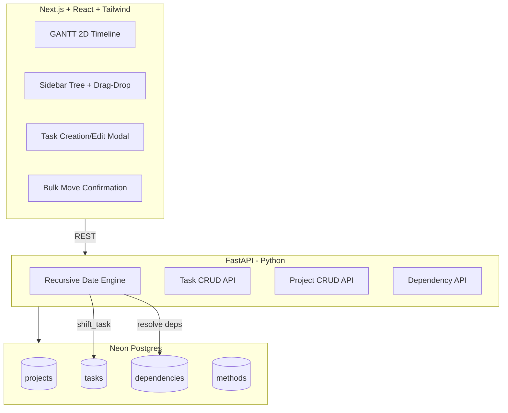
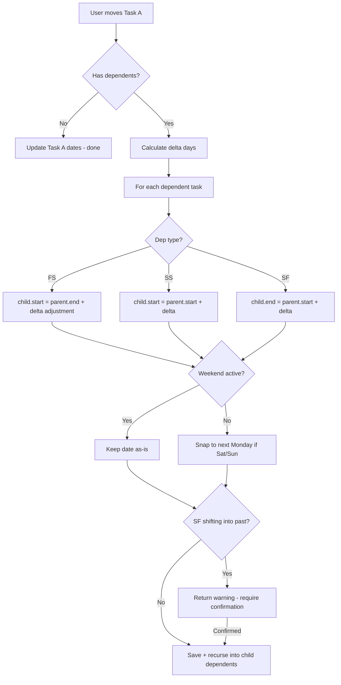
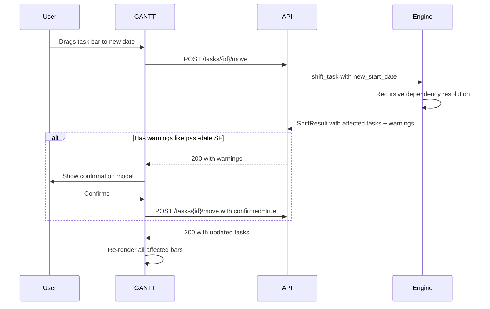

# ResearchOS Implementation Plan

## Architecture Overview



---

## Phase 1: Backend Date Engine + GANTT + Sidebar Tree

### Step 1 — Project Scaffolding

- Initialize Next.js app in `/frontend` with Tailwind CSS
- Initialize FastAPI app in `/backend` with Poetry/pip
- Set up local Postgres via Docker Compose for dev
- Create `.env.example` with placeholders for Neon connection string and GitHub token
- Configure CORS on FastAPI to accept requests from Next.js dev server

### Step 2 — Database Schema + Migrations

Apply the schema from the spec with enhancements:

```sql
CREATE TABLE projects (
    id SERIAL PRIMARY KEY,
    name TEXT NOT NULL,
    weekend_active BOOLEAN DEFAULT FALSE,
    tags TEXT[],
    created_at TIMESTAMP DEFAULT NOW
);

CREATE TABLE tasks (
    id SERIAL PRIMARY KEY,
    project_id INTEGER REFERENCES projects(id) ON DELETE CASCADE,
    name TEXT NOT NULL,
    start_date DATE NOT NULL,
    duration_days INTEGER NOT NULL,
    is_high_level BOOLEAN DEFAULT FALSE,
    is_complete BOOLEAN DEFAULT FALSE,
    weekend_override BOOLEAN DEFAULT NULL,
    -- NULL = inherit from project, TRUE/FALSE = task-level override
    method_id INTEGER,
    deviation_log TEXT,
    tags TEXT[],
    sort_order INTEGER DEFAULT 0
);

CREATE TABLE dependencies (
    id SERIAL PRIMARY KEY,
    parent_id INTEGER REFERENCES tasks(id) ON DELETE CASCADE,
    child_id INTEGER REFERENCES tasks(id) ON DELETE CASCADE,
    dep_type TEXT CHECK (dep_type IN ('FS', 'SS', 'SF')),
    UNIQUE (parent_id, child_id)
);

CREATE TABLE methods (
    id SERIAL PRIMARY KEY,
    name TEXT NOT NULL,
    parent_method_id INTEGER REFERENCES methods(id),
    github_path TEXT NOT NULL,
    folder_path TEXT,
    tags TEXT[]
);
```

Key additions vs. spec:
- `weekend_override` on tasks (per user answer Q1)
- `tags TEXT[]` on methods (per user answer Q3 — inherited on fork)
- `ON DELETE CASCADE` on tasks.project_id
- `UNIQUE` constraint on dependency pairs
- `sort_order` on tasks for sidebar ordering

### Step 3 — FastAPI CRUD Endpoints

| Endpoint | Method | Purpose |
|---|---|---|
| `/projects` | GET, POST | List/create projects |
| `/projects/{id}` | GET, PUT, DELETE | Single project ops |
| `/projects/{id}/tasks` | GET | All tasks for a project |
| `/tasks` | POST | Create task |
| `/tasks/{id}` | GET, PUT, DELETE | Single task ops |
| `/tasks/{id}/move` | POST | Move task + trigger recursive shift |
| `/tasks/{id}/replicate` | POST | Batch-create N replicates |
| `/dependencies` | POST, DELETE | Create/remove dependency |
| `/dependencies/bulk` | POST | Set dependency via drag-drop snap |

### Step 4 — Recursive Date Engine (The Brain)

This is the most critical piece. Core logic in `backend/engine/shift.py`:



**Key function signatures:**

- `resolve_weekend(date, weekend_active, weekend_override) -> date` — If weekends are off and date lands on Sat/Sun, push to Monday
- `compute_end_date(start_date, duration_days, weekend_active) -> date` — Calculate end date respecting weekend skipping
- `shift_task(task_id, new_start_date, confirmed=False) -> ShiftResult` — Main entry point. Returns list of affected tasks + warnings (e.g., past-date SF shifts)
- `get_dependency_chain(task_id) -> list[Task]` — BFS/DFS traversal of all downstream dependents
- `detect_cycle(parent_id, child_id) -> bool` — Prevent circular dependencies

**Weekend logic detail:**
- Check `task.weekend_override` first; if NULL, fall back to `project.weekend_active`
- When computing end dates with weekends off, skip Sat/Sun in the duration count (a 5-day task starting Monday ends Friday, not Wednesday of next week)

### Step 5 — Sidebar Tree (React)

Component hierarchy:
```
<SidebarTree>
  <ProjectGroup project={p}>
    <TaskNode task={t} depth={0}>
      <TaskNode task={child} depth={1}>  // nested dependents
      </TaskNode>
    </TaskNode>
  </ProjectGroup>
</SidebarTree>
```

**Drag-and-drop snapping logic:**
- Use `onDragOver` + `onMouseMove` on each `<TaskNode>`
- Get target element bounding rect via `getBoundingClientRect()`
- Calculate Y position relative to element:
  - **Top 25%**: Visual indicator = line above → creates FS dependency (dragged task BEFORE target)
  - **Middle 50%**: Visual indicator = highlight → creates SS dependency (concurrent)
  - **Bottom 25%**: Visual indicator = line below → creates FS dependency (dragged task AFTER target)
- On drop, call `POST /dependencies/bulk` with the computed `dep_type`

### Step 6 — GANTT 2D Timeline (React + Frappe Gantt)

**Rendering approach:** [Frappe Gantt](https://github.com/frappe/gantt) (MIT license, zero dependencies, v1.0.3) wrapped in a React component.

**Why Frappe Gantt:**
- Built-in SVG rendering with dependency arrows
- Drag-to-resize and drag-to-move task bars
- View modes: Day, Week, Month, Year + custom view modes
- Weekend/holiday highlighting via `holidays` and `ignore` options
- `is_weekend` function override for custom weekend logic
- `snap_at` for drag snapping intervals
- `popup` for custom task detail popups
- `infinite_padding` for seamless scrolling
- 5.8K GitHub stars, actively maintained

**Integration strategy:**
- Set `move_dependencies: false` — our backend `shift_task()` engine owns all dependency cascading
- On `on_date_change` callback → call `POST /tasks/{id}/move` → backend resolves all shifts → re-render chart with `gantt.refresh()`
- Custom `view_modes` array to support: 1wk, 2wk, 1mo, 3mo, 6mo, 1yr, all-time
- Custom `is_weekend` function that checks task-level `weekend_override` then project `weekend_active`
- Custom `popup` to show task details, dependencies, and edit button

**Layout:**
- Y-axis: One row per project; tasks grouped within each project section
- X-axis: Date timeline with Frappe Gantt zoom levels
- Default view: Month (closest to 3-month; we configure custom 3mo view mode)
- High-level goal tasks rendered with custom CSS class for semi-transparent styling
- Task bars colored per project via custom CSS
- Dependency arrows rendered natively by Frappe Gantt

**React wrapper component:**
```
<GanttChart
  tasks={tasks}           // from API, transformed to Frappe format
  viewMode="Month"        // controlled by zoom buttons
  onDateChange={handler}  // triggers backend shift_task
  onClick={handler}       // opens edit modal
  weekendActive={project.weekend_active}
/>
```

**Interactions:**
- Click task bar → open edit modal via `on_click` callback
- Drag task bar horizontally → `on_date_change` fires → calls `POST /tasks/{id}/move`
- Backend returns ShiftResult → if warnings, show confirmation modal → on confirm, re-call with `confirmed=true`
- All affected tasks re-rendered via `gantt.refresh()`
- Zoom buttons in toolbar switch `view_mode`
- Project/tag filter pills at top filter the task array

**Data flow:**


---

## Phase 2 (Future): Calendar View + Homepage Dashboard

- Month calendar view with tasks displayed on their date ranges
- Double-click day to create task
- "+" button for task creation modal
- Project filter on calendar
- Homepage with: today's tasks summary + overdue tasks summary

## Phase 3 (Future): ELN + Method Library + GitHub Integration

- GitHub proxy API endpoints (commit .md, read .md, upload images)
- Method CRUD with fork/inheritance
- Deviation logging on task completion
- Results subpage with Markdown editor
- Quick-view modal for .md files

## Phase 4 (Future): Polish + Advanced Features

- Archive view (historical GANTT snapshots)
- Replicate/batch-create feature
- Green-to-gold completion animation
- Vercel deployment pipeline
- Neon production database setup

---

## Tech Decisions Summary

| Decision | Choice | Rationale |
|---|---|---|
| Frontend framework | Next.js + React | Vercel-native, good DX |
| GANTT rendering | Frappe Gantt (MIT, v1.0.3) | Zero deps, built-in drag/arrows/zoom, React-wrappable |
| State management | React Query + Zustand | Server state via RQ, UI state via Zustand |
| Drag-and-drop | Native HTML5 DnD API | Lightweight, sufficient for sidebar tree |
| DB migrations | Alembic | Standard for SQLAlchemy + FastAPI |
| ORM | SQLAlchemy | Pairs with FastAPI, strong Postgres support |
| API client | Axios or fetch | Simple REST calls |
| Dev database | Docker Compose Postgres | Mirrors Neon in production |
