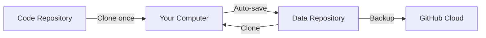

# README Improvements Plan

## Summary

Improve the README.md to be more accessible for lab researchers with basic technical skills. The key goals are:
- Make prerequisites immediately clear at the top
- Explicitly state what is NOT needed (Docker)
- Provide verification commands to check installations
- Add Windows-specific instructions
- Simplify the two-repository concept explanation

---

## Current Issues Identified

### 1. Prerequisites Buried After Features
- Current: Prerequisites section appears after Features section
- Problem: Users have to scroll to find what they need to install
- Fix: Move requirements to the very top with a clear summary box

### 2. No Explicit "Docker NOT Required" Statement
- Current: No mention of Docker
- Problem: Many similar apps use Docker, users may assume it's needed
- Fix: Add explicit statement that Docker is NOT required

### 3. Missing Verification Commands
- Current: Just lists version requirements
- Problem: Users don't know how to check their installed versions
- Fix: Add terminal commands to verify each installation

### 4. Two-Repository Concept is Confusing
- Current: Explanation is scattered across multiple steps
- Problem: Users may not understand why they need two repos
- Fix: Add a simple diagram and clearer explanation upfront

### 5. No Windows Support
- Current: start.sh is a bash script
- Problem: Windows users cannot run the start script directly
- Fix: Add Windows instructions using PowerShell or manual steps

### 6. GitHub Account Requirement Not Prominent
- Current: Mentioned in Step 2
- Problem: Users should know upfront they need a GitHub account
- Fix: Add to top-level requirements summary

---

## Proposed README Structure

```
# ResearchOS

## What You'll Need (Quick Summary)
   - Checklist format with links to download pages
   - Explicit "Docker NOT required" note
   - GitHub account requirement highlighted

## Verification Commands
   - Terminal commands to check installed versions
   - Separate sections for macOS/Linux and Windows

## Quick Start Overview
   - Simple diagram showing the two-repo concept
   - 3-step high-level summary before detailed steps

## Step-by-Step Installation
   - Step 1: Install Prerequisites (with links)
   - Step 2: Clone This Repository
   - Step 3: Create Data Repository
   - Step 4: Create GitHub Token
   - Step 5: Configure
   - Step 6: Install Dependencies
   - Step 7: Run the Application
      - macOS/Linux: Using start.sh
      - Windows: Manual start or WSL

## Configuration Reference
   - Keep existing table

## Troubleshooting
   - Keep existing content
   - Add Windows-specific issues

## Development
   - Keep existing content
```

---

## Detailed Changes

### 1. New "What You'll Need" Section (Top of README)

```markdown
## What You'll Need

Before starting, make sure you have:

| Requirement | Version | Download Link | Notes |
|-------------|---------|---------------|-------|
| **GitHub Account** | Free | [github.com/signup](https://github.com/signup) | Required for data storage |
| **Python** | 3.10+ | [python.org](https://www.python.org/downloads/) | Backend runtime |
| **Node.js** | 18+ | [nodejs.org](https://nodejs.org/) | Frontend runtime |
| **Git** | Any | [git-scm.com](https://git-scm.com/downloads) | Version control |

> **Good news!** Docker is NOT required. This app runs directly on your machine.

> **Note:** A GitHub account is required because ResearchOS stores your data in your own private GitHub repository. This gives you automatic backups and version history.
```

### 2. New Verification Commands Section

```markdown
## Check Your Installations

Open a terminal and run these commands to verify your installations:

**macOS/Linux:**
```bash
python3 --version    # Should show Python 3.10.x or higher
node --version       # Should show v18.x.x or higher
git --version        # Should show git version 2.x.x
```

**Windows (Command Prompt or PowerShell):**
```cmd
python --version     # Should show Python 3.10.x or higher
node --version       # Should show v18.x.x or higher
git --version        # Should show git version 2.x.x
```

If any command fails or shows an older version, install or update from the links above.
```

### 3. Simplified Two-Repository Explanation

Add a diagram using Mermaid:

```markdown
## How Data Storage Works

ResearchOS uses two separate GitHub repositories:



1. **Code Repository** (this one): Contains the application code. Clone once and you're done.
2. **Data Repository** (yours): Contains YOUR research data. You create this as a private repo.

This separation means:
- Your data stays private and secure
- Every change is automatically backed up to GitHub
- You can share your data repo with collaborators
- Full version history of all your research data
```

### 4. Windows-Specific Instructions

Add a new section for Windows users:

```markdown
### Running on Windows

The `start.sh` script is designed for macOS and Linux. Windows users have two options:

#### Option A: Use WSL (Windows Subsystem for Linux) - Recommended

1. Install WSL: [Microsoft WSL Guide](https://learn.microsoft.com/en-us/windows/wsl/install)
2. Open WSL terminal
3. Follow the macOS/Linux instructions

#### Option B: Manual Start (PowerShell)

Open two PowerShell windows:

**Window 1 - Backend:**
```powershell
cd backend
python -m uvicorn app.main:app --host 0.0.0.0 --port 8000 --reload
```

**Window 2 - Frontend:**
```powershell
cd frontend
npm run dev
```

Then open http://localhost:3000 in your browser.
```

---

## Implementation Checklist

- [ ] Add "What You'll Need" summary table at the top
- [ ] Add "Docker NOT required" note
- [ ] Add verification commands section
- [ ] Add two-repository diagram and explanation
- [ ] Move GitHub account requirement to top summary
- [ ] Add Windows-specific instructions
- [ ] Simplify step-by-step instructions
- [ ] Update troubleshooting for Windows issues
- [ ] Test all links work correctly

---

## Questions for User

1. Should we create a `start.bat` or `start.ps1` script for Windows users?
2. Is the current GitHub token scope (repo) the minimum required, or can we reduce permissions?
3. Should we add screenshots of the Settings popup for GUI configuration?
