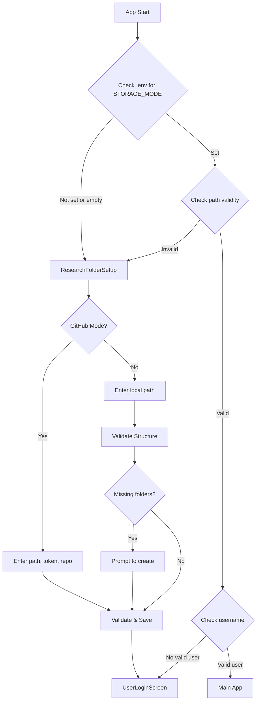
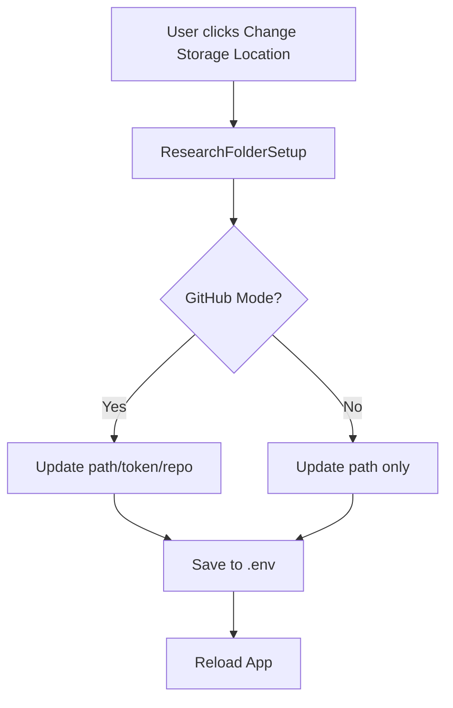
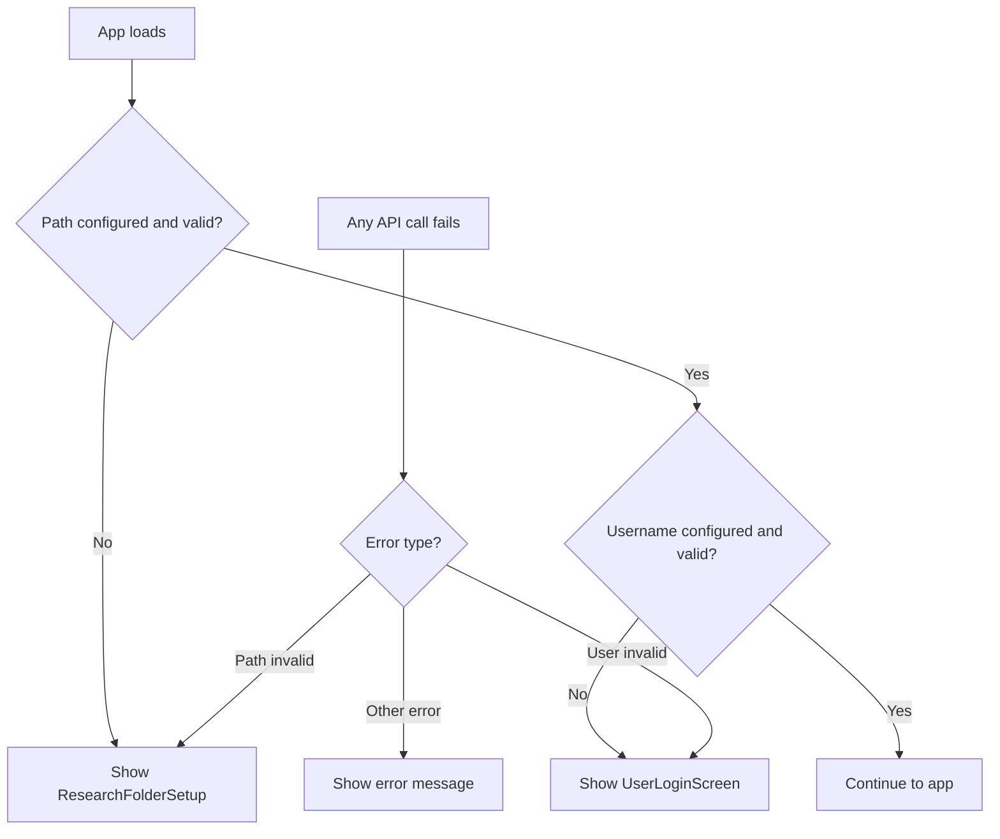

# Research Folder Setup - Implementation Gameplan

## Overview

This feature introduces a "Set up or connect a lab research folder" page that appears **before** the username selection screen. It allows users to choose between linking a GitHub-cloned repository (with full git sync support) or an alternative local folder (OneDrive, internal research drive, etc.) for data storage.

### Key Requirements

1. **Folder setup appears BEFORE username selection** - Users must configure storage before creating/selecting a user
2. **Auto-appears when path is invalid or no valid username** - Any time the configured path becomes invalid, or a username is missing, the setup page shows
3. **Two storage modes**: GitHub (with git sync) or Local (OneDrive, network drives, etc.)
4. **Local mode does NOT require `.git` folder** - Only requires the expected folder structure
5. **GitHub mode supports blank or existing repos** - Can initialize a new data repo or connect to an existing one

---

## Current Architecture Analysis

### How Data Storage Works Today

1. **Configuration** ([`backend/app/config.py`](backend/app/config.py)):
   - Settings loaded from `.env` file in backend directory
   - Key settings: `GITHUB_TOKEN`, `GITHUB_REPO`, `GITHUB_LOCALPATH`, `CURRENT_USER`
   - Path validation happens in [`settings.py`](backend/app/routers/settings.py) router

2. **Storage Layer** ([`backend/app/storage.py`](backend/app/storage.py)):
   - All data stored under `{github_localpath}/data/users/{current_user}/`
   - Public data under `{github_localpath}/data/users/public/`
   - JSON files per entity (projects, tasks, methods, etc.)

3. **Current Flow**:
   - App loads → Check data path validity → Show `DataPathCheckPopup` if invalid
   - Then show `UserLoginScreen` for username selection
   - Settings saved in `.env` (already local, not pushed to GitHub)

### Key Files Involved

| File | Purpose |
|------|---------|
| `backend/app/config.py` | Settings management, `.env` handling |
| `backend/app/storage.py` | Data path resolution, JSON storage |
| `backend/app/routers/settings.py` | Settings API endpoints, path validation |
| `frontend/src/components/DataPathCheckPopup.tsx` | Current path error popup |
| `frontend/src/components/UserLoginScreen.tsx` | Username selection UI |
| `frontend/src/app/page.tsx` | Main page with path check logic |

---

## Proposed Changes

### Phase 1: Backend - Storage Mode Support

#### 1.1 Update Configuration Model

**File:** `backend/app/config.py`

Add a new setting to track the storage mode:

```python
class Settings(BaseSettings):
    github_token: str = ""
    github_repo: str = ""  # e.g. "username/research-eln"
    github_localpath: str = ""  # local path to data repo clone
    cors_origins: List[str] = ["http://localhost:3000"]
    current_user: str = ""
    main_user: str = ""
    storage_mode: str = "github"  # NEW: "github" or "local"
    
    def is_github_mode(self) -> bool:
        """Check if using GitHub sync mode."""
        return self.storage_mode == "github"
    
    def is_local_mode(self) -> bool:
        """Check if using local-only mode."""
        return self.storage_mode == "local"
```

Update `DEFAULT_ENV_CONTENT`:
```python
DEFAULT_ENV_CONTENT = """GITHUB_TOKEN=
GITHUB_REPO=
GITHUB_LOCALPATH=
CORS_ORIGINS="["http://localhost:3000"]"
CURRENT_USER=
MAIN_USER=
STORAGE_MODE=github
"""
```

#### 1.2 Update Settings Router

**File:** `backend/app/routers/settings.py`

Add new endpoint for folder setup:

```python
class FolderSetupRequest(BaseModel):
    """Request to set up research folder."""
    mode: str  # "github" or "local"
    local_path: str
    github_token: Optional[str] = None
    github_repo: Optional[str] = None
    create_if_missing: bool = False


class FolderSetupResponse(BaseModel):
    """Response after folder setup."""
    status: str
    message: str
    path: str
    mode: str
    created_folders: bool


@router.post("/setup-folder", response_model=FolderSetupResponse)
async def setup_research_folder(request: FolderSetupRequest):
    """Set up or connect a research folder.
    
    Validates the path, creates folder structure if needed,
    and updates the .env configuration.
    """
    # Implementation details...
```

Update `check_data_path()` to handle both modes:
- In GitHub mode: require `.git` folder
- In local mode: just require valid directory with `data/users/` structure

#### 1.3 Add Folder Structure Validation

**File:** `backend/app/routers/settings.py`

```python
def validate_folder_structure(path: Path, create_if_missing: bool = False) -> dict:
    """Validate and optionally create folder structure.
    
    Returns:
        dict with 'valid', 'message', 'created' keys
    """
    required_structure = [
        "data/users",
        "data/users/public",
    ]
    
    results = {
        "valid": True,
        "message": "",
        "created": False,
        "missing": []
    }
    
    for subdir in required_structure:
        full_path = path / subdir
        if not full_path.exists():
            if create_if_missing:
                full_path.mkdir(parents=True, exist_ok=True)
                results["created"] = True
            else:
                results["missing"].append(subdir)
                results["valid"] = False
    
    if results["missing"]:
        results["message"] = f"Missing folders: {', '.join(results['missing'])}"
    
    return results
```

---

### Phase 2: Frontend - Setup Page UI

#### 2.1 New Component: ResearchFolderSetup

**New File:** `frontend/src/components/ResearchFolderSetup.tsx`

A full-screen setup wizard with two options:

```
┌─────────────────────────────────────────────────────────────┐
│                                                             │
│                    🧪 ResearchOS                            │
│                                                             │
│         Set Up or Connect a Lab Research Folder             │
│                                                             │
│  ┌─────────────────────┐    ┌─────────────────────┐        │
│  │   🔗 GitHub Repo    │    │   📁 Local Folder   │        │
│  │                     │    │                     │        │
│  │  Clone and sync     │    │  OneDrive, network  │        │
│  │  with GitHub for    │    │  drive, or any      │        │
│  │  version control    │    │  local folder       │        │
│  │                     │    │                     │        │
│  │  [Select]           │    │  [Select]           │        │
│  └─────────────────────┘    └─────────────────────┘        │
│                                                             │
└─────────────────────────────────────────────────────────────┘
```

**GitHub Mode Flow:**
1. Choose: "Blank repo" or "Existing repo"
2. Enter local path (where to clone or where already cloned)
3. Enter GitHub repository (e.g., "username/research-eln")
4. Enter GitHub Personal Access Token
5. Validate and save

**Local Mode Flow:**
1. Enter/browse to local folder path
2. Validate folder structure
3. If missing, prompt: "Folder structure not found. Create it?"
4. Save configuration

#### 2.2 Update Main Page Flow

**File:** `frontend/src/app/page.tsx`

Modify the startup flow:

```tsx
// Current flow:
// 1. Check data path
// 2. Show DataPathCheckPopup if error
// 3. Show UserLoginScreen

// New flow:
// 1. Check if storage_mode is configured AND path is valid
// 2. If not configured OR path invalid → Show ResearchFolderSetup
// 3. After setup → Check if valid username exists
// 4. If no valid username → Show UserLoginScreen
// 5. If valid username → Show main app
```

Add state management:
```tsx
const [showFolderSetup, setShowFolderSetup] = useState(false);
const [setupComplete, setSetupComplete] = useState(false);

useEffect(() => {
    const checkSetup = async () => {
        try {
            const result = await settingsApi.checkDataPath();
            if (result.status === "error") {
                // Path error - show folder setup to fix
                setShowFolderSetup(true);
            } else {
                // Path valid - check user
                setShowFolderSetup(false);
                // Then validate user...
            }
        } catch {
            setShowFolderSetup(true);
        } finally {
            setCheckingPath(false);
        }
    };
    checkSetup();
}, []);
```

#### 2.3 Replace DataPathCheckPopup with ResearchFolderSetup

The `DataPathCheckPopup` component will be replaced by the new `ResearchFolderSetup` component. The new component handles both:
- Initial setup (no configuration exists)
- Fixing broken configuration (path changed, folder deleted, etc.)

---

### Phase 3: API Updates

#### 3.1 Settings API Extensions

**File:** `frontend/src/lib/api.ts`

Add new API methods:

```typescript
export const settingsApi = {
    // ... existing methods ...
    
    setupFolder: async (request: FolderSetupRequest): Promise<FolderSetupResponse> => {
        const response = await fetch(`${API_BASE}/settings/setup-folder`, {
            method: "POST",
            headers: { "Content-Type": "application/json" },
            body: JSON.stringify(request),
        });
        if (!response.ok) {
            const error = await response.json();
            throw new Error(error.detail || "Failed to setup folder");
        }
        return response.json();
    },
    
    getStorageMode: async (): Promise<{ mode: string; path: string }> => {
        const response = await fetch(`${API_BASE}/settings/storage-mode`);
        return response.json();
    },
};
```

---

## User Flow Diagrams

### First Launch Flow



### Change Path Flow - from Settings



### Auto-Appearance Logic



---

## Implementation Checklist

### Backend Changes

- [ ] Add `STORAGE_MODE` to `Settings` class in [`config.py`](backend/app/config.py)
- [ ] Update `DEFAULT_ENV_CONTENT` with new setting
- [ ] Add `is_github_mode()` and `is_local_mode()` helper methods
- [ ] Create `FolderSetupRequest` and `FolderSetupResponse` models in [`schemas.py`](backend/app/schemas.py)
- [ ] Add `/settings/setup-folder` endpoint in [`settings.py`](backend/app/routers/settings.py)
- [ ] Add `/settings/storage-mode` GET endpoint
- [ ] Update `check_data_path()` to handle both modes:
  - GitHub mode: require `.git` folder
  - Local mode: only require `data/users/` structure
- [ ] Add `validate_folder_structure()` helper function
- [ ] Update `write_env_file()` to include `STORAGE_MODE`

### Frontend Changes

- [ ] Create `ResearchFolderSetup.tsx` component with:
  - [ ] Two-card selection UI (GitHub vs Local)
  - [ ] GitHub mode form (path, repo, token, blank/existing option)
  - [ ] Local mode form (path only, create structure option)
  - [ ] Validation and error handling
- [ ] Add folder setup API methods to [`api.ts`](frontend/src/lib/api.ts)
- [ ] Update [`page.tsx`](frontend/src/app/page.tsx) to:
  - [ ] Show setup on first launch
  - [ ] Show setup when path invalid
  - [ ] Show UserLoginScreen after setup complete
- [ ] Remove or repurpose `DataPathCheckPopup.tsx`
- [ ] Add types for new API requests/responses in [`types.ts`](frontend/src/lib/types.ts)

### Testing

- [ ] Test first launch with no .env
- [ ] Test GitHub mode setup flow:
  - [ ] Blank repo option
  - [ ] Existing repo option
- [ ] Test local mode setup flow
- [ ] Test folder structure validation
- [ ] Test folder structure creation
- [ ] Test switching from GitHub to local mode
- [ ] Test switching from local to GitHub mode
- [ ] Test path validation for OneDrive paths
- [ ] Test path validation for network drives
- [ ] Test auto-appearance when path becomes invalid
- [ ] Test auto-appearance when username becomes invalid

---

## Environment File Schema

### GitHub Mode (.env)

```env
GITHUB_TOKEN=ghp_xxxxxxxxxxxx
GITHUB_REPO=username/research-eln
GITHUB_LOCALPATH=/Users/username/research-eln
CORS_ORIGINS=["http://localhost:3000"]
CURRENT_USER=GrantNickles
MAIN_USER=
STORAGE_MODE=github
```

### Local Mode (.env)

```env
GITHUB_TOKEN=
GITHUB_REPO=
GITHUB_LOCALPATH=/Users/gnickles/Library/CloudStorage/OneDrive-UW-Madison/ResearchData
CORS_ORIGINS=["http://localhost:3000"]
CURRENT_USER=GrantNickles
MAIN_USER=
STORAGE_MODE=local
```

---

## Folder Structure Requirements

Both modes require the following structure:

```
{GITHUB_LOCALPATH}/
└── data/
    └── users/
        ├── _user_metadata.json    # User colors and metadata
        ├── public/                 # Shared methods and protocols
        │   ├── methods/
        │   ├── pcr_protocols/
        │   └── _counters.json
        ├── {username1}/           # User-specific data
        │   ├── projects/
        │   ├── tasks/
        │   ├── methods/
        │   └── ... (other entities)
        └── {username2}/
            └── ...
```

---

## Key Decisions

1. **Git Sync Optional**: Local mode does not require GitHub token or repo configuration. Git sync features are disabled in this mode.

2. **Folder Validation**: The system validates that the expected folder structure exists. If missing, the user is prompted to create it before proceeding.

3. **Setup Page Trigger**: The setup page appears when:
   - First launch (no `STORAGE_MODE` configured)
   - Path becomes invalid (folder deleted, moved, or inaccessible)
   - User clicks "Change Storage Location" from settings

4. **Settings Persistence**: All settings are saved in the local `.env` file, which is not pushed to GitHub (already in `.gitignore`).

5. **Backward Compatibility**: Existing installations with `GITHUB_LOCALPATH` set but no `STORAGE_MODE` will default to GitHub mode.

6. **Order of Operations**: Folder setup → Username selection → Main app. This ensures data storage is configured before any user data is accessed.

---

## Future Considerations

1. **Folder Browser**: Add a native folder picker dialog for easier path selection
2. **Migration Tool**: Help users migrate data between GitHub and local modes
3. **Multi-folder Support**: Allow switching between multiple research folders
4. **Cloud Sync Indicators**: Show sync status for OneDrive/iCloud folders
