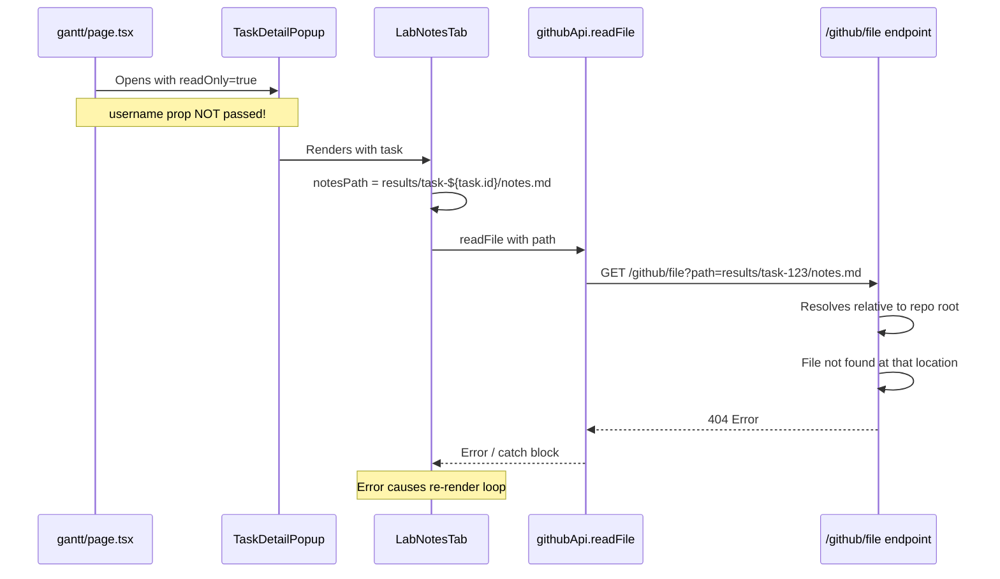
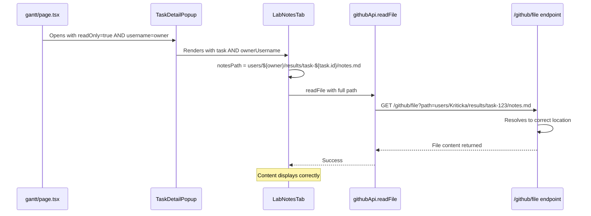

# Shared Experiment Popup Bug Fix Plan

## Problem Description

When a shared experiment is opened from the Gantt page, the popup glitches and repeatedly opens/closes, preventing any interaction. This occurs because the frontend constructs file paths without considering the owner's username, causing file read failures that trigger error loops.

### Specific Scenario
- Experiment created by `KritickaChopra` is shared with `GrantNickles`
- Shows correctly on both accounts with `[K]` owner indicator
- When Grant clicks on the experiment, the popup glitches

## Root Cause Analysis

### Current Flow (Broken)



### Expected Flow (Fixed)



## Key Files Involved

### Frontend Files

1. **[`frontend/src/app/gantt/page.tsx`](frontend/src/app/gantt/page.tsx:218-225)**
   - Opens `TaskDetailPopup` for shared experiments
   - Currently passes `readOnly={editingTask.is_shared_with_me === true}`
   - Does NOT pass `username` prop

2. **[`frontend/src/components/TaskDetailPopup.tsx`](frontend/src/components/TaskDetailPopup.tsx:26-33)**
   - Main popup component
   - Accepts `username` prop but doesn't use it for file paths
   - Passes `username` to `PurchaseEditor` (line 408) but NOT to `LabNotesTab` or `ResultsTab`

3. **[`frontend/src/components/TaskDetailPopup.tsx`](frontend/src/components/TaskDetailPopup.tsx:1801-2062) - `LabNotesTab`**
   - Constructs paths: `results/task-${task.id}/notes.md` (line 1812)
   - Does NOT receive or use owner username

4. **[`frontend/src/components/TaskDetailPopup.tsx`](frontend/src/components/TaskDetailPopup.tsx:3055-3312) - `ResultsTab`**
   - Constructs paths: `results/task-${task.id}/results.md` (line 3066)
   - Does NOT receive or use owner username

### Backend Files

5. **[`backend/app/routers/github_proxy.py`](backend/app/routers/github_proxy.py:64-70)**
   - `_resolve()` function resolves paths relative to repo root
   - No owner context for file operations

6. **[`backend/app/storage.py`](backend/app/storage.py:26-33)**
   - `_data_root()` uses `settings.current_user` for path resolution
   - Has `_get_user_data_root(username)` function for cross-user access

## Solution Design

### Approach: Frontend Path Construction with Owner Prefix

The simplest and most consistent approach is to construct full paths including the owner's username on the frontend, similar to how Lab mode works.

### Changes Required

#### 1. Update `gantt/page.tsx` - Pass Owner Username

```typescript
// Line 218-225: Add username prop
{editingTask && (
  <TaskDetailPopup
    task={editingTask}
    project={editingProject}
    onClose={() => setEditingTaskId(null)}
    readOnly={editingTask.is_shared_with_me === true}
    username={editingTask.is_shared_with_me ? editingTask.owner : undefined}
  />
)}
```

#### 2. Update `TaskDetailPopup.tsx` - Pass Owner to Tabs

```typescript
// Line 399: Pass ownerUsername to LabNotesTab
{activeTab === "notes" && (
  <LabNotesTab 
    task={task} 
    readOnly={readOnly} 
    ownerUsername={task.is_shared_with_me ? task.owner : username}
  />
)}

// Line 407: Pass ownerUsername to ResultsTab
{activeTab === "results" && (
  <ResultsTab 
    task={task} 
    readOnly={readOnly} 
    ownerUsername={task.is_shared_with_me ? task.owner : username}
  />
)}
```

#### 3. Update `LabNotesTab` - Use Owner Username in Paths

```typescript
// Add ownerUsername prop
function LabNotesTab({ 
  task, 
  readOnly = false,
  ownerUsername 
}: { 
  task: Task; 
  readOnly?: boolean;
  ownerUsername?: string;
}) {
  // Construct paths with owner prefix
  const basePath = ownerUsername 
    ? `users/${ownerUsername}/results/task-${task.id}`
    : `results/task-${task.id}`;
  
  const notesPath = `${basePath}/notes.md`;
  const imagesDir = `${basePath}/Images`;
  const pdfsDir = `${basePath}/NotesPDFs`;
  // ... rest of component
}
```

#### 4. Update `ResultsTab` - Use Owner Username in Paths

```typescript
// Add ownerUsername prop
function ResultsTab({ 
  task, 
  readOnly = false,
  ownerUsername 
}: { 
  task: Task; 
  readOnly?: boolean;
  ownerUsername?: string;
}) {
  // Construct paths with owner prefix
  const basePath = ownerUsername 
    ? `users/${ownerUsername}/results/task-${task.id}`
    : `results/task-${task.id}`;
  
  const resultsPath = `${basePath}/results.md`;
  const imagesDir = `${basePath}/Images`;
  const pdfsDir = `${basePath}/ResultsPDFs`;
  // ... rest of component
}
```

#### 5. Update `PdfAttachmentsPanel` - Accept Owner Username

```typescript
function PdfAttachmentsPanel({ 
  task, 
  pdfsDir, 
  label,
  ownerUsername 
}: { 
  task: Task; 
  pdfsDir: string; 
  label: string;
  ownerUsername?: string;
}) {
  // Use ownerUsername for path construction if provided
  // This is already using pdfsDir from parent, so minimal changes needed
}
```

## Implementation Checklist

### Phase 1: Frontend Changes

- [ ] **Task 1.1**: Update `gantt/page.tsx` to pass `username` prop to `TaskDetailPopup` for shared experiments
  - File: [`frontend/src/app/gantt/page.tsx`](frontend/src/app/gantt/page.tsx:218-225)
  - Add: `username={editingTask.is_shared_with_me ? editingTask.owner : undefined}`

- [ ] **Task 1.2**: Update `TaskDetailPopup` to pass `ownerUsername` to `LabNotesTab`
  - File: [`frontend/src/components/TaskDetailPopup.tsx`](frontend/src/components/TaskDetailPopup.tsx:399)
  - Add: `ownerUsername={task.is_shared_with_me ? task.owner : username}`

- [ ] **Task 1.3**: Update `TaskDetailPopup` to pass `ownerUsername` to `ResultsTab`
  - File: [`frontend/src/components/TaskDetailPopup.tsx`](frontend/src/components/TaskDetailPopup.tsx:407)
  - Add: `ownerUsername={task.is_shared_with_me ? task.owner : username}`

- [ ] **Task 1.4**: Update `LabNotesTab` to accept and use `ownerUsername` prop
  - File: [`frontend/src/components/TaskDetailPopup.tsx`](frontend/src/components/TaskDetailPopup.tsx:1801-2062)
  - Add `ownerUsername?: string` to props
  - Update path construction to include `users/${ownerUsername}/` prefix

- [ ] **Task 1.5**: Update `ResultsTab` to accept and use `ownerUsername` prop
  - File: [`frontend/src/components/TaskDetailPopup.tsx`](frontend/src/components/TaskDetailPopup.tsx:3055-3312)
  - Add `ownerUsername?: string` to props
  - Update path construction to include `users/${ownerUsername}/` prefix

- [ ] **Task 1.6**: Update `PdfAttachmentsPanel` if needed
  - File: [`frontend/src/components/TaskDetailPopup.tsx`](frontend/src/components/TaskDetailPopup.tsx:3365-3642)
  - Verify path handling with owner prefix

### Phase 2: Testing

- [ ] **Task 2.1**: Test shared experiment popup from Gantt page
  - Verify popup opens without glitching
  - Verify Lab Notes tab loads content from owner's folder
  - Verify Results tab loads content from owner's folder
  - Verify Files/PDFs tab works correctly

- [ ] **Task 2.2**: Test own experiments still work
  - Verify popup opens normally for own experiments
  - Verify file paths resolve correctly

- [ ] **Task 2.3**: Test Lab mode still works
  - Verify Lab mode continues to function correctly
  - Verify cross-user file access works

## Additional Considerations

### Error Handling

The current error handling in `LabNotesTab` and `ResultsTab` catches file not found errors and creates new content. This is correct behavior for new experiments, but for shared experiments, we should:

1. Show a clear message if the file doesn't exist in the owner's folder
2. NOT create new content in the wrong location
3. Handle the error gracefully without causing re-render loops

### Security Considerations

The backend should verify that:
1. The user has permission to access the shared experiment
2. The file path being requested is within the owner's directory
3. Path traversal attacks are prevented (already handled by `_resolve()` function)

### Alternative Approaches Considered

1. **Backend owner parameter**: Add `?owner=username` to API endpoints
   - Pros: Centralized logic, consistent with Lab mode
   - Cons: Requires backend changes, more complex

2. **Frontend-only path construction**: Construct full paths on frontend
   - Pros: Simple, no backend changes needed
   - Cons: Frontend needs to know storage structure

We recommend **Approach 2** (Frontend-only path construction) because:
- It's simpler and requires fewer changes
- It's consistent with how Lab mode already works
- The storage structure is already known to the frontend

## Related Code Patterns

### Lab Mode Pattern (Working Example)

From [`frontend/src/app/lab/page.tsx`](frontend/src/app/lab/page.tsx:377-384):
```typescript
{selectedTask && (
  <TaskDetailPopup
    task={labTaskToTask(selectedTask)}
    onClose={() => setSelectedTask(null)}
    readOnly={true}
    username={selectedTask.username}  // <-- This is passed correctly
  />
)}
```

### Task Type Definition

From [`frontend/src/lib/types.ts`](frontend/src/lib/types.ts):
```typescript
interface Task {
  // ... other fields
  owner?: string;           // Username of the task owner
  shared_with?: string[];   // Array of usernames the task is shared with
  is_shared_with_me?: boolean;  // True if task is shared WITH current user
}
```

## Estimated Effort

- Frontend changes: 4-6 code modifications across 2 files
- Testing: Manual verification of 3 scenarios
- No backend changes required
- No database migrations required
