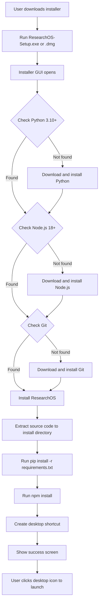

# ResearchOS Smart Installer Plan

## Overview

Create a user-friendly installer application that guides non-technical users through the ResearchOS setup process. The installer will check for dependencies, install missing ones, and create a desktop shortcut for one-click launching.

## Current State

Users currently need to:
1. Install Python 3.10+ manually
2. Install Node.js 18+ manually
3. Install Git manually
4. Clone the repository
5. Run `pip install -r requirements.txt`
6. Run `npm install`
7. Configure environment variables
8. Run start scripts via terminal

## Target Experience

1. Download single installer file - `ResearchOS-Setup.exe` or `ResearchOS-Installer.dmg`
2. Run installer - GUI wizard appears
3. Installer checks and installs dependencies automatically
4. Desktop shortcut created
5. User clicks desktop icon to launch ResearchOS

---

## Architecture

### Approach: Electron-based Installer

Using Electron to create a cross-platform installer GUI provides:
- Single codebase for Windows and Mac
- Modern, professional UI
- Can bundle ResearchOS source code
- Easy to maintain and update



---

## Project Structure

Create a new `installer/` directory in the repository:

```
installer/
├── package.json
├── tsconfig.json
├── src/
│   ├── main.ts                 # Electron main process
│   ├── preload.ts              # Preload script for IPC
│   ├── renderer/               # React-based UI
│   │   ├── index.html
│   │   ├── App.tsx
│   │   ├── components/
│   │   │   ├── WelcomeScreen.tsx
│   │   │   ├── DependencyCheck.tsx
│   │   │   ├── InstallationProgress.tsx
│   │   │   ├── GitHubSetup.tsx
│   │   │   └── SuccessScreen.tsx
│   │   └── styles.css
│   └── utils/
│       ├── dependencyChecker.ts    # Check if Python/Node/Git installed
│       ├── dependencyInstaller.ts  # Download and install dependencies
│       ├── fileOps.ts              # File operations
│       └── shortcutCreator.ts      # Create desktop shortcuts
├── assets/
│   ├── icon.icns               # Mac app icon
│   ├── icon.ico                # Windows app icon
│   └── icon.png                # Generic icon
└── electron-builder.yml        # Build configuration
```

---

## Implementation Steps

### Phase 1: Basic Installer Framework

1. **Set up Electron project**
   - Create `installer/` directory
   - Initialize npm project with Electron, React, TypeScript
   - Configure electron-builder for packaging

2. **Create installer UI skeleton**
   - Welcome screen with Start button
   - Progress screen with status messages
   - Success screen with Launch button

3. **Implement dependency checking**
   - Check Python version via `python --version` or `python3 --version`
   - Check Node.js version via `node --version`
   - Check Git via `git --version`

### Phase 2: Dependency Installation

4. **Implement Python installation**
   - Windows: Download Python installer from python.org, run silently
   - Mac: Download .pkg installer or use Homebrew

5. **Implement Node.js installation**
   - Windows: Download Node.js MSI, run silently
   - Mac: Download .pkg or use Homebrew

6. **Implement Git installation**
   - Windows: Download Git for Windows, run silently
   - Mac: Download .dmg or use Homebrew

### Phase 3: ResearchOS Installation

7. **Bundle and extract source code**
   - Include ResearchOS source in installer
   - Extract to user-selected directory or default location
   - Default: `%LOCALAPPDATA%\ResearchOS` (Windows) or `~/Applications/ResearchOS` (Mac)

8. **Install Python dependencies**
   - Run `pip install -r requirements.txt` in backend directory
   - Show progress to user

9. **Install Node.js dependencies**
   - Run `npm install` in frontend directory
   - Show progress to user

### Phase 4: Configuration and Shortcuts

10. **GitHub configuration screen**
    - Prompt for GitHub Personal Access Token
    - Prompt for data repository path
    - Create `.env` file in backend directory

11. **Create desktop shortcut**
    - Windows: Create .lnk shortcut pointing to start.ps1
    - Mac: Create .app bundle pointing to start.sh

12. **Create uninstaller**
    - Windows: Add to Add/Remove Programs
    - Mac: Include uninstall script

---

## Dependency Installation Details

### Windows

| Dependency | Download URL | Silent Install Command |
|------------|--------------|------------------------|
| Python 3.12 | `https://www.python.org/ftp/python/3.12.0/python-3.12.0-amd64.exe` | `python-3.12.0-amd64.exe /quiet InstallAllUsers=1 PrependPath=1` |
| Node.js 20 LTS | `https://nodejs.org/dist/v20.10.0/node-v20.10.0-x64.msi` | `msiexec /i node-v20.10.0-x64.msi /qn` |
| Git | `https://github.com/git-for-windows/git/releases/download/v2.43.0.windows.1/Git-2.43.0-64-bit.exe` | `Git-2.43.0-64-bit.exe /VERYSILENT /NORESTART` |

### macOS

| Dependency | Method | Command |
|------------|--------|---------|
| Python 3.12 | Homebrew or .pkg | `brew install python@3.12` or download .pkg |
| Node.js 20 LTS | Homebrew or .pkg | `brew install node@20` or download .pkg |
| Git | Homebrew or Xcode CLI | `brew install git` or `xcode-select --install` |

---

## UI Design

### Welcome Screen
```
┌─────────────────────────────────────────────────────────────┐
│  🔬 ResearchOS Installer                                    │
│                                                             │
│  Welcome to ResearchOS! This installer will:               │
│                                                             │
│  ✓ Check and install required dependencies                 │
│  ✓ Set up ResearchOS on your computer                      │
│  ✓ Create a desktop shortcut for easy access               │
│                                                             │
│  Required dependencies:                                     │
│  • Python 3.10+                                             │
│  • Node.js 18+                                              │
│  • Git                                                      │
│                                                             │
│                              [Cancel]  [Next →]             │
└─────────────────────────────────────────────────────────────┘
```

### Dependency Check Screen
```
┌─────────────────────────────────────────────────────────────┐
│  Checking Dependencies                                      │
│                                                             │
│  Python 3.10+    ✓ Found (3.12.0)                          │
│  Node.js 18+     ⏳ Installing... ████████░░ 80%            │
│  Git             ⏳ Waiting...                              │
│                                                             │
│  Installing Node.js 20 LTS...                               │
│  This may take a few minutes.                               │
│                                                             │
│                              [Cancel]                       │
└─────────────────────────────────────────────────────────────┘
```

### GitHub Setup Screen
```
┌─────────────────────────────────────────────────────────────┐
│  GitHub Configuration                                       │
│                                                             │
│  ResearchOS stores your data in your own GitHub repository. │
│                                                             │
│  GitHub Personal Access Token:                              │
│  ┌─────────────────────────────────────────────────────┐   │
│  │ ghp_xxxxxxxxxxxx                                    │   │
│  └─────────────────────────────────────────────────────┘   │
│  [? How to create a token]                                  │
│                                                             │
│  Data Repository (username/repo-name):                      │
│  ┌─────────────────────────────────────────────────────┐   │
│  │ yourname/ResearchOS                                 │   │
│  └─────────────────────────────────────────────────────┘   │
│                                                             │
│  Local Data Path:                                           │
│  ┌─────────────────────────────────────────────────────┐   │
│  │ /Users/yourname/ResearchOS-Data        [Browse...]  │   │
│  └─────────────────────────────────────────────────────┘   │
│                                                             │
│                          [Back]  [Cancel]  [Install →]      │
└─────────────────────────────────────────────────────────────┘
```

### Success Screen
```
┌─────────────────────────────────────────────────────────────┐
│  ✓ Installation Complete!                                   │
│                                                             │
│  ResearchOS has been installed successfully!                │
│                                                             │
│  A desktop shortcut has been created.                       │
│                                                             │
│  Installation location:                                     │
│  /Users/yourname/Applications/ResearchOS                    │
│                                                             │
│  [ ] Launch ResearchOS now                                  │
│  [ ] View README                                            │
│                                                             │
│                              [Finish]                       │
└─────────────────────────────────────────────────────────────┘
```

---

## Desktop Shortcut Creation

### Windows Shortcut
Create a `.lnk` file on the desktop that runs:
```powershell
powershell.exe -ExecutionPolicy Bypass -File "C:\Users\{user}\AppData\Local\ResearchOS\start.ps1"
```

### Mac App Bundle
Create a minimal `.app` bundle structure:
```
ResearchOS.app/
├── Contents/
│   ├── MacOS/
│   │   └── launcher          # Shell script that runs start.sh
│   ├── Resources/
│   │   └── app.icns          # App icon
│   └── Info.plist            # App metadata
```

---

## Build and Distribution

### Building the Installer

```bash
# Development
cd installer
npm install
npm run dev

# Build for current platform
npm run build

# Build for all platforms
npm run build:all
```

### Output Files

| Platform | Output File | Size Estimate |
|----------|-------------|---------------|
| Windows | `ResearchOS-Setup-1.0.0.exe` | ~150-200 MB |
| macOS | `ResearchOS-Installer-1.0.0.dmg` | ~200-250 MB |

### Distribution Options

1. **GitHub Releases**: Upload installers to GitHub Releases page
2. **Direct Download**: Host on a simple website
3. **Auto-update**: Implement electron-updater for automatic updates

---

## Future Enhancements

### Phase 5: Advanced Features (Optional)

1. **Auto-update mechanism**
   - Check for ResearchOS updates on launch
   - Download and install updates automatically

2. **Portable version**
   - USB-stick compatible version
   - No installation required

3. **Multi-user support**
   - Install for all users or current user only
   - Shared configuration options

4. **Offline installation**
   - Bundle all dependencies in installer
   - No internet required after download

---

## Technical Considerations

### Security
- Installer should be code-signed (requires certificate)
- Download dependencies only from official sources
- Verify checksums of downloaded files

### Error Handling
- Retry failed downloads
- Rollback on installation failure
- Detailed error messages with solutions

### Cross-platform Testing
- Test on Windows 10, Windows 11
- Test on macOS 12+ (Intel and Apple Silicon)
- Test with fresh OS installs (no dependencies pre-installed)

---

## Files to Create/Modify

| File | Action | Description |
|------|--------|-------------|
| `installer/package.json` | Create | NPM configuration for installer |
| `installer/src/main.ts` | Create | Electron main process |
| `installer/src/preload.ts` | Create | Preload script for IPC |
| `installer/src/renderer/*` | Create | React UI components |
| `installer/src/utils/*` | Create | Utility functions |
| `installer/electron-builder.yml` | Create | Build configuration |
| `installer/assets/*` | Create | App icons |
| `README.md` | Modify | Add installer download links |
| `.github/workflows/build-installer.yml` | Create | CI/CD for building installers |

---

## Estimated Effort

| Phase | Tasks |
|-------|-------|
| Phase 1: Framework | Set up Electron project, basic UI |
| Phase 2: Dependencies | Implement checking and installation |
| Phase 3: Installation | Bundle and install ResearchOS |
| Phase 4: Configuration | GitHub setup, shortcuts |
| Testing | Cross-platform testing, edge cases |

---

## Alternative: Simpler First Version

If the full installer is too complex for an initial version, consider a **PowerShell/Bash installer script with GUI**:

### Windows: PowerShell GUI Script
```powershell
# Run as a single downloadable .ps1 file
Add-Type -AssemblyName System.Windows.Forms
# Show simple forms-based wizard
# Check and install dependencies
# Create shortcut
```

### Mac: AppleScript or Swift app
```bash
# Create a simple .app with AppleScript
# Show dialogs for each step
# Use Homebrew for dependency installation
```

This approach would be faster to implement but less polished than an Electron installer.

---

## Confirmed Decisions

| Decision | Choice | Rationale |
|----------|--------|-----------|
| **Installer framework** | ✅ Electron | Modern UI, single codebase, easier maintenance |
| **Dependency handling** | ✅ Download on-demand | Smaller installer (~50MB), always latest versions |
| **GitHub setup** | During install | Streamlined first-launch experience |
| **Update mechanism** | Manual (Phase 1) | Can add auto-update later |

---

## Next Steps

1. Review and approve this plan
2. Set up installer project structure
3. Implement Phase 1 (basic framework)
4. Test on clean VMs
5. Iterate and enhance
