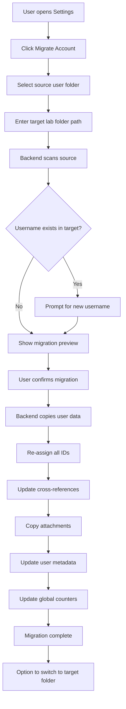
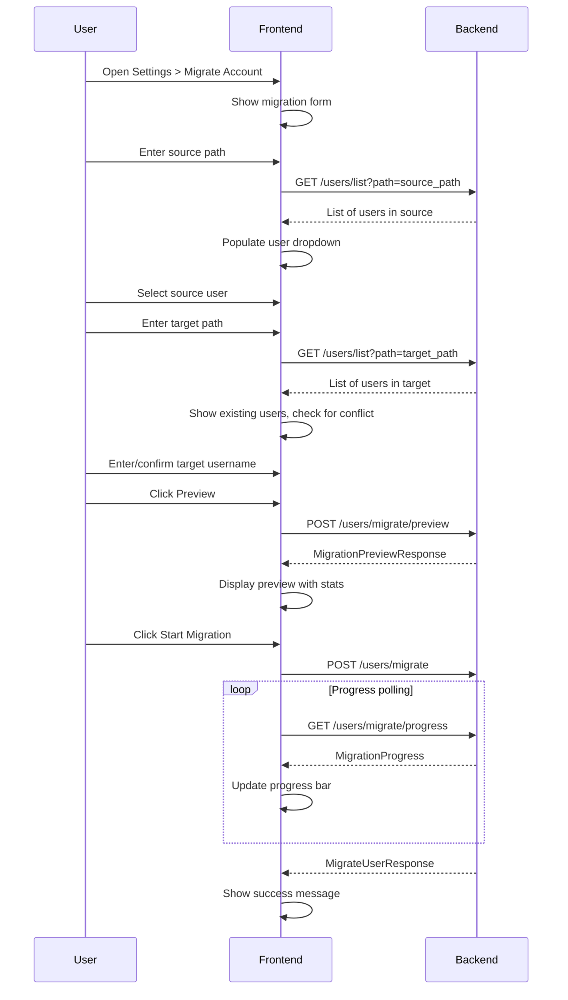

# User Account Migration Plan

## Overview

Add the ability to migrate a user account from one ResearchOS data folder to another existing lab folder that already contains other user accounts. This is useful when a lab member creates an account locally in a temp folder and later wants to move their data to the lab's shared folder (e.g., OneDrive).

## Use Case

A lab member:
1. Creates a user account on their local machine with data in a temp folder
2. Later wants to migrate their account to the lab's shared OneDrive folder
3. The lab folder already has other user accounts in it
4. Need to handle username conflicts and ID collisions

## Current Architecture

### Data Structure
```
{github_localpath}/
├── users/
│   ├── {username}/
│   │   ├── projects/          # Project JSON files
│   │   ├── tasks/             # Task JSON files
│   │   ├── dependencies/      # Dependency JSON files
│   │   ├── methods/           # Method JSON files
│   │   ├── events/            # Event JSON files
│   │   ├── goals/             # Goal JSON files
│   │   ├── pcr_protocols/     # PCR protocol JSON files
│   │   ├── purchase_items/    # Purchase item JSON files
│   │   ├── item_catalog/      # Item catalog JSON files
│   │   ├── lab_links/         # Lab link JSON files
│   │   ├── notes/             # Note JSON files
│   │   ├── Images/            # Image attachments
│   │   │   ├── _metadata.json
│   │   │   └── {experiment-folders}/
│   │   ├── Files/             # File attachments
│   │   │   ├── _metadata.json
│   │   │   └── {experiment-folders}/
│   │   ├── _counters.json     # ID counters for this user
│   │   ├── _shared_with_me.json
│   │   └── _notifications.json
│   ├── public/                # Shared methods & PCR protocols
│   ├── lab/                   # Lab-level shared data
│   ├── _user_metadata.json    # User colors, created_at
│   └── _global_counters.json  # Global ID counters for methods/pcr
```

### Key Considerations

1. **ID Collisions**: Each user folder has its own `_counters.json` for local IDs. When migrating to a folder with existing users, we need to re-assign IDs to avoid collisions.

2. **Cross-References**: Tasks reference projects (`project_id`), dependencies reference tasks (`parent_id`, `child_id`), etc. All references must be updated when IDs change.

3. **Global Counters**: Methods and PCR protocols use global counters (`_global_counters.json`) for unique IDs across all users. These need special handling.

4. **Attachments**: Images and Files folders contain binary data organized by experiment folders. These need to be copied and their metadata updated.

5. **User Metadata**: The `_user_metadata.json` file tracks user colors and creation dates. The migrated user needs a color assignment.

## Migration Flow



## Technical Design

### Backend API Endpoints

#### `POST /users/migrate/preview`
Preview a user account migration.

**Request:**
```python
class MigrationPreviewRequest(BaseModel):
    source_path: str        # Path to source users folder
    source_username: str    # Username to migrate
    target_path: str        # Path to target users folder
    target_username: str    # Username in target - can be different if renaming
```

**Response:**
```python
class MigrationPreviewResponse(BaseModel):
    status: str
    source_username: str
    target_username: str
    can_proceed: bool
    warnings: List[str]
    stats: MigrationStats
    
class MigrationStats(BaseModel):
    projects_count: int
    tasks_count: int
    dependencies_count: int
    methods_count: int
    events_count: int
    goals_count: int
    pcr_protocols_count: int
    purchase_items_count: int
    notes_count: int
    images_count: int
    files_count: int
    total_size_bytes: int
```

#### `POST /users/migrate`
Execute the user account migration.

**Request:**
```python
class MigrateUserRequest(BaseModel):
    source_path: str
    source_username: str
    target_path: str
    target_username: str    # May differ from source if renaming
    delete_source: bool = False  # Whether to delete source after migration
```

**Response:**
```python
class MigrateUserResponse(BaseModel):
    status: str
    message: str
    source_username: str
    target_username: str
    target_path: str
    id_mappings: Dict[str, Dict[int, int]]  # entity -> old_id -> new_id
    items_migrated: int
    bytes_copied: int
```

#### `GET /users/migrate/progress`
Get migration progress for long-running migrations.

**Response:**
```python
class MigrationProgress(BaseModel):
    status: str  # "idle", "in_progress", "complete", "error"
    current_step: str
    items_processed: int
    total_items: int
    bytes_copied: int
    total_bytes: int
    error_message: str = ""
```

### ID Re-assignment Strategy

When migrating a user to a folder with existing users, we need to re-assign all IDs to avoid collisions:

1. **Read target counters**: Get the current ID counters from the target user folder
2. **Create ID mappings**: Build a mapping of old IDs to new IDs for each entity type
3. **Update all references**: When writing each JSON file, update any referenced IDs

```python
# Example ID mapping structure
id_mappings = {
    "projects": {1: 5, 2: 6},      # Old project 1 -> New project 5
    "tasks": {1: 10, 2: 11, 3: 12},
    "methods": {1: 15},             # Methods use global counters
    "dependencies": {1: 20, 2: 21},
}
```

### Reference Updates

When re-assigning IDs, we need to update:

| Entity | Fields to Update |
|--------|------------------|
| Tasks | `project_id`, `method_ids[]` |
| Dependencies | `parent_id`, `child_id` |
| Purchase Items | `task_id` |
| Image/File Metadata | `experiment_id` (task ID) |
| Events | `task_id` |

### Attachment Migration

Images and Files need special handling:

1. Copy the folder structure to the target
2. Update `_metadata.json` with new experiment IDs
3. Preserve folder names (date-experiment format)

## Frontend UI

### Migration Section in Settings

Add a "Migrate Account" section to the Settings popup:

1. **Source Section**
   - Path input for source users folder
   - Dropdown to select user from source folder
   - Shows stats for selected user

2. **Target Section**
   - Path input for target users folder
   - Shows existing users in target
   - Username input - pre-filled with source username, editable

3. **Preview Section**
   - Shows what will be migrated
   - Warnings about conflicts
   - Estimated size

4. **Options**
   - Checkbox: Delete source after migration
   - Checkbox: Switch to target folder after migration

5. **Action Buttons**
   - Preview Migration
   - Start Migration
   - Progress indicator during migration

### UI Flow



## Implementation Steps

### Phase 1: Backend Migration Logic

1. **Add migration helper functions** in `backend/app/routers/users.py`:
   - `_scan_source_user()` - Scan source user folder for stats
   - `_check_username_conflict()` - Check if username exists in target
   - `_build_id_mappings()` - Create old_id -> new_id mappings
   - `_update_references()` - Update referenced IDs in JSON data
   - `_migrate_user_data()` - Main migration function

2. **Add migration endpoints**:
   - `POST /users/migrate/preview`
   - `POST /users/migrate`
   - `GET /users/migrate/progress`

3. **Handle global counters**:
   - Update `_global_counters.json` for methods and PCR protocols
   - Ensure unique IDs across all users

### Phase 2: Frontend UI

1. **Add migration API functions** in `frontend/src/lib/api.ts`:
   - `migratePreview()`
   - `migrateUser()`
   - `getMigrationProgress()`
   - `listUsersAtPath()` - List users in a specific path

2. **Add migration section** to `SettingsPopup.tsx`:
   - Source path input with folder browser
   - User selection dropdown
   - Target path input
   - Username input with conflict detection
   - Preview display
   - Progress indicator

### Phase 3: Testing

1. Test migration with no username conflict
2. Test migration with username conflict and rename
3. Test migration with ID collisions
4. Test attachment migration
5. Test with large datasets
6. Test delete source option
7. Test switch to target option

## Edge Cases

### 1. Username Conflict
- If target username exists, prompt user to enter a new username
- Validate new username follows naming rules

### 2. Method ID Collisions
- Methods use global counters, so IDs are unique across users
- Still need to check if method ID exists in target's global pool
- Re-assign if collision detected

### 3. Shared Items
- If source user has items shared with them, these references may break
- Warn user that shared items will not be migrated
- Only migrate items owned by the user

### 4. Public Methods
- If user owns public methods, decide whether to migrate them
- Public methods are in `users/public/`, not user folder
- Option to migrate public methods or leave them

### 5. Large Attachments
- Progress tracking for large file copies
- Handle network/OneDrive sync delays
- Consider zipping attachments for faster copy

### 6. Partial Migration Failure
- If migration fails partway, clean up partial data
- Transaction-like approach: verify all copies before committing

## Security Considerations

1. **Path Validation**: Ensure paths are valid and accessible
2. **Access Control**: Only allow migration for authenticated users
3. **Data Integrity**: Verify JSON files are valid after migration
4. **Backup**: Consider creating backup before migration

## Alternative: Simplified Approach

If the full migration feature is too complex, a simpler approach:

1. Export user data to a portable format (zip file)
2. User manually copies to target folder
3. Import function to read and integrate data

This puts more responsibility on the user but is simpler to implement.

## Decision

**Recommended**: Full automated migration with ID re-assignment

This provides the best user experience and handles all edge cases automatically.

## Files to Modify

### Backend
- `backend/app/routers/users.py` - Add migration endpoints
- `backend/app/storage.py` - Add helper functions for cross-path operations

### Frontend
- `frontend/src/lib/api.ts` - Add migration API functions
- `frontend/src/components/SettingsPopup.tsx` - Add migration UI section

### New Files
- None required - all functionality can be added to existing files
