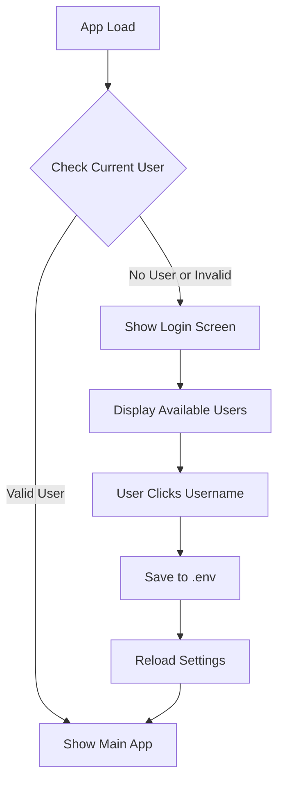

# User Login Screen Implementation Plan

## Overview
Implement a user login screen that displays on first load if no valid user is configured. Users can select their username from a list of available users in the data repository.

## Architecture



## Implementation Steps

### 1. Backend Changes

#### A. Add `.env` to `.gitignore`
The backend `.env` file contains sensitive tokens and should not be committed.

#### B. Create Users Router - `backend/app/routers/users.py`
New endpoints:
- `GET /api/users` - List all available users by scanning `data/users/` directory
- `POST /api/users/login` - Set current user and update .env file
- `GET /api/users/validate` - Check if current_user exists in users directory

#### C. Update Settings Router
The existing `current_user` field in settings response will be used to check login status.

### 2. Frontend Changes

#### A. Create User Login Screen Component
`frontend/src/components/UserLoginScreen.tsx`
- Full-screen overlay with user selection UI
- Fetches available users from API
- Displays users as clickable cards/buttons
- Shows loading state while fetching
- Handles login API call on selection
- **Create New User option:**
  - Button to show create user form
  - Text input for new username
  - Validation (alphanumeric only)
  - Calls create user API endpoint
  - Auto-login after creation

#### B. Update Providers Component
`frontend/src/lib/providers.tsx`
- Add user validation check on mount
- Manage login state with React context or local state
- Conditionally render login screen or children

#### C. Add API Functions
`frontend/src/lib/api.ts`
- `usersApi.list()` - Get available users
- `usersApi.login(username)` - Set current user
- `usersApi.create(username)` - Create new user and login
- `usersApi.validate()` - Check if current user is valid

### 3. User Experience Flow

1. **First Load / No User Set:**
   - App shows login screen with available users
   - User clicks their username
   - Backend updates .env with selected username
   - App reloads settings and shows main interface

2. **Returning User:**
   - App checks if current_user is set and valid
   - If valid, skip login screen and show main interface
   - If invalid (user folder doesn't exist), show login screen

### 4. API Specifications

#### GET /api/users
Response:
```json
{
  "users": ["GrantNickles", "OtherUser"],
  "current_user": "GrantNickles"
}
```

#### POST /api/users/login
Request:
```json
{
  "username": "GrantNickles"
}
```
Response:
```json
{
  "status": "ok",
  "current_user": "GrantNickles"
}
```

#### POST /api/users/create
Request:
```json
{
  "username": "NewUser"
}
```
Response:
```json
{
  "status": "ok",
  "current_user": "NewUser",
  "created": true
}
```
Notes:
- Validates username (alphanumeric, no spaces)
- Creates user folder structure at `data/users/{username}/`
- Initializes all required subdirectories (projects, tasks, etc.)
- Automatically logs in the new user

#### GET /api/users/validate
Response:
```json
{
  "valid": true,
  "current_user": "GrantNickles"
}
```

## Files to Modify/Create

### Backend
- `.gitignore` - Add `backend/.env`
- `backend/app/routers/users.py` - New file
- `backend/app/main.py` - Include users router
- `backend/app/routers/settings.py` - Already has current_user

### Frontend
- `frontend/src/lib/api.ts` - Add users API
- `frontend/src/lib/providers.tsx` - Add login check logic
- `frontend/src/components/UserLoginScreen.tsx` - New file

## Notes
- The login is not a security feature - it's for user identification
- No password authentication required
- User selection is persisted in .env file
- Each local installation can have a different default user
