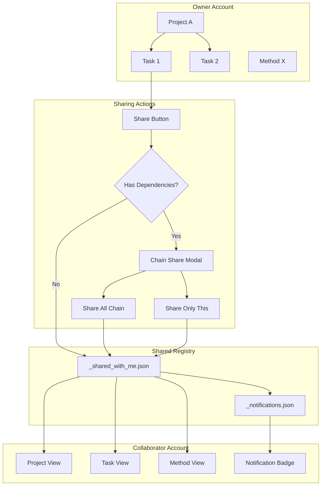

# User-Specific Sharing Feature Plan

## Overview

This plan describes a system for sharing experiments (tasks) and methods with specific users, rather than the current binary public/private model. The goal is to allow fine-grained access control where:

1. **Experiments** can be shared with specific collaborators (e.g., Kritika) who can then see them in their GANTT chart and edit lab notes/methods
2. **Methods** can be individually shared with specific users instead of being universally public or private

## Current Architecture Analysis

### Data Storage Structure
```
{data_repo}/
├── users/
│   ├── {username}/
│   │   ├── projects/
│   │   ├── tasks/           # Each task as {id}.json
│   │   ├── methods/         # Private methods
│   │   ├── dependencies/
│   │   └── ...
│   ├── public/
│   │   ├── methods/         # Universally public methods
│   │   └── pcr_protocols/
│   └── lab/
│       └── funding_accounts/
└── _global_counters.json
```

### Current Sharing Model
- **Methods**: Binary public/private via `is_public` flag
  - Private: `users/{username}/methods/{id}.json`
  - Public: `users/public/methods/{id}.json`
- **Tasks**: No sharing - only visible to the creating user
- **Public methods**: Visible to all, editable only by creator

## Proposed Solution: Shared Access Control Lists (ACLs)

### Design Principles
1. **Single Source of Truth**: Data remains stored on the original owner's account
2. **Pointer System**: Shared items are referenced via pointers in the recipient's space
3. **Permission Levels**: Support for view-only and edit permissions
4. **Backwards Compatible**: Existing public/private model continues to work

### Data Model Changes

#### 1. Task Schema Enhancement
```python
# In schemas.py - TaskCreate/TaskUpdate/TaskOut
class SharedUser(BaseModel):
    username: str
    permission: str = "edit"  # "view" or "edit"
    
class TaskOut(BaseModel):
    # ... existing fields ...
    owner: str = ""  # Username of task owner
    shared_with: List[SharedUser] = []  # Users with access
```

#### 2. Method Schema Enhancement
```python
# In methods.py - MethodOut
class MethodOut(BaseModel):
    # ... existing fields ...
    owner: str = ""  # Username of method owner (renamed from created_by)
    shared_with: List[SharedUser] = []  # Specific users with access
    # is_public remains for universal public access
```

#### 3. New Shared Items Registry
A new file tracks all items shared WITH the current user:

```
{data_repo}/users/{username}/_shared_with_me.json
```

```json
{
  "version": 1,
  "tasks": [
    {
      "id": 123,
      "owner": "gnickles",
      "permission": "edit",
      "shared_at": "2026-03-04T20:00:00Z"
    }
  ],
  "methods": [
    {
      "id": 456,
      "owner": "gnickles", 
      "permission": "view",
      "shared_at": "2026-03-04T20:00:00Z"
    }
  ]
}
```

### Storage Layer Changes

#### New Functions in `storage.py`

```python
def get_shared_items_for_user(username: str) -> Dict:
    """Get all items shared with a specific user."""
    pass

def share_task_with_user(task_id: int, owner: str, target_user: str, permission: str) -> bool:
    """Share a task with another user by adding to their registry."""
    pass

def unshare_task_with_user(task_id: int, owner: str, target_user: str) -> bool:
    """Remove a user's access to a task."""
    pass

def get_task_with_access_check(task_id: int, requesting_user: str) -> Optional[Dict]:
    """Get a task if the user has access (owner or shared_with)."""
    pass

def list_all_tasks_including_shared() -> List[Dict]:
    """List user's own tasks + tasks shared with them."""
    pass
```

### API Endpoint Changes

#### Tasks Router (`/api/tasks`)

```python
# New endpoints
POST /tasks/{task_id}/share
    Body: {"username": "kritika", "permission": "edit"}
    # Share task with specific user

DELETE /tasks/{task_id}/share/{username}
    # Remove user's access to task

GET /tasks/shared-with-me
    # List all tasks shared with current user

PUT /tasks/{task_id}
    # Modified to check if user has edit permission (owner or shared_with)
```

#### Methods Router (`/api/methods`)

```python
# New endpoints  
POST /methods/{method_id}/share
    Body: {"username": "kritika", "permission": "edit"}
    # Share method with specific user

DELETE /methods/{method_id}/share/{username}
    # Remove user's access to method

GET /methods/shared-with-me
    # List methods shared with current user (not public, specifically shared)
```

### Frontend Changes

#### 1. Task Detail Popup Enhancement
- Add "Sharing" section with user list
- User picker to add collaborators
- Permission dropdown (View/Edit)
- Remove access button

#### 2. GANTT Chart Integration
- Show shared tasks with visual indicator (e.g., different color, shared icon)
- Display owner name on shared tasks
- Allow editing if permission is "edit"

#### 3. Method Tabs Enhancement
- Similar sharing UI for methods
- Show "Shared with me" tab
- Visual distinction between owned and shared methods

#### 4. Lab Mode Integration
- Shared experiments appear in collaborator's lab view
- Both users can edit lab notes (with conflict resolution)
- Activity log shows who made changes

### Permission Model

| Action | Owner | Shared (Edit) | Shared (View) | Public |
|--------|-------|---------------|---------------|--------|
| View | ✓ | ✓ | ✓ | ✓ |
| Edit | ✓ | ✓ | ✗ | ✗ |
| Delete | ✓ | ✗ | ✗ | ✗ |
| Share | ✓ | ✗ | ✗ | ✗ |

### Conflict Resolution

For shared experiments where multiple users can edit:

1. **Optimistic Locking**: Include `updated_at` timestamp, reject stale updates
2. **Auto-refresh**: Poll for changes when viewing shared items
3. **Visual Indicators**: Show "Last edited by {user} at {time}"
4. **Edit Locking** (Optional): Lock item while someone is editing

### Migration Strategy

#### Phase 1: Add Schema Fields
1. Add `owner` and `shared_with` fields to task/method schemas
2. Default values ensure backwards compatibility
3. Existing tasks get `owner = current_user`, `shared_with = []`

#### Phase 2: Storage Layer
1. Create `_shared_with_me.json` files for each user
2. Implement new storage functions
3. Update existing functions to check permissions

#### Phase 3: API Endpoints
1. Add new sharing endpoints
2. Modify existing endpoints to respect permissions
3. Add audit logging for share/unshare actions

#### Phase 4: Frontend UI
1. Add sharing UI components
2. Update GANTT chart to show shared tasks
3. Update method library for shared methods

#### Phase 5: Testing & Rollout
1. Test with multiple user accounts
2. Verify permission enforcement
3. Test concurrent editing scenarios

## Alternative Approaches Considered

### Option A: Symlink/Pointer Files
Create actual pointer files in the recipient's folders that reference the original.

**Pros**: Transparent to existing code
**Cons**: Complex file management, sync issues, git complications

### Option B: Central Shared Registry
Single file at root level tracking all shared items.

**Pros**: Single source of truth for sharing
**Cons**: Lock contention, single point of failure

### Option C: Per-User Registry (Chosen)
Each user has their own `_shared_with_me.json` file.

**Pros**: No lock contention, easy to query, works with git
**Cons**: Need to update multiple files when sharing changes

## Implementation Order

1. **Backend Schema & Storage** (Day 1)
   - Add `owner`, `shared_with` fields to schemas
   - Create `_shared_with_me.json` structure
   - Implement storage functions

2. **Backend API Endpoints** (Day 2)
   - Task sharing endpoints
   - Method sharing endpoints
   - Permission checks in existing endpoints

3. **Frontend Sharing UI** (Day 3)
   - Task sharing popup
   - Method sharing UI
   - User picker component

4. **Frontend Integration** (Day 4)
   - GANTT chart shared tasks
   - Method library shared methods
   - Lab mode integration

5. **Testing & Polish** (Day 5)
   - Multi-user testing
   - Edge cases
   - Documentation

## User Feedback Incorporated

Based on user feedback, the following features have been added to the plan:

### 1. Dismissible Notifications
When something is shared with a user, they receive a notification that can be dismissed after viewing.

**Implementation:**
- Add `_notifications.json` file per user to track unread notifications
- Notification types: `task_shared`, `method_shared`, `project_shared`
- Frontend shows notification badge with count of unread items
- Clicking notification marks it as read/dismissed

```json
// users/{username}/_notifications.json
{
  "version": 1,
  "notifications": [
    {
      "id": "notif-123",
      "type": "task_shared",
      "from_user": "gnickles",
      "item_type": "task",
      "item_id": 456,
      "item_name": "PCR Experiment - Week 3",
      "permission": "edit",
      "created_at": "2026-03-04T20:00:00Z",
      "read": false
    }
  ]
}
```

### 2. Dependency Chain Sharing
When sharing an experiment that is part of a dependency chain, the app prompts to share the entire chain.

**Implementation:**
- Before sharing a task, check if it has dependencies (parents or children)
- If dependencies exist, show modal: "This experiment is part of a chain with X other experiments. Share the entire chain?"
- Options: "Share All", "Share Only This", "Cancel"
- If "Share All" selected, recursively find all connected tasks and share them all

**Backend Logic:**
```python
def get_dependency_chain(task_id: int) -> List[int]:
    """Get all task IDs in the dependency chain for a task."""
    visited = set()
    
    def traverse_up(tid):
        # Find parents
        for dep in get_dependencies_store().query(child_id=tid):
            if dep["parent_id"] not in visited:
                visited.add(dep["parent_id"])
                traverse_up(dep["parent_id"])
    
    def traverse_down(tid):
        # Find children
        for dep in get_dependencies_store().query(parent_id=tid):
            if dep["child_id"] not in visited:
                visited.add(dep["child_id"])
                traverse_down(dep["child_id"])
    
    visited.add(task_id)
    traverse_up(task_id)
    traverse_down(task_id)
    return list(visited)
```

### 3. Project-Level Sharing
Share an entire project folder with another user. All experiments in that project automatically appear for the shared user.

**Implementation:**
- Add `shared_with` field to Project schema
- When viewing tasks, include tasks from shared projects
- New API endpoints for project sharing
- Project sharing is inherited - new experiments in shared projects are automatically visible

**Project Schema Enhancement:**
```python
class ProjectOut(BaseModel):
    # ... existing fields ...
    owner: str = ""  # Username of project owner
    shared_with: List[SharedUser] = []  # Users with access to entire project
```

**Project Sharing Registry:**
```json
// users/{username}/_shared_with_me.json - updated
{
  "version": 1,
  "projects": [
    {
      "id": 789,
      "owner": "gnickles",
      "permission": "edit",
      "shared_at": "2026-03-04T20:00:00Z"
    }
  ],
  "tasks": [...],
  "methods": [...]
}
```

### 4. GANTT Chart User Initials Display
Show the username initial in the left corner of shared experiments, similar to lab mode.

**Implementation:**
- For shared tasks, display owner's initial in a colored circle
- Use the same color assignment system as lab mode
- Position: Top-left corner of the task bar
- Only show for tasks NOT owned by current user

**Visual Design:**
```
┌─────────────────────────────────┐
│ [K] PCR Experiment - Week 3     │  <- K for Kritika (shared)
└─────────────────────────────────┘

┌─────────────────────────────────┐
│ PCR Experiment - Week 2         │  <- No initial (owned by me)
└─────────────────────────────────┘
```

**Frontend Component:**
```tsx
// In GanttChart.tsx
function TaskBar({ task, isShared, ownerUsername }) {
  return (
    <div className="task-bar">
      {isShared && (
        <div className="owner-initial" style={{ backgroundColor: getUserColor(ownerUsername) }}>
          {ownerUsername.charAt(0).toUpperCase()}
        </div>
      )}
      <span>{task.name}</span>
    </div>
  );
}
```

## Updated Data Model

### Project Schema
```python
class SharedUser(BaseModel):
    username: str
    permission: str = "edit"  # "view" or "edit"

class ProjectOut(BaseModel):
    id: int
    name: str
    weekend_active: bool
    tags: Optional[List[str]]
    color: Optional[str]
    created_at: datetime
    sort_order: int = 0
    is_archived: bool = False
    archived_at: Optional[datetime] = None
    owner: str = ""  # NEW: Username of project owner
    shared_with: List[SharedUser] = []  # NEW: Users with project access
```

### Task Schema
```python
class TaskOut(BaseModel):
    # ... existing fields ...
    owner: str = ""  # NEW: Username of task owner
    shared_with: List[SharedUser] = []  # NEW: Direct sharing (not via project)
    inherited_from_project: Optional[int] = None  # NEW: If shared via project
```

### Method Schema
```python
class MethodOut(BaseModel):
    # ... existing fields ...
    owner: str = ""  # Renamed from created_by
    shared_with: List[SharedUser] = []  # NEW: Specific users with access
```

## Updated API Endpoints

### Projects Router
```python
POST /projects/{project_id}/share
    Body: {"username": "kritika", "permission": "edit"}
    # Share entire project with user

DELETE /projects/{project_id}/share/{username}
    # Remove user's access to project

GET /projects/shared-with-me
    # List projects shared with current user
```

### Tasks Router
```python
POST /tasks/{task_id}/share
    Body: {"username": "kritika", "permission": "edit", "include_chain": false}
    # Share task with specific user, optionally include dependency chain

GET /tasks/{task_id}/dependency-chain
    # Get all tasks in the dependency chain for sharing preview
```

### Notifications Router (NEW)
```python
GET /notifications
    # List all notifications for current user

POST /notifications/{notification_id}/dismiss
    # Mark a notification as read/dismissed

POST /notifications/dismiss-all
    # Dismiss all notifications
```

## Architecture Diagram



## Implementation Timeline

### Phase 1: Backend Core (Days 1-2)
1. Add `owner` and `shared_with` fields to schemas
2. Create `_shared_with_me.json` and `_notifications.json` structures
3. Implement storage functions for sharing
4. Implement dependency chain detection
5. Add notification creation/dismissal logic

### Phase 2: Backend APIs (Days 3-4)
1. Task sharing endpoints with chain support
2. Method sharing endpoints
3. Project sharing endpoints
4. Notification endpoints
5. Permission checks in existing endpoints

### Phase 3: Frontend Sharing UI (Days 5-6)
1. Share button in task/method/project detail popups
2. User picker component with permission dropdown
3. Dependency chain modal
4. Notification badge and popup
5. Project sharing UI

### Phase 4: Frontend Integration (Days 7-8)
1. GANTT chart shared task display with user initials
2. Method library shared methods tab
3. Project list shared projects
4. Lab mode integration

### Phase 5: Testing & Polish (Day 9)
1. Multi-user testing
2. Permission enforcement verification
3. Edge cases (revocation, deletion, etc.)
4. Documentation

## Summary

This plan introduces a flexible sharing system that:
- Keeps data stored on the owner's account
- Uses a per-user registry to track shared items
- Supports view/edit permission levels
- Integrates seamlessly with existing public/private model
- Enables collaborative experiment tracking and method development
- **NEW**: Dismissible notifications when shared with
- **NEW**: Dependency chain sharing with user confirmation
- **NEW**: Project-level sharing for automatic experiment visibility
- **NEW**: User initials display on shared GANTT items
