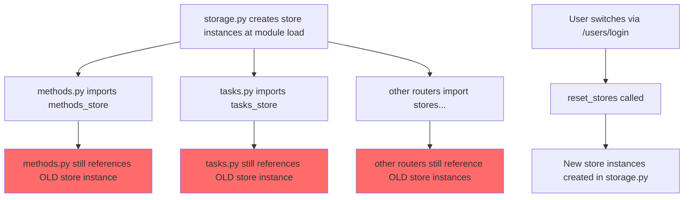
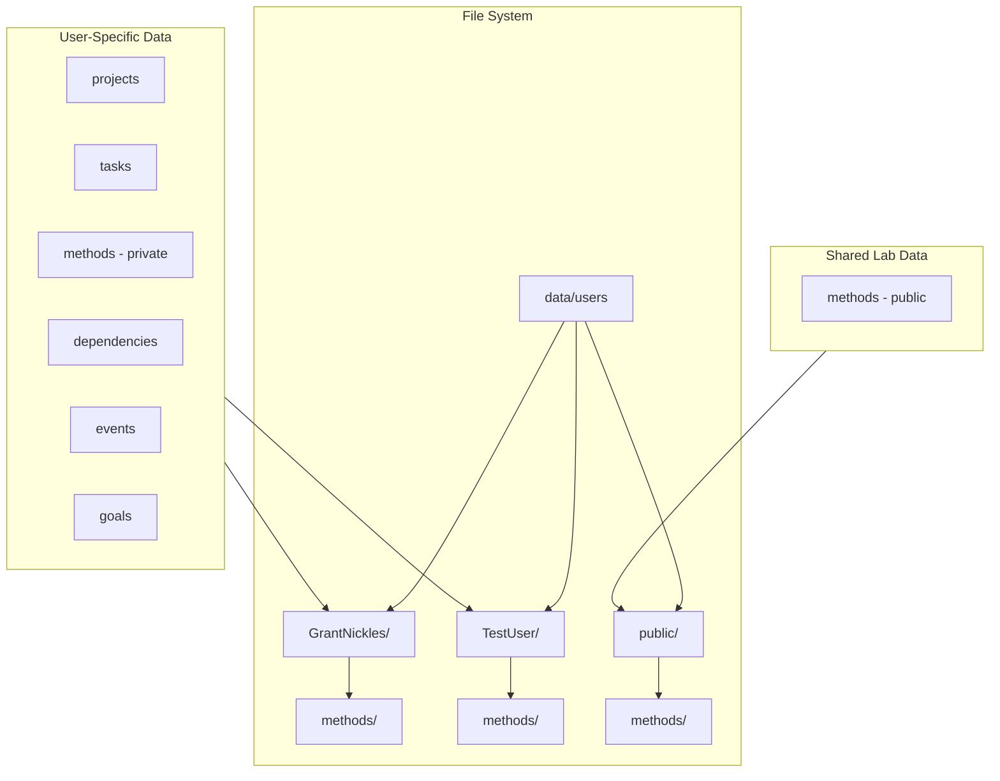

# User System Fix & Public Methods Feature Plan

## Overview

This plan addresses two related issues:
1. **Bug Fix**: User switching doesn't refresh data because store references are cached
2. **New Feature**: Methods can be marked as "Public" to share across all lab members

---

## Part 1: Fix User Switching Bug

### Problem Analysis

The bug occurs because of how Python module imports work:



The `reset_stores()` function reassigns module-level variables in `storage.py`, but the imported references in other modules still point to the old instances.

### Solution: Dynamic Store Access

Instead of importing store instances directly, routers will call a function that returns the current store instance:

**Before (buggy):**
```python
# In methods.py
from app.storage import methods_store  # Cached at import time

@router.get("")
async def list_methods():
    records = methods_store.list_all()  # Uses old instance after user switch
```

**After (fixed):**
```python
# In methods.py
from app.storage import get_methods_store  # Function that returns current store

@router.get("")
async def list_methods():
    records = get_methods_store().list_all()  # Always gets current instance
```

### Implementation Steps

1. **Add getter functions in `storage.py`**:
   - `get_projects_store()`
   - `get_tasks_store()`
   - `get_methods_store()`
   - etc.

2. **Update all routers** to use getter functions instead of direct imports

3. **Update `reset_stores()`** to work with the new pattern

---

## Part 2: Public Methods Feature

### Data Model Changes

Add `is_public` field to methods:

```json
{
  "id": 1,
  "name": "DNA Extraction Protocol",
  "is_public": true,
  "created_by": "GrantNickles",
  "folder_path": "methods/dna-extraction",
  ...
}
```

### Storage Architecture



### Storage Changes

1. **New public data location**: `data/users/public/`
   - Contains `methods/` folder for public methods
   - Contains `_counters.json` for ID generation

2. **Method storage logic**:
   - Private methods: `data/users/{username}/methods/{id}.json`
   - Public methods: `data/users/public/methods/{id}.json`

3. **When `is_public` changes**:
   - Move method file between user folder and public folder
   - Update `created_by` field to track original creator

### API Changes

#### Updated Endpoints

| Endpoint | Change |
|----------|--------|
| `GET /methods` | Returns user's private methods + all public methods |
| `POST /methods` | Creates method in user's folder (private by default) |
| `PUT /methods/{id}` | Supports toggling `is_public` field |
| `DELETE /methods/{id}` | Only creator can delete public methods |

#### New Fields

```python
class MethodCreate(BaseModel):
    name: str
    folder_path: Optional[str] = None
    parent_method_id: Optional[int] = None
    tags: Optional[List[str]] = None
    attachments: Optional[List[MethodAttachment]] = None
    is_public: bool = False  # New field

class MethodOut(BaseModel):
    id: int
    name: str
    folder_path: Optional[str]
    parent_method_id: Optional[int]
    tags: Optional[List[str]]
    attachments: List[MethodAttachment]
    is_public: bool = False  # New field
    created_by: Optional[str] = None  # New field - tracks original creator
```

### Frontend Changes

1. **Methods List Display**:
   - Show public methods with a "Public" badge
   - Show creator name for public methods
   - Group or filter by public/private status

2. **Method Editor**:
   - Add "Make Public" toggle switch
   - Show confirmation dialog when making method public
   - Show warning when toggling from public to private

3. **Visual Design**:
   ```
   ┌─────────────────────────────────────────────┐
   │ 🧬 DNA Extraction Protocol    [🌐 Public]   │
   │    by GrantNickles                          │
   │    Tags: extraction, dna                    │
   └─────────────────────────────────────────────┘
   
   ┌─────────────────────────────────────────────┐
   │ 🧪 My Custom PCR Protocol                   │
   │    Tags: pcr, custom                        │
   │    [Toggle: Make Public]                    │
   └─────────────────────────────────────────────┘
   ```

---

## Implementation Order

### Phase 1: Bug Fix (Critical)
1. Add getter functions to `storage.py`
2. Update `reset_stores()` function
3. Update all routers to use getter functions
4. Test user switching

### Phase 2: Public Methods Storage
1. Create public data directory structure
2. Add `is_public` and `created_by` fields to method schema
3. Implement method file moving logic in storage layer
4. Update methods router to handle public/private

### Phase 3: Frontend Updates
1. Update methods list to show public methods
2. Add public/private toggle to method editor
3. Add visual indicators for public methods
4. Add creator attribution display

### Phase 4: PCR Protocols (Same Pattern)
1. Add `is_public` and `created_by` to PCR protocol schema
2. Create public PCR protocols storage
3. Update PCR router to handle public/private
4. Update frontend PCR pages

---

## Files to Modify

### Backend
- `backend/app/storage.py` - Add getter functions, public store support
- `backend/app/routers/methods.py` - Use getters, handle public methods
- `backend/app/routers/tasks.py` - Use getters
- `backend/app/routers/projects.py` - Use getters
- `backend/app/routers/pcr.py` - Use getters, handle public PCR protocols
- `backend/app/routers/*.py` - All routers using stores
- `backend/app/schemas.py` - Add is_public, created_by fields

### Frontend
- `frontend/src/lib/types.ts` - Add is_public, created_by to Method and PCR types
- `frontend/src/app/methods/page.tsx` - Display public methods, add toggle
- `frontend/src/app/pcr/page.tsx` - Display public PCR protocols, add toggle
- `frontend/src/components/MethodTabs.tsx` - Public method indicators

---

## Design Decisions (Confirmed)

1. **Permissions**: Only the creator can edit or delete their public methods
2. **Deletion**: Same as edit - only creator can delete
3. **Forking**: Forks are private by default (user can choose to make them public later)
4. **PCR Protocols**: Will also have public/private toggle (same rules as methods)

---

## Testing Checklist

- [ ] User switch refreshes all data immediately
- [ ] Private methods only visible to creator
- [ ] Public methods visible to all users
- [ ] Toggle public/private moves method file correctly
- [ ] Creator attribution preserved after making public
- [ ] Method IDs don't conflict between users and public
- [ ] Only creator can edit/delete their public methods
- [ ] Forks of public methods are private by default
- [ ] PCR protocols work with same public/private logic
- [ ] Public PCR protocols visible to all users
