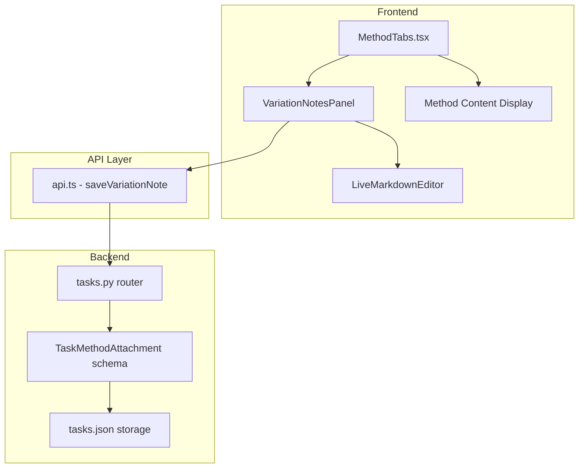

# Variation Notes Feature Plan

## Overview

Add the ability for users to add variation notes for each method attached to an experiment. These notes document any variations or modifications made to a method during a specific experimental run.

## Requirements

- **Markdown Support**: Notes should support markdown formatting
- **Collapsible Panel**: Notes appear in a collapsible panel at the top of each method tab
- **Timestamps**: Each note entry shows when it was added/modified
- **Per-Method-Per-Experiment**: Notes are specific to each method-experiment combination

## Data Model

### TaskMethodAttachment Update

Add a new `variation_notes` field to store notes specific to each method attachment:

```typescript
// frontend/src/lib/types.ts
export interface TaskMethodAttachment {
  method_id: number;
  pcr_gradient: string | null;
  pcr_ingredients: string | null;
  variation_notes: string | null;  // NEW: Markdown content with timestamps
}
```

### Note Format

The `variation_notes` field will store markdown content with timestamped entries:

```markdown
### Variation - 2026-02-15 4:52 PM

Used 1.5x concentration of reagent A due to availability constraints.

### Variation - 2026-02-14 10:30 AM

Extended incubation time by 15 minutes.
```

## Architecture



## Implementation Steps

### 1. Backend Changes

#### 1.1 Update schemas.py

Add `variation_notes` field to the TaskMethodAttachment schema:

```python
# backend/app/schemas.py
class TaskMethodAttachment(BaseModel):
    method_id: int
    pcr_gradient: Optional[str] = None
    pcr_ingredients: Optional[str] = None
    variation_notes: Optional[str] = None  # NEW
```

#### 1.2 Update tasks.py router

Add a new endpoint to save variation notes:

```python
# backend/app/routers/tasks.py
@router.put("/{task_id}/methods/{method_id}/notes")
async def save_variation_note(
    task_id: int,
    method_id: int,
    body: VariationNoteRequest
) -> TaskOut:
    # Update the variation_notes field in the method attachment
    ...
```

### 2. Frontend Changes

#### 2.1 Update types.ts

Add `variation_notes` field to TaskMethodAttachment interface.

#### 2.2 Update api.ts

Add a new API method:

```typescript
export const tasksApi = {
  // ... existing methods
  saveVariationNote: (taskId: number, methodId: number, notes: string) =>
    api.put<Task>(`/tasks/${taskId}/methods/${methodId}/notes`, { variation_notes: notes })
      .then((r) => r.data),
};
```

#### 2.3 Update MethodTabs.tsx

Add a collapsible VariationNotesPanel component:

```tsx
// New component structure
function VariationNotesPanel({ 
  attachment, 
  onSave 
}: { 
  attachment: TaskMethodAttachment;
  onSave: (notes: string) => void;
}) {
  const [isExpanded, setIsExpanded] = useState(false);
  const [isEditing, setIsEditing] = useState(false);
  const [content, setContent] = useState(attachment.variation_notes || '');
  
  // Render collapsible panel with:
  // - Header showing "Variation Notes" with expand/collapse toggle
  // - Badge showing note count or "Add notes" prompt
  // - LiveMarkdownEditor when expanded and editing
  // - Markdown preview when expanded and not editing
  // - Save/Cancel buttons when editing
}
```

### 3. UI Design

#### Collapsed State
```
┌─────────────────────────────────────────────────────────────┐
│ 📝 Variation Notes (2 entries)                    [▼ Expand] │
└─────────────────────────────────────────────────────────────┘
```

#### Expanded State - Viewing
```
┌─────────────────────────────────────────────────────────────┐
│ 📝 Variation Notes                                 [▲ Collapse]│
├─────────────────────────────────────────────────────────────┤
│ ### Variation - 2026-02-15 4:52 PM                          │
│                                                             │
│ Used 1.5x concentration of reagent A...                     │
│                                                             │
│ ### Variation - 2026-02-14 10:30 AM                         │
│                                                             │
│ Extended incubation time by 15 minutes.                     │
│                                                             │
│ [Add Note]                                    [Edit All]     │
└─────────────────────────────────────────────────────────────┘
```

#### Expanded State - Adding New Note
```
┌─────────────────────────────────────────────────────────────┐
│ 📝 Variation Notes                                 [▲ Collapse]│
├─────────────────────────────────────────────────────────────┤
│ [Existing notes displayed above as preview]                 │
│                                                             │
│ ┌─────────────────────────────────────────────────────────┐ │
│ │ ### Variation - 2026-02-15 4:52 PM                      │ │
│ │                                                         │ │
│ │ [Markdown editor area...]                               │ │
│ │                                                         │ │
│ └─────────────────────────────────────────────────────────┘ │
│                                                             │
│ [Cancel]                                         [Save Note] │
└─────────────────────────────────────────────────────────────┘
```

## Files to Modify

### Backend
- `backend/app/schemas.py` - Add variation_notes field
- `backend/app/routers/tasks.py` - Add PUT endpoint for notes

### Frontend
- `frontend/src/lib/types.ts` - Add variation_notes field
- `frontend/src/lib/api.ts` - Add saveVariationNote method
- `frontend/src/components/MethodTabs.tsx` - Add VariationNotesPanel component

## Migration Strategy

No migration needed - the `variation_notes` field is optional and defaults to null. Existing method attachments will work without any changes.

## Testing Checklist

- [ ] Create new experiment with method
- [ ] Add variation note to method
- [ ] Verify note persists after closing/reopening popup
- [ ] Add multiple notes with timestamps
- [ ] Test markdown formatting in notes
- [ ] Test with PCR methods
- [ ] Test with markdown methods
- [ ] Test with PDF methods
- [ ] Verify notes are specific to each method tab
- [ ] Verify notes don't affect other experiments using same method
